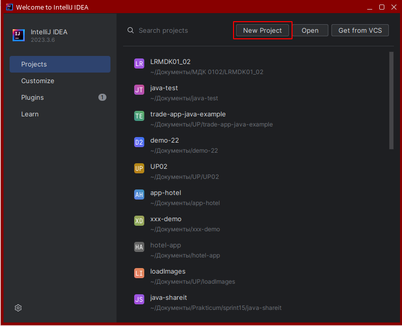
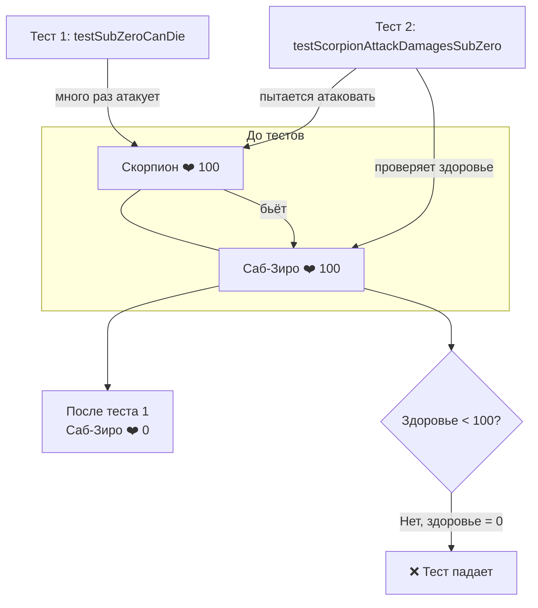
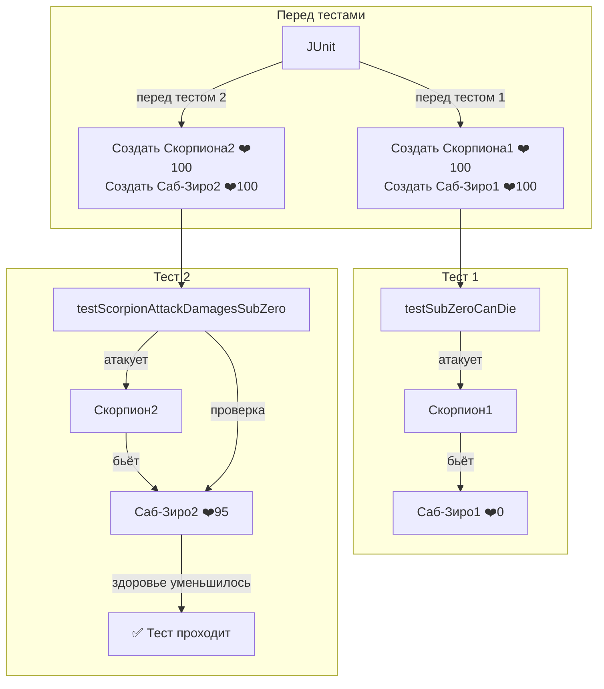

Предыдущее занятие |         &nbsp;          | Следующее занятие
:----------------:|:-----------------------:|:----------------:
[Урок 10](LESSON10.MD) | [Содержание](../README.MD) | [Урок 12](LESSON11.md)

# Лекция 7. Тестовое окружение 🧪🧪

## Оглавление 📚

1.  [Введение](#введение-в-тему)
2.  [Мир окружений: от Dev до Prod 🌍](#что-такое-окружение)
3.  [Тестовое окружение для бойцов 🥊](#тестовое-окружение-1)
    *   [Проблема «общего ринга» ⚠️](#подготовка-тестового-окружения)
    *   [Визуализация проблемы 🖼️](#визуализация-проблемы-️)
    *   [Решение: `@BeforeEach` ✅](#решение-beforeeach-️)
    *   [Как это работает (схема) 🔄](#как-это-работает-схема-)
    *   [Другие аннотации 🧩](#другие-аннотации-)

---

## Введение в тему 🎯

Современные игры — это сложные системы с тысячами классов и взаимодействий. Один баг может сделать вашего любимого персонажа неуязвимым 💪 или, наоборот, слишком слабым 😢. Чтобы этого не случилось, код тестируют на разных окружениях (стендах). Но и внутри одного тестового класса важно правильно подготовить «арену» для каждого боя, чтобы персонажи не влияли на результаты сражений друг друга.

## Что такое окружение

**Среда, или окружение** (англ. _environment_) — это сервер или группа серверов, на которых находится копия приложения. Конкретное окружение часто называется **стендом** (англ. _stand_).

У любой компании есть как минимум одна среда — та, с которой взаимодействуют её клиенты. 
Но часто для полноценной работы над продуктом выделяют и другие окружения:

* **Среда разработки** (англ. _development environment_), **dev** или **dev-стенд**. 
Используется исключительно для разработки. Именно сюда стекаются изменения от всех программистов, 
работающих над проектом. Здесь же запускаются тесты, написанные разработчиками, и ставятся эксперименты.
* **Тестовая среда** (англ. _test environment_), **test** или **test-стенд**. Здесь продукт стабилизируется при помощи более сложных тестов. 
Например, **интеграционных** (англ. _integration tests_) **— которые объединяют (интегрируют) несколько программ/сервисов вместе. 
При интеграционном тестировании часто проверяют, корректно ли данные из одного сервиса передаются в другой. 
Такие тесты часто пишут отдельные команды тестировщиков.
* **Продуктовая среда** (англ. _production environment_), или **prod**. Её ещё называют «боевая среда» 
как противоположность тестовой, «учебной». 
С ней взаимодействуют клиенты компании, поэтому любые ошибки могут привести к денежным и репутационным потерям.
В идеальном мире к моменту выкладки кода на прод в программе уже не должно быть багов, влияющих на пользователя.



Многие компании создают и другие среды для своих целей. Например, одни воспроизводят баги в специфичном окружении — на сервере с определённой версией Java. 
Другие используют отдельные среды для разных видов тестов. 
Третьи вообще создают отдельное тестовое окружение для каждого изменения в коде. 

Во всём этом многообразии одна вещь остаётся верной всегда. Тесты сокращают количество багов, которые увидит конечный пользователь. 

> 💡 Окружением часто называют не только полноценный набор 
> серверов с копией приложения, но также и набор внешних параметров, от которых зависит работа программы. Это может быть и версия Java, и другие приложения, 
> и разные файлы конфигурации. Часть таких внешних параметров 
> можно контролировать во время тестирования, с чем тоже помогает библиотека JUnit.
Но сегодня мы поговорим о более мелком окружении — о том, как подготовить персонажей для отдельного теста, чтобы они не «запоминали» предыдущие схватки.

## Тестовое окружение для бойцов 🥊

Представьте, что мы разрабатываем файтинг и у нас есть класс `Fighter` (боец). У каждого бойца есть имя, сила удара 💥, ловкость 🤸, запас здоровья ❤️ и методы атаковать противника или получать урон.

```java
public class Fighter {
    private String name;
    private int strength;   // сила удара
    private int agility;    // ловкость (влияет на защиту)
    private int health;     // текущее здоровье
    private int maxHealth;  // максимум здоровья

    public Fighter(String name, int strength, int agility, int health) {
        this.name = name;
        this.strength = strength;
        this.agility = agility;
        this.health = health;
        this.maxHealth = health;
    }

    // Атаковать противника 🥊
    public void attack(Fighter opponent) {
        // Урон зависит от силы атакующего и ловкости защищающегося
        int damage = Math.max(1, this.strength - opponent.agility / 2);
        opponent.takeDamage(damage);
    }

    // Получить урон 💔
    public void takeDamage(int damage) {
        this.health -= damage;
        if (this.health < 0) this.health = 0;
    }

    // Проверить, жив ли боец ❤️‍🩹
    public boolean isAlive() {
        return health > 0;
    }

    public int getHealth() {
        return health;
    }

    // Восстановить здоровье (для нового раунда) 🔄
    public void resetHealth() {
        this.health = maxHealth;
    }

    // Геттеры и сеттеры...
}
```

А ещё у нас есть фабрика `FighterFactory`, которая создаёт предопределённых персонажей (Скорпиона 🦂, Саб-Зиро ❄️ и т.д.).

```java
public class FighterFactory {
    public static Fighter createFighter(String type) {
        switch (type) {
            case "Scorpion":
                return new Fighter("Scorpion", 8, 7, 100);
            case "SubZero":
                return new Fighter("SubZero", 7, 8, 100);
            default:
                throw new IllegalArgumentException("Unknown fighter type");
        }
    }
}
```

Теперь напишем тесты. Проверим, что атака Скорпиона уменьшает здоровье Саб-Зиро, и что после получения урона боец может умереть.

### Проблема «общего ринга» ⚠️

Наивный подход — создать одного бойца для всех тестов. Это приведёт к тому, что тесты начнут влиять друг на друга.

```java
// ПЛОХОЙ ПРИМЕР ❌
public class FighterTest {
    private static Fighter scorpion = FighterFactory.createFighter("Scorpion");
    private static Fighter subZero = FighterFactory.createFighter("SubZero");

    @Test
    public void testScorpionAttackDamagesSubZero() {
        int healthBefore = subZero.getHealth();
        scorpion.attack(subZero);
        Assertions.assertTrue(subZero.getHealth() < healthBefore);
    }

    @Test
    public void testSubZeroCanDie() {
        // "Добиваем" SubZero несколькими ударами
        while (subZero.isAlive()) {
            scorpion.attack(subZero);
        }
        Assertions.assertFalse(subZero.isAlive());
    }
}
```

### Визуализация проблемы 🖼️

Посмотрим, что происходит, если тесты используют **одних и тех же** бойцов. На схеме показано, как состояние персонажей меняется после первого теста и влияет на второй.



**Почему?**  
Первый тест убил Саб-Зиро (❤️ 0). Второй тест ожидает увидеть здоровое уменьшение, но получает уже мёртвого персонажа. Тесты оказались **зависимыми** — порядок их запуска влияет на результат.

### Решение: `@BeforeEach` ✅

Чтобы каждый тест начинался с «новыми» бойцами, используем `@BeforeEach`. Этот метод будет запускаться перед каждым тестом и создавать свежих персонажей.

```java
import org.junit.jupiter.api.*;

public class FighterTest {
    private Fighter scorpion;
    private Fighter subZero;

    @BeforeEach
    public void setUp() {
        // Создаём новых бойцов перед КАЖДЫМ тестом 🔄
        scorpion = FighterFactory.createFighter("Scorpion");
        subZero = FighterFactory.createFighter("SubZero");
    }

    @Test
    public void testScorpionAttackDamagesSubZero() {
        int healthBefore = subZero.getHealth();
        scorpion.attack(subZero);
        Assertions.assertTrue(subZero.getHealth() < healthBefore);
    }

    @Test
    public void testSubZeroCanDie() {
        while (subZero.isAlive()) {
            scorpion.attack(subZero);
        }
        Assertions.assertFalse(subZero.isAlive());
    }
}
```

### Как это работает (схема) 🔄

Теперь перед каждым тестом создаются **новые** экземпляры персонажей. Схема ниже показывает, что тесты полностью изолированы.



**Важно:** Каждый тест работает со **своей** копией данных. Никакого влияния между тестами нет — они независимы и всегда начинают с одинаковым состоянием.

### Другие аннотации 🧩

*   **`@BeforeAll`** — выполняется один раз перед всеми тестами (метод должен быть `static`). Например, можно загрузить список всех доступных персонажей. 🗂️
*   **`@AfterEach`** — выполняется после каждого теста. Например, сохранить результат боя в лог. 📝
*   **`@AfterAll`** — выполняется один раз после всех тестов. Например, закрыть соединение с базой данных. 🔚

Пример с полным циклом:

```java
public class TournamentTest {

    @BeforeAll
    static void initTournament() {
        System.out.println("🏆 Турнир начинается! Загружаем арены...");
    }

    @AfterAll
    static void finishTournament() {
        System.out.println("🏁 Турнир окончен. Сохраняем результаты.");
    }

    @BeforeEach
    void createFighters() {
        System.out.println("  🥊 Новый бой: выходят бойцы!");
    }

    @AfterEach
    void logFightResult() {
        System.out.println("  📊 Бой завершён. Обновляем статистику.");
    }

    @Test
    void scorpionVsSubZero() {
        System.out.println("    ⚔️ Сражение Scorpion vs SubZero");
    }

    @Test
    void liuKangVsKungLao() {
        System.out.println("    ⚔️ Сражение LiuKang vs KungLao");
    }
}
```

Вывод покажет порядок выполнения:

```
🏆 Турнир начинается! Загружаем арены...
  🥊 Новый бой: выходят бойцы!
    ⚔️ Сражение Scorpion vs SubZero
  📊 Бой завершён. Обновляем статистику.
  🥊 Новый бой: выходят бойцы!
    ⚔️ Сражение LiuKang vs KungLao
  📊 Бой завершён. Обновляем статистику.
🏁 Турнир окончен. Сохраняем результаты.
```

## Итог 🎯

Используя аннотации JUnit, мы можем гибко управлять состоянием объектов перед тестами, гарантировать их независимость и избегать «плавающих» ошибок. Это как подготовка ринга перед каждым боем: бойцы всегда выходят с полным здоровьем, и результаты предыдущих схваток не влияют на следующие. 🥊✨

---

Предыдущее занятие | &nbsp; | Следующее занятие
:----------------:|:----------:|:----------------:
[Урок ](LESSON10.md) | [Содержание](readme.md) | [Урок 12](LESSON12.md)
