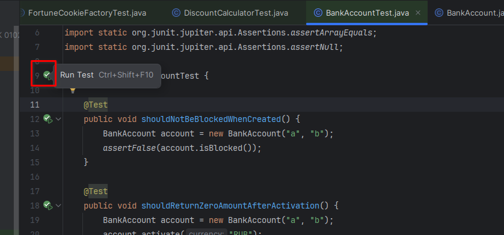
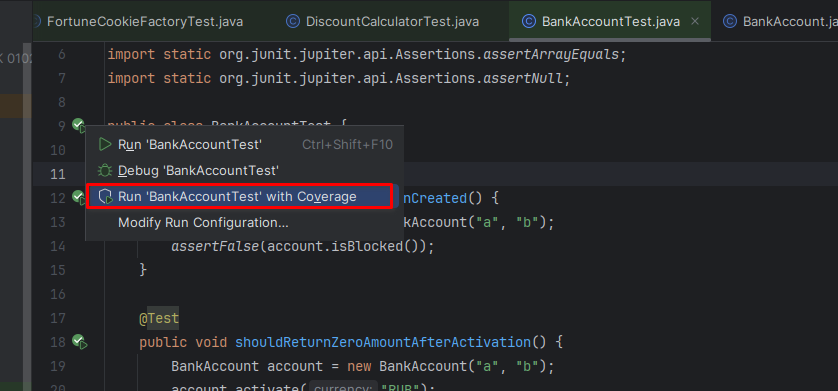
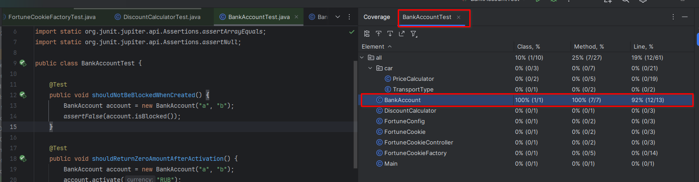
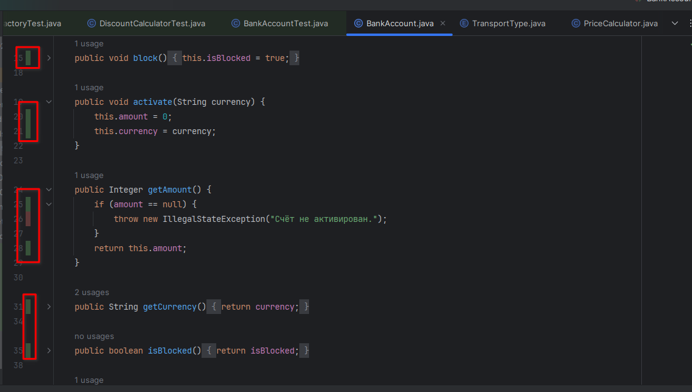

Предыдущее занятие |         &nbsp;          | Следующее занятие
:----------------:|:-----------------------:|:----------------:
[Урок 10](LESSON10.MD) | [Содержание](../README.MD) | [Урок 12](LESSON11.md)

# Лекция 8. Покрытие кода и покрытие требований

# Оглавление


[Покрытие кода и покрытие требований](#покрытие-кода-и-покрытие-требований)
* [Считаем тестовое покрытие в Intellij IDEA](#считаем-тестовое-покрытие-в-intellij-idea)


---

<details>

<summary>Покрытие кода и покрытие требований</summary>

# Покрытие кода и покрытие требований

[Оглавление](#оглавление)

С помощью техник выделения классов эквивалентности и 
граничных значений удобно проверять отдельно взятые методы и классы. 
Но в очень больших проектах невозможно выделить все возможные ситуации, 
в которых будет запускаться программа. А значит, и протестировать программу на 100% не получится. 

Поэтому при работе с масштабными проектами многие компании используют метрики покрытия кодовой базы тестами.
О двух таких метриках расскажем в этом уроке.

## Покрытие кода и покрытие требований

- **покрытие кода** (англ. _code coverage_), показывает, какой процент строк кода исполняется при запуске всех тестов. 
Это может быть и **70%** строк, и **5%** — в зависимости от количества и сложности тестов. **100%** бывает редко, потому что 
покрыть тестами абсолютно весь код — довольно трудоёмкая задача. 
Также покрытие кода иногда называют **тестовым покрытием** (англ. _test coverage_).
 
> 💡 Часто тестовое покрытие считают не от всего кода, 
> а только от **бизнес-логики** (англ. _business logic_) программы. 
> **Бизнес-логика (или бизнес-функционал)** — это та часть кода, которая описывает функциональные требования. 
> В неё не входят файлы конфигураций, настройки окружения и модели объектов. 
> Распространённая практика — устанавливать порог тестового покрытия бизнес-логики в 80%. 
> Такой уровень считается оптимальным соотношением между временем, 
> потраченным на написание тестов, и качеством готового продукта.


- **покрытие требований** (англ. _requirements coverage_), она показывает процент требований, проверенных набором тестов. 

Рассмотрим работу двух этих метрик на примере. 
Допустим, нужно написать метод `transfer(...)` (англ. «_перевод_»)
в классе `MoneyTransferService` (англ. «сервис по переводу денег»), который переводит сумму денег `amount` с одного счёта 
на другой. При этом должны соблюдаться следующие требования:
* переводить деньги можно только на другой счёт (нельзя совершить перевод на тот же счёт, с которого выполняется перевод);
* сумма перевода должна быть больше 0;
* баланс счёта, с которого осуществляется перевод, не может быть меньше 0;
* при зачислении средств на счёт его баланс может только расти.

Разработчик программы торопился и реализовал только два из четырёх требований. В результате код выглядит так:

```java
class MoneyTransferService {

    public int transfer(int amount, Account accountOne, Account accountTwo) {
        // переводить деньги можно только на другой счёт
        if (accountOne.id.equals(accountTwo.id)) {
            System.out.println("Нельзя перевести деньги на тот же аккаунт. Id: " + accountOne.id);
            return -2;
        }
        // сумма перевода должна быть больше 0
        if (amount <= 0){
            System.out.println("Сумма перевода должна быть больше 0. Текущая сумма: " + amount);
            return -1;
        }

        accountOne.balance -= amount;
        accountTwo.balance += amount;
        return 0;
    }

    
}

class Account {
    public String id;
    public int balance;

    public Account(String id, int balance) {
        this.id = id;
        this.balance = balance;
    }
}
```

Тесты

```java
import org.junit.jupiter.api.Test;

import static org.junit.jupiter.api.Assertions.assertEquals;

public class MoneyTransferTest {
    private final MoneyTransferService moneyTransferService = new MoneyTransferService();

    @Test
    void shouldMakeTransfer() {
        Account accountOne = new Account("1", 10);
        Account accountTwo = new Account("2", 10);
        
        assertEquals(0, moneyTransferService.transfer(7, accountOne, accountTwo), "Успешная транзакция должна возвращать результат 0");
        assertEquals(3, accountOne.balance);
        assertEquals(17, accountTwo.balance);
    }

    @Test
    void shouldNotTransferMoneyOnSameAccount() {
        Account accountOne = new Account("1", 10);
        assertEquals(-2, moneyTransferService.transfer(5, accountOne, accountOne), "Нельзя перевести деньги на тот же аккаунт. Id: 1");
    }

    @Test
    public void shouldNotTransferZero() {

        Account accountOne = new Account("1", 10);
        Account accountTwo = new Account("2", 10);

        assertEquals(-1, moneyTransferService.transfer(0, accountOne, accountTwo), "Сумма перевода должна быть больше 0. Текущая сумма: 0");
    }

}


```

Все написанные тесты будут пройдены. Но из этого не следует, что программа написана корректно. 

Покрытие кода в этом случае составит 100%, 
потому что в тесте вызывается каждая строчка кода. 
Тем не менее программа работает неправильно, потому что не выполнены два из четырёх требований: 
баланс может оказаться меньше нуля, а также программа неверно работает с переполнением при переводе очень больших сумм. 
Получается, что покрытие требований на текущий момент — только 50%.

Добавим тесты, чтобы проверить все требования:

```java
import org.junit.jupiter.api.Test;

import static org.junit.jupiter.api.Assertions.assertEquals;

public class MoneyTransferTest {
    private final MoneyTransferService moneyTransferService = new MoneyTransferService();

    @Test
    void shouldMakeTransfer() {
        Account accountOne = new Account("1", 10);
        Account accountTwo = new Account("2", 10);
        
        assertEquals(0, moneyTransferService.transfer(7, accountOne, accountTwo), "Успешная транзакция должна возвращать результат 0");
        assertEquals(3, accountOne.balance);
        assertEquals(17, accountTwo.balance);
    }

    @Test
    void shouldNotTransferMoneyOnSameAccount() {
        Account accountOne = new Account("1", 10);
        assertEquals(-2, moneyTransferService.transfer(5, accountOne, accountOne), "Нельзя перевести деньги на тот же аккаунт. Id: 1");
    }

    @Test
    public void shouldNotTransferZero() {

        Account accountOne = new Account("1", 10);
        Account accountTwo = new Account("2", 10);

        assertEquals(-1, moneyTransferService.transfer(0, accountOne, accountTwo), "Сумма перевода должна быть больше 0. Текущая сумма: 0");
    }

    @Test
    public void shouldNotMakeBalanceLessThanZero() {

        Account accountOne = new Account("1", 10);
        Account accountTwo = new Account("2", 10);
        assertEquals(-3, moneyTransferService.transfer(15, accountOne, accountTwo), "Недостаточно средств на счёте с id 1. Перевод суммы 15 невозможен.");
    }

    @Test
    public void shouldNotMakeOverflowOnTransfer() {

        Account accountOne = new Account("1", 10);
        Account accountTwo = new Account("2", Integer.MAX_VALUE);

        assertEquals(-4, moneyTransferService.transfer(1, accountOne, accountTwo), "Перевод невозможен. Если транзакция выполнится, счёт с id 2 будет переполнен.");
    }
}
```

Тесты `shouldNotMakeBalanceLessThanZero` и `shouldNotMakeOverflowOnTransfer` завершаются ошибкой. Они проверяют два условия:
* баланс счёта, с которого осуществляется перевод, не может быть меньше 0;
* при зачислении средств на счёт его баланс может только расти.

Исправим программу так, чтобы она проходила новые тесты. Но в этом коде не хватает ещё нескольких проверок: по граничным значениям и классам эквивалентности. 

```java
class MoneyTransferService {

    public int transfer(int amount, Account accountOne, Account accountTwo) {
        // переводить деньги можно только на другой счёт
        if (accountOne.id.equals(accountTwo.id)) {
            System.out.println("Нельзя перевести деньги на тот же аккаунт. Id: " + accountOne.id);
            return -2;
        }
        // сумма перевода должна быть больше 0
        if (amount <= 0){
            System.out.println("Сумма перевода должна быть больше 0. Текущая сумма: " + amount);
            return -1;
        }

        // баланс не может стать отрицательным
        if (amount > accountOne.balance) {
            System.out.println("Недостаточно средств на счёте с id " + accountOne.id + ". Перевод суммы " + amount + " невозможен.");
            return -3;
        }

        // перевод не должен приводить к переполнению баланса
        if (accountTwo.balance + amount < 0) {
            System.out.println("Перевод невозможен. Если транзакция выполнится, счёт с " + accountTwo.id + " будет переполнен.");
            return -4;
        }

        accountOne.balance -= amount;
        accountTwo.balance += amount;
        return 0;
    }
}
```

Теперь программа будет работать правильно в любой ситуации. 
Из этого примера можно сделать важный вывод: 

>> 100% покрытие кода совсем не означает, что программа работает корректно. Важно обращать внимание на покрытие требований.

## Считаем тестовое покрытие в Intellij IDEA

Процент запускаемых строчек кода во время теста очень легко подсчитать, например, в среде разработки IntelliJ IDEA.
Для этого перейдите в класс с тестами, наведите курсор
мышки на кнопку запуска одного теста или всего класса.



А затем выберите `Run 'BankAccountTest' with Coverage` (англ. «запустить [имя класса] с покрытием»).



После исполнения тестов в контекстном меню справа можно будет увидеть покрытие кода. 



Если открыть файл с кодом тестируемого класса, то покрытые тестами строки кода также будут выделяться зеленым цветом.



Убрать все обозначения можно командой `Hide Coverage` 
(англ. «**скрыть покрытие**»). Для этого дважды нажмите Shift для вызова контекстного меню, 
введите “Hide Coverage” и нажмите Enter. Или просто наведите курсор мыши на любой из зеленых или красных прямоугольников.
Далее в всплывающем меню нажмите на кнопку `Hide coverage`.


Аналогичным способом можно запустить тесты или подсчёт покрытия не для одного тест-класса, а для всех тестов внутри проекта. 

Для этого нужно щёлкнуть правой кнопкой мыши на открытом модуле в дереве проектов, 
в открывшемся меню выбрать “Run 'All Tests'” 
для запуска всех тестов или “More Run/Debug” → “Run 'All Tests' with Coverage” для подсчёта тестового покрытия.


Если покрытие уже было подсчитано для каких-то пакетов/тест-кейсов, то при запуске подсчёта покрытия для других пакетов IDEA спросит, что делать с новыми результатами:


* **Replace active suites** (англ. «_заменить текущие тест-кейсы»_) — оставит только что запущенный результат;
* **Add to active suites** (англ. «_добавить к текущим тест-кейсам_») — добавит к имеющимся результатам новый;
* **Do not apply collected coverage** (англ. «_не принимать подсчитанное покрытие_») — оставит старые результаты;

Если отметить пункт “Do not show this dialog in the future” (англ. «больше не показывать этот диалог»), 
то выбранный пункт будет применяться всегда.

После подсчётов статистика будет показана для каждого тестируемого класса и для проекта вцелом.


> Если вместо покрытия кода сфокусироваться на покрытии требований к программе, 
> с высокой вероятностью это приведёт к 100% покрытию кода.

</details>

