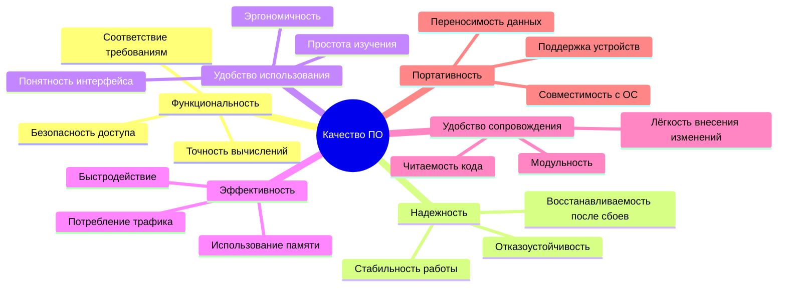
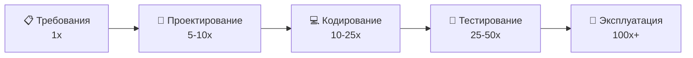
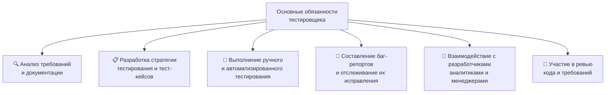
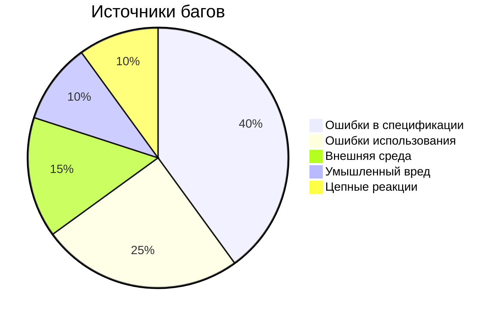

Предыдущее занятие |         &nbsp;          | Следующее занятие
:----------------:|:-----------------------:|:----------------:
[ЛЕКЦИЯ 1](LESSON1.MD) | [Содержание](README.MD) | [ЛЕКЦИЯ 2](LESSON2.md)

# 📚 ЛЕКЦИЯ 1: Тестирование как часть процесса верификации программного обеспечения

**Дисциплина:** МДК 01.02 Поддержка и тестирование программных модулей  
**Группа:** 2 курс
**Преподаватель:** Сафиулин Руслан Ринатович  

---
# 📑 Оглавление

1. [Введение](#введение)
2. [Лекция 1: Тестирование как часть процесса верификации программного обеспечения](#-лекция-1-тестирование-как-часть-процесса-верификации-программного-обеспечения)
   - [Цели урока](#-цели-урока)
   - [План урока](#-план-урока)
   - [Организационный момент](#-1-организационный-момент)
   - [Мотивационный блок](#-2-мотивационный-блок)
   - [Исторический экскурс: как развивалось тестирование](#-3-исторический-экскурс-как-развивалось-тестирование)
   - [Качество программного обеспечения](#-4-качество-программного-обеспечения)
   - [Базовые термины: Ошибка, Дефект, Сбой](#-5-базовые-термины-ошибка-дефект-сбой)
   - [Уровни возникновения дефектов](#-6-уровни-возникновения-дефектов)
   - [Причины появления дефектов в программном коде](#-7-причины-появления-дефектов-в-программном-коде)
   - [Кто такой тестировщик и что он делает](#-8-кто-такой-тестировщик-и-что-он-делает)
   - [Источники багов](#-9-источники-багов-источники-дефектов)
   - [Подведение итогов](#-10-подведение-итогов-и-выдача-домашнего-задания)
3. [Домашнее задание к лекции 1](#-домашнее-задание-к-лекции-1)
   - [Задание 1. «Расследование: Ошибка века»](#-задание-1-расследование-ошибка-века-4-балла)
   - [Задание 2. «Диагност качества»](#-задание-2-диагност-качества-4-балла)
   - [Задание 3. «Я — тестировщик»](#-задание-3-я--тестировщик-2-балла)
   - [Сдача работы](#-сдача-работы)
   - [Критерии оценки](#-критерии-оценки)
---

## 🎯 Цели урока

| **Обучающая** | **Развивающая** | **Воспитательная** |
|---------------|-----------------|--------------------|
| Сформировать у студентов целостное понимание роли тестирования в жизненном цикле ПО, базовой терминологии и модели качества ПО | Развить аналитическое мышление, способность критически оценивать качество ПО и систематизировать информацию | Привить осознание ответственности тестировщика за качество конечного продукта и понимание социальной значимости профессии |

---

## 🗂️ План урока

| № | Этап урока | Время               |
|---|------------|---------------------|
| 1 | Организационный момент | 3 мин               |
| 2 | Мотивационный блок | 5 мин               |
| 3 | Исторический экскурс: как развивалось тестирование | 8 мин               |
| 4 | Качество программного обеспечения | 12 мин              |
| 5 | Базовые термины: Ошибка, Дефект, Сбой | 12 мин              |
| 6 | Уровни возникновения дефектов | 7 мин               |
| 7 | Причины появления дефектов | 5 мин               |
| 8 | Кто такой тестировщик и что он делает | 10 мин              |
| 9 | Источники багов | 5 мин               |
| 10 | Подведение итогов и выдача домашнего задания | 8 мин               |
| **Итого** | | **90 мин (1 пара)** |

---

## 📖 1. Организационный момент

Приветствие группы, проверка присутствующих, объявление темы и плана занятия.

**Тема урока:** *Тестирование как часть процесса верификации программного обеспечения*

> 💡 «Сегодня мы начнём наше путешествие в мир тестирования программного обеспечения. Мы узнаем, что такое качество ПО, откуда берутся ошибки, кто такой тестировщик и почему эта профессия сегодня одна из самых востребованных в IT».

---

## 🔥 2. Мотивационный блок

### 📌 Вопрос к группе:
*«Представьте, что вы купили билет на самолёт. Система управления полётом — это тоже программное обеспечение. Готовы ли вы лететь, если программу не тестировали?»*

### 📌 Реальный кейс:
**Ошибка в ПО стоимостью в $500 млн** — крушение ракеты Ariane 5 в 1996 году из-за ошибки преобразования данных. ПО работало «по плану», но план был неправильным. Это наглядно показывает разницу между **верификацией** (мы сделали всё по плану) и **валидацией** (план был правильным?).

**Вывод:** Тестирование — это не формальность, а вопрос безопасности, денег и репутации.

---

## 📜 3. Исторический экскурс: как развивалось тестирование

🔹 **1940–1950-е гг. — «Эра отладки»**
- Компьютеры были большими и дорогими, программы — короткими и писались на машинных кодах.
- Проверка сводилась к отладке: разработчик запускал программу, смотрел, работает ли она, и исправлял ошибки «на лету».
- Тестирование как отдельная деятельность не выделялось.

🔹 **1957–1970-е гг. — «Эра демонстрации»**
- Чарльз Л. Бейкер в 1957 году впервые разделил отладку и тестирование.
- Тестирование рассматривалось как **доказательство** того, что программа соответствует спецификации.
- Основная цель — **подтвердить**, что программа работает правильно.

🔹 **1979 г. — «Эра разрушения»**
- Выход книги Гленфорда Майерса «Искусство тестирования программ» перевернул представление.
- **Новое определение:** «Тестирование — это процесс обнаружения ошибок».
- Цель — не доказать, что всё работает, а **найти** максимум дефектов.

🔹 **1980-е гг. — «Эра оценки»**
- Тестирование интегрируется во все этапы разработки (требования, проектирование, кодирование).
- Появляются стандарты (IEEE, ГОСТ ЕСПД), регламентирующие документирование и процесс тестирования.
- Внимание смещается к **качеству** в целом, а не только к поиску багов.

🔹 **1990-е — настоящее время — «Эра управления качеством»**
- Бурное развитие автоматизации тестирования и CASE-средств.
- Появление методологий **TDD** (Test-Driven Development) и **BDD** (Behavior-Driven Development).
- Тестирование становится частью культуры разработки, а не изолированным этапом.
- Современные DevOps-практики требуют непрерывного тестирования (Continuous Testing).

> 📝 **Краткий конспект:** Тестирование прошло путь от «проверки работающего кода» до «культуры управления качеством на всех этапах разработки».

---

## 💎 4. Качество программного обеспечения

### 📌 Определения

**Качество программного обеспечения** — это степень, в которой ПО обладает требуемой комбинацией свойств (характеристик).

В более развернутом виде: **совокупность характеристик ПО, относящихся к его способности удовлетворять установленные и предполагаемые потребности**.

> **Требование (Requirement)** — потребность или ожидание, которое установлено, обычно предполагается или является обязательным.

### 📊 Модель качества (по стандарту ISO/IEC 25010)

| Характеристика (рус.) | Характеристика (англ.) | Краткое описание |
|------------------------|------------------------|-------------------|
| **Функциональность** | **Functionality** | Способность ПО выполнять задачи, для которых оно предназначено, в заданных условиях |
| **Надежность** | **Reliability** | Способность сохранять работоспособность в течение определённого времени; устойчивость к сбоям |
| **Удобство использования** | **Usability** | Понятность, простота изучения, эргономичность, удовлетворённость пользователя |
| **Эффективность** | **Efficiency** | Соотношение производительности (быстродействия) и потребляемых ресурсов (память, процессор, сеть) |
| **Удобство сопровождения** | **Maintainability** | Лёгкость внесения изменений (исправления ошибок, добавления нового функционала) |
| **Портативность** | **Portability** | Способность ПО быть перенесённым на другую аппаратную платформу или операционную систему |

### 📌 Схема модели качества

### 💡 Пример из жизни:

Мобильное приложение «Умный дневник» должно:
- ✅ **функционально** правильно выставлять оценки;
- ✅ **надёжно** работать при одновременном доступе тысяч родителей;
- ✅ **удобно** использоваться детьми, родителями и учителями (разные интерфейсы);
- ✅ **эффективно** работать даже на слабых телефонах;
- ✅ **легко сопровождаться** — быстро добавлять новые предметы или отчёты;
- ✅ **портироваться** на iOS и Android без переписывания всего кода.

> 🗣️ **Обсуждение в группе:** *«Какие из этих характеристик вы считаете самыми важными для банковского приложения? А для мобильной игры? А для приложения для записи к врачу?»*

---

## 🔍 5. Базовые термины: Ошибка, Дефект, Сбой

В тестировании важно различать три ключевых понятия:

### 📌 Определения

| Термин | Определение | Пример |
|--------|-------------|--------|
| **❌ Ошибка (Error)** | Действие человека, которое порождает неправильный результат. Это может быть неверное понимание требования, опечатка в коде, неверная формула. | Программист перепутал знак «+» и «-» в формуле расчёта итоговой оценки. |
| **🐛 Дефект, Баг (Defect, Bug)** | Недостаток компонента или системы, который может привести к отказу определённой функциональности. Дефект — это *проявление* ошибки в коде, документации или дизайне. | В коде расчёта итоговой оценки заложена неверная формула (вместо сложения вычитание). |
| **💥 Сбой (Failure)** | Несоответствие фактического результата работы компонента или системы ожидаемому результату. Сбой — это *внешнее проявление* дефекта, которое видит пользователь. | Ученик получил итоговую оценку 2, хотя должен был получить 4. |

### ⚠️ Условия существования дефекта (три обязательных условия):

1. Известен **ожидаемый результат** (эталон).
2. Известен **фактический результат** (полученный).
3. Фактический результат **отличается** от ожидаемого.

**Если нет эталона** — мы не знаем, баг это или фича.  
**Если результат совпадает** — дефекта нет.

### 🔄 Схема взаимосвязи

> 💬 **Вопрос для закрепления:** *«Приведите свой пример: какая ошибка программиста → какой дефект → какой сбой увидит пользователь?»*

---

## 🧱 6. Уровни возникновения дефектов

Ошибки могут быть допущены на разных этапах разработки, и последствия этого сильно различаются.

### 📊 Уровни дефектов

### 📌 Описание уровней

| Уровень | Сложность обнаружения | Сложность исправления | Последствия |
|---------|----------------------|----------------------|-------------|
| **📋 Уровень требований** | ⚠️ Самая высокая | ⚠️ Самая высокая | Программа прошла все тесты, но заказчик её забраковал |
| **📐 Уровень проектирования** | ⚠️ Высокая | ⚠️ Высокая | Требует серьёзной переработки архитектуры |
| **💻 Уровень кодирования** | ✅ Низкая | ✅ Низкая | Легко находится и исправляется в процессе отладки |

> 💰 **Практическое правило:** чем раньше найдена ошибка, тем дешевле её исправить. Поэтому тестирование должно начинаться уже на этапе анализа требований.

### 📊 График стоимости исправления ошибок

> 💡 *На этом графике видно, что ошибка, найденная на этапе эксплуатации, может стоить в 100 раз дороже, чем если бы её нашли на этапе требований.*

---

## ⚙️ 7. Причины появления дефектов в программном коде

Согласно исследованиям, основные причины дефектов:

| № | Причина | Описание |
|---|---------|----------|
| 1 | 🗣️ **Недостаток общения в команде** | Разработчики, аналитики и тестировщики не синхронизируют свои действия |
| 2 | 🔬 **Сложность ПО** | Современные системы имеют миллионы строк кода и множество зависимостей |
| 3 | 🔄 **Изменения требований** | Частая смена требований ведёт к переделкам, в которых легко ошибиться |
| 4 | 📄 **Плохо документированный код** | Отсутствие комментариев и документации затрудняет понимание и поддержку |
| 5 | 🛠️ **Средства разработки ПО** | Инструменты и компиляторы тоже могут содержать ошибки |

> 🗣️ **Обсуждение:** *«Сталкивались ли вы с последствиями плохого общения в команде при выполнении групповых проектов?»*

---

## 🧑‍💻 8. Кто такой тестировщик и что он делает?

**Тестировщик (QA-инженер)** — специалист, обеспечивающий качество программного продукта путём проверки его соответствия требованиям, поиска дефектов и оценки рисков.

### 🎯 Главная цель тестировщика
> «Понимать, что в настоящий момент необходимо проекту, получает ли проект это необходимое в должной мере и, если нет, то как изменить ситуацию к лучшему».

### 📝 Основные обязанности

### 🛠️ Технические навыки (Hard skills)

| № | Навык | Почему важен |
|---|-------|--------------|
| 1 | 🌍 **Английский язык** | Большая часть документации, форумов, инструментов — на английском |
| 2 | 🖥️ **Продвинутый пользователь ПК** | Работа с ОС, файловой системой, командной строкой |
| 3 | 💻 **Основы программирования** | Для написания автотестов, понимания кода (Python, Java, JS) |
| 4 | 🗄️ **Базы данных и SQL** | Для проверки данных, выполнения запросов |
| 5 | 🌐 **Понимание работы сетей** | HTTP/HTTPS, API, клиент-серверная архитектура |
| 6 | 📱 **Веб и мобильные приложения** | Браузерные инструменты разработчика, эмуляторы, отладка |

### ❤️ Личностные качества (Soft skills)

| № | Качество | Почему важно |
|---|----------|--------------|
| 1 | 🔒 **Ответственность** | От работы тестировщика зависит репутация продукта |
| 2 | 🗣️ **Коммуникабельность** | Умение чётко и вежливо донести информацию о баге до разработчика |
| 3 | 🧘 **Усидчивость** | Рутинные проверки, многократное повторение действий |
| 4 | 🧠 **Аналитическое мышление** | Поиск неочевидных сценариев, понимание бизнес-логики |
| 5 | 🔎 **Исследовательский склад ума** | Любопытство, желание разобраться, как работает система |
| 6 | 👀 **Внимательность к деталям** | Замечать малейшие отклонения от ожидаемого результата |

> 🗣️ **Обсуждение:** *«Какими из этих качеств вы обладаете? Какие хотите развить?»*

---

## 🧩 9. Источники багов (источники дефектов)

Ошибки могут возникать не только в коде.

| № | Источник | Описание |
|---|----------|----------|
| 1 | 📄 **Ошибки в спецификации** | Неправильно написанные требования, дизайн или реализация |
| 2 | 👤 **Ошибки использования** | Пользователь делает что-то, что разработчик не предусмотрел |
| 3 | 🌍 **Внешняя среда** | Проблемы с сетью, операционной системой, железом |
| 4 | 🕵️ **Умышленный вред** | Действия злоумышленников (взломы, SQL-инъекции) |
| 5 | ⛓️ **Цепные реакции** | Потенциальные последствия предыдущих ошибок |

> 💡 *Наибольший процент багов возникает из-за ошибок в спецификации — именно поэтому тестировщики должны участвовать в анализе требований на ранних этапах!*

---

## 🏁 10. Подведение итогов и выдача домашнего задания

### 📌 Ключевые выводы урока

- 🧪 **Тестирование** — это не просто поиск багов, а комплексная деятельность по обеспечению качества.
- 📊 Качество ПО многогранно: функциональность, надёжность, удобство использования, эффективность, сопровождаемость и портативность.
- ❌ **Ошибка** человека → 🐛 **дефект** в коде → 💥 **сбой**, который видит пользователь.
- ⏰ Чем раньше найдена ошибка, тем дешевле её исправить.
- 🧑‍💻 **Тестировщик** — это не «кнопкотык», а интеллектуальный аналитик, обладающий техническими и личностными навыками.
- 📋 Ошибки на уровне **требований** — самые дорогие и опасные.

### ❓ Вопросы для закрепления (устно на паре)

1. 📖 Что такое качество ПО и какие его характеристики вы знаете?
2. 🔍 В чём разница между ошибкой, дефектом и сбоем?
3. ⚠️ Какие три условия должны быть выполнены, чтобы можно было говорить о дефекте?
4. 📋 Почему ошибки на уровне требований самые опасные?
5. 🛠️ Назовите причины появления дефектов в коде.

---

# 🏠 ДОМАШНЕЕ ЗАДАНИЕ К ЛЕКЦИИ 1

**Тема:** Тестирование как часть процесса верификации ПО  
**Формат сдачи:** Письменный отчёт (Microsoft Word, .docx)  
**Срок сдачи:** до 23:59 8 сентября 2026 г.

---

## 📝 ЗАДАНИЕ 1. «Расследование: Ошибка века» (4 балла)

*Это задание проверит, как вы понимаете цепочку возникновения дефекта и умеете работать с информацией.*

В лекции упоминалась катастрофа ракеты **Ariane 5** (1996 год). Ваша задача — найти в интернете (или вспомнить из лекции) детали этой аварии и заполнить таблицу.

**Инструкция:** Используя поисковик, найдите **техническую причину** взрыва ракеты Ariane 5. Заполните таблицу, опираясь на определения из лекции:

| Термин | Определение из лекции | Ваш ответ применительно к Ariane 5 |
| :--- | :--- | :--- |
| **Ошибка (Error)** | Действие человека, которое порождает неправильный результат. | *(Напишите, что именно сделали инженеры/программисты неправильно)* |
| **Дефект / Баг (Defect)** | Недостаток компонента или системы, который может привести к отказу. | *(Опишите, какой недостаток был заложен в программное обеспечение)* |
| **Сбой (Failure)** | Несоответствие фактического результата ожидаемому. | *(Напишите, что именно произошло с ракетой в реальности)* |
| **Уровень возникновения** | Требований / Проектирования / Кодирования | *(Определите, на каком уровне разработки была допущена эта ошибка и почему вы так считаете)* |

---

## 🧩 ЗАДАНИЕ 2. «Диагност качества» (4 балла)

*Это задание готовит вас к тесту, который мы будем проходить на следующем занятии. Оно проверяет понимание 6 характеристик качества ПО.*

**Представьте:** Вы тестируете приложение **«Калькулятор здорового питания»**. Пользователи жалуются на разные проблемы. Соотнесите каждую проблему с той **характеристикой качества**, которая нарушена (выберите из списка: *Функциональность, Надёжность, Удобство использования, Эффективность, Удобство сопровождения, Портативность*).

| № | Описание проблемы (жалоба пользователя) | Нарушенная характеристика качества |
| :--- | :--- | :--- |
| 1 | «Я установил приложение на старый телефон с Android 6, и оно вообще не запускается!» | _____________ |
| 2 | «Я ввёл свой рост 180 см, а программа выдала результат, как будто я ввёл 150 см. Всё пересчитала неправильно!» | _____________ |
| 3 | «Каждый раз, когда я пытаюсь сохранить дневник питания, приложение вылетает (крашится)». | _____________ |
| 4 | «Я не могу понять, где здесь кнопка «Добавить продукт». Интерфейс запутанный, нашёл только через 10 минут». | _____________ |
| 5 | «Пока я загружал список продуктов из интернета, телефон сильно нагрелся и разрядился на 20% за 2 минуты». | _____________ |
| 6 | «Разработчикам потребовалось 3 недели, чтобы поправить опечатку в названии продукта «Гречка». Очень долго». | _____________ |

---

## 🧑‍💻 ЗАДАНИЕ 3. «Я — тестировщик» (2 балла)

*Это задание на рефлексию и самопознание, оно показывает, насколько вы осознаёте требования профессии.*

В лекции мы выделили **личные качества** (внимательность, коммуникабельность, усидчивость) и **технические навыки** (знание SQL, сетей, английского).

**Вопрос:** Оцените себя по 5-балльной шкале (1 — совсем не развито, 5 — отлично развито) по трём параметрам ниже. **Напишите 1-2 предложения**, почему вы поставили себе такую оценку и как этот навык пригодится вам в работе тестировщика.

1. **Внимательность к деталям:** Оценка ___ .  
   Комментарий: _______________________________________________________________

2. **Коммуникабельность (умение ясно писать/говорить):** Оценка ___ .  
   Комментарий: _______________________________________________________________

3. **Английский язык (чтение технической документации):** Оценка ___ .  
   Комментарий: _______________________________________________________________

---

## 📤 СДАЧА РАБОТЫ

**Внимание!** Домашнее задание принимается **только в электронном виде** через Google-форму.

1. 📄 **Оформите отчёт** в Microsoft Word. Объедините все три задания в один документ.
2. 💾 **Сохраните файл** в формате **.docx**.
3. 📛 **Название файла** должно быть по шаблону:  
   `Фамилия_Имя_Группа_Лекция1.docx`  
   *(Например: Иванов_Петр_255_Лекция1.docx)*
4. 🔗 **Перейдите по ссылке** на Google-форму: **[255 группа](https://forms.gle/bHnyTvnETdBVETE56)** | **[257 группа](https://forms.gle/99HqrgM4HMhxrJEg6)**
5. ✍️ **Укажите** в форме:
   - Фамилию, Имя
6. 📎 **Загрузите** файл с отчётом.
7. ✅ **Нажмите «Отправить»** и убедитесь, что получили уведомление об успешной отправке.

⏰ **Срок сдачи:** до **23:59 8 сентября 2026 г.**  
Работы, сданные после дедлайна, оцениваются сниженным баллом (не более 50% от максимума).

---

## ⭐ КРИТЕРИИ ОЦЕНКИ

| Оценка | Баллы | Требования |
|--------|-------|------------|
| **«Отлично»** | 10/10 | Задание 1 заполнено верно по фактам Ariane 5. Задание 2 — все 6 пунктов соотнесены без ошибок. Задание 3 — даны развёрнутые, осмысленные комментарии к самооценке. |
| **«Хорошо»** | 7-8/10 | Допущена 1 ошибка в Задании 2 или неполный ответ в Задании 1, но суть понята. |
| **«Удовлетворительно»** | 5-6/10 | Допущены 2-3 ошибки в Заданиях 1 и 2, комментарии в Задании 3 очень краткие. |
| **«Неудовлетворительно»** | 0 баллов | Задание не выполнено или выполнено формально (скопировано без осмысления). |

