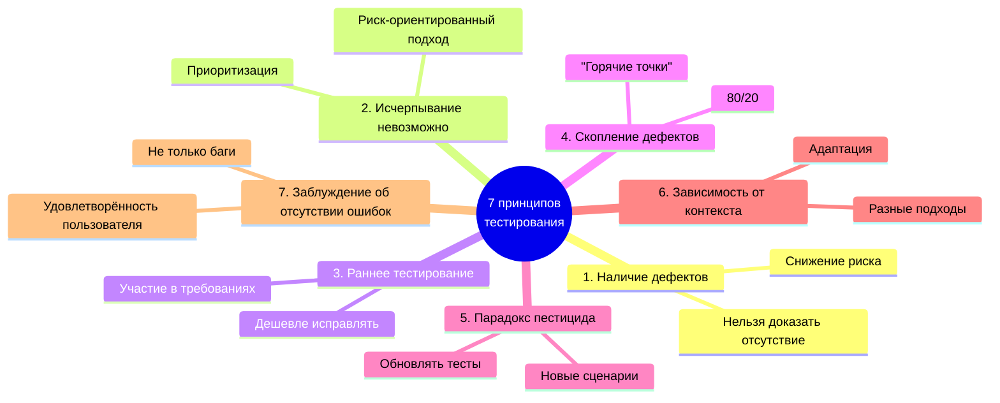
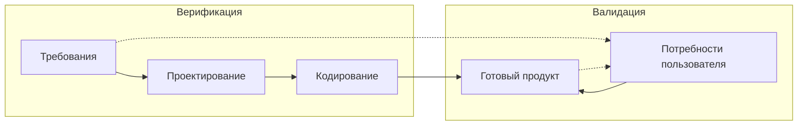
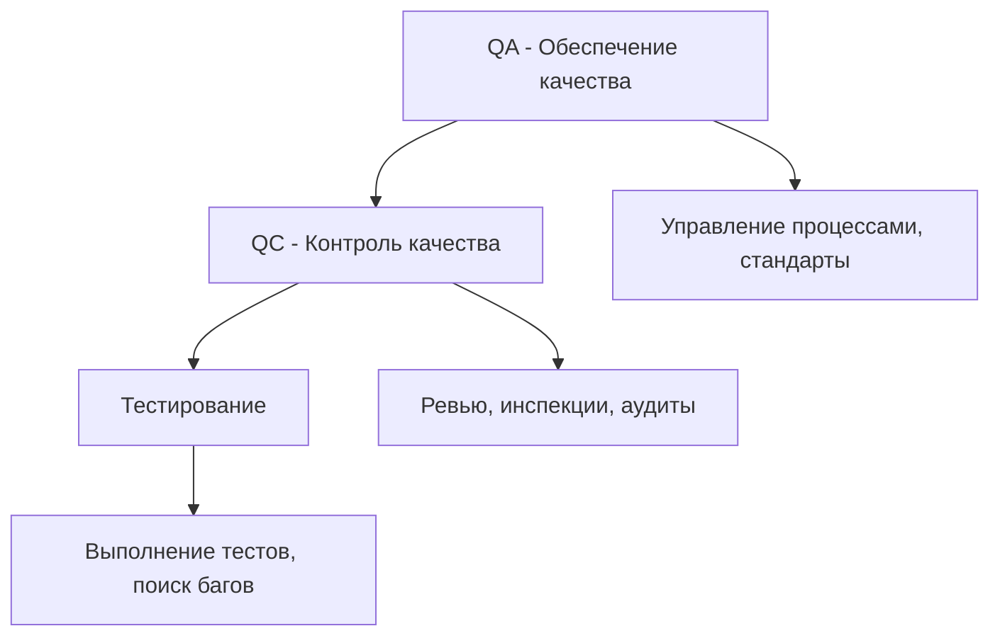

| Предыдущее занятие | | Следующее занятие |
|:----------------:|:-----------------------:|:----------------:|
| [ЛЕКЦИЯ 1](LESSON1.MD) | [Содержание](README.MD) | [ЛЕКЦИЯ 3](LESSON3.md) |

---

# 📚 ЛЕКЦИЯ 2: Принципы тестирования. Верификация и валидация

**Дисциплина:** МДК 01.02 Поддержка и тестирование программных модулей  
**Группа:** 2 курс  
**Преподаватель:** Сафиулин Руслан Ринатович  

---

# 📑 Оглавление

1. [Лекция 2: Принципы тестирования. Верификация и валидация](#-лекция-2-принципы-тестирования-верификация-и-валидация)
   - [Цели урока](#-цели-урока)
   - [План урока](#-план-урока)
   - [Организационный момент и входное тестирование](#-1-организационный-момент-и-входное-тестирование)
   - [Мотивационный блок](#-2-мотивационный-блок)
   - [Принципы тестирования (ISTQB)](#-3-принципы-тестирования-istqb)
   - [Верификация и валидация](#-4-верификация-и-валидация)
   - [QA, QC и тестирование](#-5-qa-qc-и-тестирование)
   - [Практический кейс: «Умный дневник»](#-6-практический-кейс-умный-дневник)
   - [Подведение итогов](#-7-подведение-итогов)
2. [Домашнее задание к лекции 2](#-домашнее-задание-к-лекции-2)
   - [Задание 1. «Критический ответ»](#-задание-1-критический-ответ-4-балла)
   - [Задание 2. «Практическое предложение»](#-задание-2-практическое-предложение-4-балла)
   - [Задание 3. «Рефлексия: Верификация vs Валидация»](#-задание-3-рефлексия-верификация-vs-валидация-2-балла)
   - [Сдача работы](#-сдача-работы)
   - [Критерии оценки](#-критерии-оценки)

---

## 🎯 Цели урока

| **Обучающая** | **Развивающая** | **Воспитательная** |
|---------------|-----------------|--------------------|
| Сформировать у студентов понимание семи принципов тестирования, различий между верификацией и валидацией, а также иерархии QA, QC и тестирования | Развить навыки критического мышления, аргументации и принятия решений в условиях ограниченного времени | Привить осознание профессиональной ответственности за качество продукта и умение отстаивать свою позицию перед стейкхолдерами |

---

## 🗂️ План урока

| № | Этап урока | Время               |
|---|------------|---------------------|
| 1 | Организационный момент и входное тестирование | 10 мин              |
| 2 | Мотивационный блок | 5 мин               |
| 3 | Принципы тестирования (ISTQB) | 20 мин              |
| 4 | Верификация и валидация | 13 мин              |
| 5 | QA, QC и тестирование | 8 мин               |
| 6 | Практический кейс: «Умный дневник» | 22 мин              |
| 7 | Подведение итогов и выдача домашнего задания | 7 мин               |
| **Итого** | | **90 мин (1 пара)** |

---

## 📖 1. Организационный момент и входное тестирование

Приветствие группы, проверка присутствующих.

### 📌 Входное тестирование (проверка ДЗ с прошлого занятия)

> 💡 *«Прежде чем мы перейдём к новой теме, давайте проверим, как вы усвоили материал прошлого занятия. Тест уже опубликован в Google Формах. Перейдите по ссылке в чате и выполните задания. У вас будет 7-10 минут»*

**Ссылка на тест:** **[255 группа](https://forms.gle/jZUJoJRT6kFJgrP67)** | **[257 группа](https://forms.gle/P1Tt7j9VJYgkwTRE9)**

|Количество баллов | Оценка |
|--------|----------|
|🟢 19-20 баллов | 5️⃣(😎) |
|🟡 17-18 баллов | 4️⃣(😇) | 
|🟠 12-16 баллов | 3️⃣(😬 ) | 
|🔴 0-11 баллов | 2️⃣(🤬) |

## 🔥 2. Мотивационный блок

### 📌 Вопрос к группе:
*«Представьте, что вы — тестировщик в проекте «Умный дневник». Менеджер говорит: «Мы уже прогнали все тесты, давайте релизиться!» Ваши действия? Что вы скажете менеджеру?»*

### 📌 Почему это важно:

Сегодня мы научимся **аргументированно отстаивать качество продукта**. Знание принципов тестирования — это не просто теория для экзамена. Это **инструмент**, который позволяет:
- Доказывать руководству необходимость тестирования;
- Принимать правильные решения в условиях дефицита времени;
- Строить стратегию тестирования, а не просто «тыкать кнопки».

**Вывод:** Сегодняшние знания — это ваша профессиональная «броня» и «оружие».

---

## 📌 3. Принципы тестирования (ISTQB)

Международный стандарт ISTQB выделяет **семь фундаментальных принципов**, которые лежат в основе любой тестовой деятельности.

### 1️⃣ Тестирование показывает наличие дефектов, а не их отсутствие

| Аспект | Описание |
|--------|----------|
| **Суть** | Успешный тест — тот, который **находит** ошибку. Тестирование никогда не может доказать, что программа абсолютно безошибочна. Оно лишь снижает риск. |
| **Пример** | После недели тестирования приложение «Умный дневник» не нашло ни одного бага. Это не значит, что багов нет; возможно, тесты были слабыми. |
| **Вывод** | Нельзя говорить «программа работает», можно говорить «мы не нашли ошибок в протестированных сценариях». |

---

### 2️⃣ Исчерпывающее тестирование невозможно

| Аспект | Описание |
|--------|----------|
| **Суть** | Невозможно проверить все комбинации входных данных и состояний системы. Вместо этого тестирование должно быть **риск-ориентированным**. |
| **Пример** | В «Умном дневнике» невозможно проверить все варианты расписания для всех классов. Но можно протестировать типовые недели, граничные даты, переходы между четвертями. |
| **Вывод** | Нужно сосредоточиться на наиболее критичных функциях и вероятных местах ошибок. |

---

### 3️⃣ Раннее тестирование экономит время и деньги

| Аспект | Описание |
|--------|----------|
| **Суть** | Ошибки, обнаруженные на этапе требований, исправляются в сотни раз дешевле, чем на этапе эксплуатации. |
| **Пример** | Если на этапе анализа выяснится, что родители хотят видеть не только оценки, но и комментарии учителей, то это требование можно заложить в ТЗ до начала разработки. |
| **Вывод** | Тестировщики должны участвовать в обсуждении требований и дизайна с самого начала. |

---

### 4️⃣ Дефекты имеют свойство скапливаться (скопление дефектов)

| Аспект | Описание |
|--------|----------|
| **Суть** | Обычно 80% всех ошибок сосредоточено в 20% модулей. Надо выявлять «горячие точки» и тестировать их с повышенным вниманием. |
| **Пример** | В «Умном дневнике» модуль «Выставление оценок» может быть самым сложным и содержать большинство багов — его нужно тестировать особенно тщательно. |
| **Вывод** | Анализируйте статистику дефектов и направляйте усилия на самые проблемные области. |

---

### 5️⃣ Парадокс пестицида

| Аспект | Описание |
|--------|----------|
| **Суть** | Если повторять одни и те же тесты снова и снова, они перестают находить новые ошибки. Тест-кейсы нужно регулярно пересматривать и обновлять. |
| **Пример** | Первый набор тестов для «Умного дневника» нашёл 100 багов. Если запустить их второй раз, они найдут только те, что были пропущены в прошлый раз, но не новые. |
| **Вывод** | Регулярно рецензируйте и дополняйте тест-кейсы новыми сценариями. |

---

### 6️⃣ Тестирование зависит от контекста

| Аспект | Описание |
|--------|----------|
| **Суть** | Разные системы требуют разных подходов. Тестирование медицинской системы и мобильной игры существенно отличается. |
| **Пример** | Для «Умного дневника» критически важны **безопасность** (личные данные детей) и **нагрузочное тестирование** (утренний пик). Для игры на первое место выйдет юзабилити и производительность. |
| **Вывод** | Адаптируйте стратегию тестирования под специфику продукта. |

---

### 7️⃣ Заблуждение об отсутствии ошибок

| Аспект | Описание |
|--------|----------|
| **Суть** | Даже если программа не содержит дефектов, это не гарантирует успеха. Пользователь может отвергнуть продукт из-за неудобства или несоответствия ожиданиям. |
| **Пример** | «Умный дневник» может быть идеально реализован технически, но если интерфейс неудобен для пожилых родителей, они не будут им пользоваться. |
| **Вывод** | Проверяйте не только функциональность, но и удовлетворённость пользователя. |

---

### 📊 Схема принципов тестирования

---

## 🔄 4. Верификация и валидация

Это два ключевых понятия, которые часто путают.

### 📌 Сравнительная таблица

| | **Верификация (Verification)** | **Валидация (Validation)** |
|------------------------|--------------------------------|-----------------------------|
| **Вопрос** | «Строим ли мы систему правильно?» | «Строим ли мы правильную систему?» |
| **Смысл** | Соответствие промежуточных продуктов утверждённым стандартам и спецификациям | Соответствие конечного продукта реальным потребностям пользователей |
| **Когда** | На протяжении всего жизненного цикла | В основном на этапе приёмки |
| **Инструменты** | Ревью, инспекции, статический анализ, модульное тестирование | Приёмочное тестирование, бета-тестирование, UX-тестирование |
| **Пример** | Проверка, что модуль входа реализован по ТЗ | Проверка, что родителям удобно входить и видеть оценки своего ребёнка |

### 🔄 Схема взаимосвязи

> ⚠️ **Важно:** Верификация без валидации бессмысленна. Можно строго следовать ТЗ и создать идеальную с технической точки зрения систему, которая никому не нужна.

---

## 🏗️ 5. QA, QC и тестирование

Эти термины часто используют как синонимы, но между ними есть чёткие различия.

### 📌 Определения

- **✅ QA (Quality Assurance / Обеспечение качества)** — **процессно-ориентированная** деятельность. Направлена на **предотвращение** дефектов путём улучшения процессов разработки, стандартов, обучения сотрудников. Вопрос: *«Как сделать так, чтобы ошибки не появлялись?»*

- **🔍 QC (Quality Control / Контроль качества)** — **продукто-ориентированная** деятельность. Направлена на **обнаружение** дефектов в уже созданном продукте. Вопрос: *«Соответствует ли продукт заданным критериям качества?»*

- **🧪 Тестирование (Testing)** — конкретные действия по проверке продукта, часть QC. Включает написание тест-кейсов, их выполнение, анализ результатов, составление отчётов.

### 📊 Иерархия

### 💡 Пример

В компании есть отдел QA, который разрабатывает политику тестирования, обучает сотрудников, выбирает инструменты.

Отдел QC (или группа тестирования) проверяет конкретные сборки «Умного дневника», проводит ревью требований, организует приёмочное тестирование.

Тестировщики в рамках QC пишут тест-кейсы, запускают автотесты, заносят баги в Jira.

---

## 🧠 6. Практический кейс: «Умный дневник»

*Это задание заставит вас не просто пересказать теорию, а применить её в смоделированной рабочей ситуации.*

### 📖 Ситуация

Команда разработки создает новое мобильное приложение — **«Умный дневник»** для школьников и родителей. Приложение позволяет:

- **Ученикам:** просматривать расписание, домашние задания, оценки.
- **Родителям:** видеть оценки и посещаемость ребенка, получать уведомления.
- **Учителям:** выставлять оценки и назначать домашние задания.

Проект сильно отстает от графика. Чтобы успеть к запуску к 1 сентября, менеджер продукта предлагает **сократить время на тестирование в два раза**. Он аргументирует это следующим:

1. *«Мы и так провели много модульных тестов, разработчики уверены, что всё работает. Новые тесты вряд ли найдут что-то серьезное».*
2. *«Наша главная цель сейчас — выпустить продукт вовремя. Пользователи простят нам несколько мелких багов, главное — успеть к началу учебного года».*
3. *«Мы протестировали все основные сценарии (позитивные). Этого достаточно для первого релиза».*

---

### 🎯 Задание для работы в парах/группах (15 минут)

**Шаг 1. Критический ответ**

Используя изученные принципы тестирования, составьте аргументированный ответ менеджеру. Объясните, почему его предложение сократить тестирование является рискованным.

👉 **Требование:** В своём ответе используйте **не менее 4 принципов** и дайте краткое пояснение по каждому.

**Шаг 2. Практическое предложение**

Предложите альтернативный план действий. Как команде тестирования можно поступить, чтобы сэкономить время, но не в ущерб качеству?

Ответьте на вопросы:
1. Какие **типы тестирования** являются критически важными для этого приложения и почему?
2. Как можно **расставить приоритеты** в тестировании?
3. Какие ещё принципы можно применить для оптимизации?

**Шаг 3. Верификация vs Валидация**

К чему из описанного в ситуации больше относится: к **Verification** или к **Validation**? Аргументируйте.

---

### 📋 Ожидаемые ответы (для преподавателя)

**Шаг 1. Критический ответ:**

1. **Парадокс пестицида** — уверенность, что «новые тесты ничего не найдут», ошибочна. Старые тесты уже «исчерпали себя», нужны новые сценарии.

2. **Заблуждение об отсутствии ошибок** — отсутствие найденных дефектов не означает готовность к релизу. Программа может быть технически «чистой», но неудобной для пользователей.

3. **Тестирование зависит от контекста** — это образовательное приложение с конфиденциальными данными. Его нельзя тестировать как казуальную игру.

4. **Скопление дефектов** — вместо сокращения тестирования нужно проанализировать, где наиболее высокая вероятность дефектов, и сфокусироваться на этих модулях.

**Шаг 2. Практическое предложение:**

- **Приоритизация:** Сфокусироваться на наиболее важных функциональных блоках.
- **Типы тестирования:** Обязательно провести безопасность, юзабилити (для трёх аудиторий) и производительность (на пиковые нагрузки).
- **Пересмотр тестов:** Рецензировать и обновить тест-кейсы, убрав устаревшие и добавив новые.

**Шаг 3. Верификация vs Валидация:**

Предложение менеджера сфокусировано на **Verification** («успеть к сроку» — соответствие плану). Однако он полностью игнорирует **Validation** («удовлетворяет ли продукт реальные потребности»). Риск: продукт выйдет вовремя (verification ok), но окажется бесполезным (validation failed).

---

## 🏁 7. Подведение итогов

### 📌 Ключевые выводы урока

- 📌 Семь принципов ISTQB — путеводитель в мире тестирования, они помогают принимать правильные решения.
- 🔄 Верификация и валидация — две стороны одной медали; нельзя пренебрегать ни одной.
- 🏗️ QA, QC и Testing — три уровня управления качеством, от профилактики до обнаружения.
- 🧠 Тестирование — это интеллектуальная деятельность, требующая анализа, критического мышления и умения отстаивать свою позицию.
- 🎯 В реальной работе важно не просто «находить баги», а управлять качеством, учитывая контекст и риски.

### ❓ Вопросы для закрепления (устно на паре, 3-4 мин)

1. 📌 Какой принцип тестирования говорит о том, что старые тесты перестают находить новые ошибки?
2. 🔄 Чем верификация отличается от валидации? Приведите пример.
3. 🏗️ Что шире: QA, QC или тестирование?

---

# 🏠 ДОМАШНЕЕ ЗАДАНИЕ К ЛЕКЦИИ 2

**Тема:** Принципы тестирования. Верификация и валидация  
**Формат сдачи:** Письменный отчёт (Microsoft Word, .docx)  
**Срок сдачи:** до 23:59 15 сентября 2026 г.

---

## 📝 ЗАДАНИЕ 1. «Критический ответ» (4 балла)

*Это задание проверяет, как вы умеете применять принципы тестирования в реальной ситуации.*

**Ситуация:** (та же, что разбирали на уроке — «Умный дневник»)

Менеджер продукта предлагает сократить время на тестирование в два раза, аргументируя это тремя пунктами (см. практический кейс).

**Ваша задача:** Составить аргументированный письменный ответ менеджеру. В своём ответе **обязательно используйте и выделите (подчеркните или выделите жирным) не менее 4 принципов тестирования**. По каждому принципу дайте краткое пояснение, почему он опровергает аргументы менеджера.

**Структура ответа:**
- Вступление (кратко, 1-2 предложения)
- Перечень принципов с пояснениями (основная часть)
- Заключение (вывод)

---

## 📝 ЗАДАНИЕ 2. «Практическое предложение» (4 балла)

*Это задание проверяет вашу способность предлагать конструктивные решения в условиях дефицита времени.*

На основе той же ситуации с «Умным дневником» предложите альтернативный план действий для команды тестирования.

**Ответьте на три вопроса (каждый вопрос — отдельный пункт):**

1. **Какие типы тестирования** являются критически важными для этого приложения? Назовите минимум 3 типа и объясните, почему каждый важен.

2. **Как можно расставить приоритеты** в тестировании, чтобы сосредоточиться на самом важном? Опишите, на какие модули или сценарии вы бы обратили особое внимание.

3. **Какие ещё принципы тестирования** (кроме использованных в Задании 1) вы можете применить для оптимизации процесса, не сокращая время слепо?

---

## 📝 ЗАДАНИЕ 3. «Рефлексия: Верификация vs Валидация» (2 балла)

*Это задание проверяет понимание ключевого различия между двумя важнейшими понятиями.*

**Вопрос:** В описанной ситуации с «Умным дневником» менеджер больше ориентируется на **Verification** или на **Validation**? Аргументируйте свой ответ.

**Требования к ответу:**
- Чётко укажите, к чему относится позиция менеджера.
- Дайте определения обоих терминов (своими словами).
- Объясните, почему вы так считаете, и к каким рискам это может привести.

---

## 📤 СДАЧА РАБОТЫ

**Внимание!** Домашнее задание принимается **только в электронном виде** через Google-форму.

1. 📄 **Оформите отчёт** в Microsoft Word. Объедините все три задания в один документ.
2. 💾 **Сохраните файл** в формате **.docx**.
3. 📛 **Название файла** должно быть по шаблону:  
   `Фамилия_Имя_Группа_Лекция2.docx`  
   *(Например: Иванов_Петр_247_Лекция2.docx)*
4. **Перейдите по ссылке** на Google-форму: [255 группа](https://forms.gle/bHnyTvnETdBVETE56) | [257 группа](https://forms.gle/99HqrgM4HMhxrJEg6)
5. ✍️ **Укажите** в форме:
   - Фамилию, Имя
   - Номер группы
6. 📎 **Загрузите** файл с отчётом.
7. ✅ **Нажмите «Отправить»** и убедитесь, что получили уведомление об успешной отправке.

⏰ **Срок сдачи:** до **23:59 15 сентября 2026 г.**  
Работы, сданные после дедлайна, оцениваются сниженным баллом (не более 50% от максимума).

---

## ⭐ КРИТЕРИИ ОЦЕНКИ

| Оценка | Баллы | Требования |
|--------|-------|------------|
| **«Отлично»** | 10/10 | Задание 1 — использованы 4+ принципов с грамотными пояснениями. Задание 2 — все три вопроса раскрыты полно и аргументированно. Задание 3 — чётко определено и обосновано. |
| **«Хорошо»** | 7-8/10 | Использованы 4 принципа, но пояснения неполные. В Задании 2 один из вопросов раскрыт поверхностно. Задание 3 выполнено верно, но без развёрнутой аргументации. |
| **«Удовлетворительно»** | 5-6/10 | Использованы менее 4 принципов или пояснения очень краткие. В Задании 2 два вопроса раскрыты поверхностно. Задание 3 выполнено с ошибками. |
| **«Неудовлетворительно»** | 0 баллов | Задание не выполнено или выполнено формально (скопировано без осмысления). |
