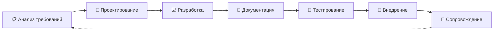
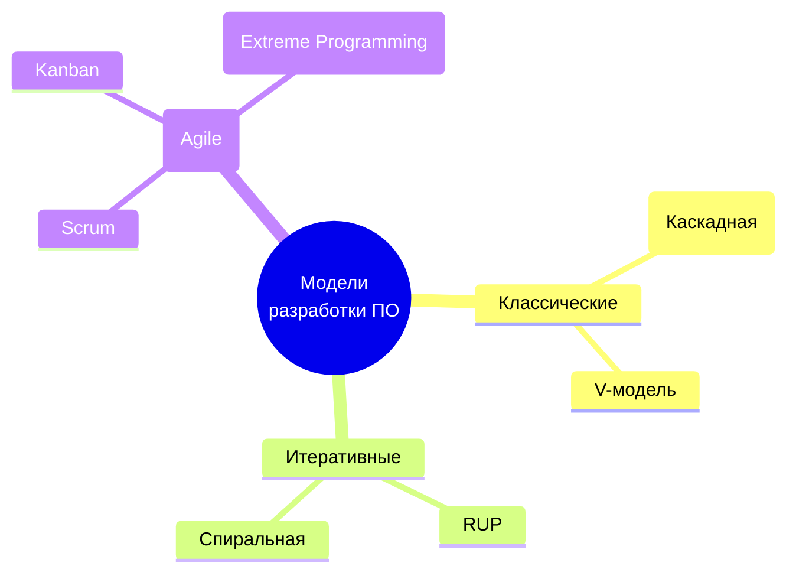
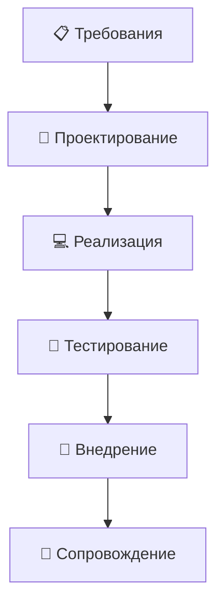
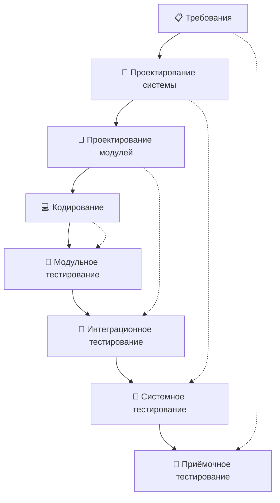
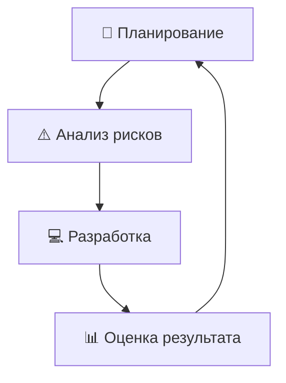
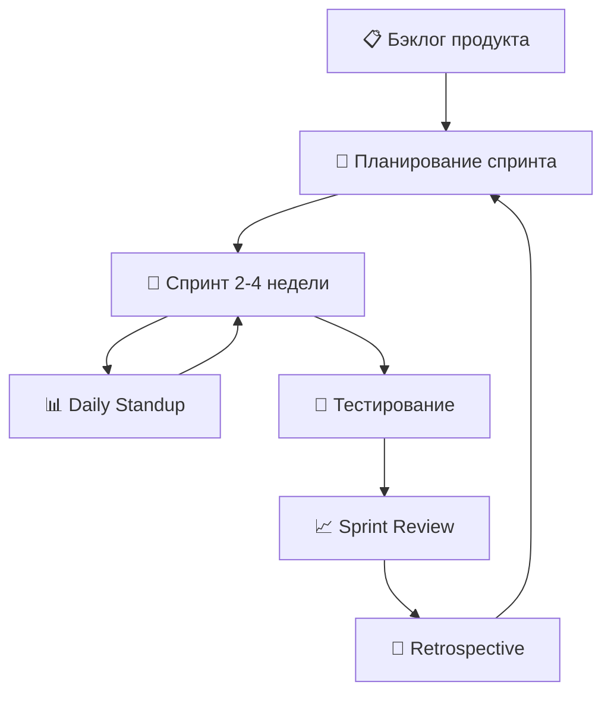
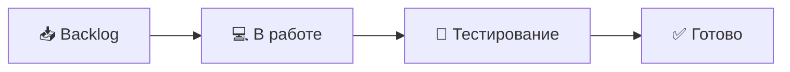

| Предыдущее занятие | | Следующее занятие |
|:----------------:|:-----------------------:|:----------------:|
| [ЛЕКЦИЯ 2](LESSON2.MD) | [Содержание](README.MD) | [ЛЕКЦИЯ 4](LESSON4.md) |

---

# 📚 ЛЕКЦИЯ 3: Жизненный цикл ПО и модели разработки программного обеспечения

**Дисциплина:** МДК 01.02 Поддержка и тестирование программных модулей  
**Группа:** 2 курс  
**Преподаватель:** Сафиулин Руслан Ринатович  

---

# 📑 Оглавление

1. [Лекция 3: Жизненный цикл ПО и модели разработки](#-лекция-3-жизненный-цикл-по-и-модели-разработки)
   - [Цели урока](#-цели-урока)
   - [План урока](#-план-урока)
   - [Организационный момент и входное тестирование](#-1-организационный-момент-и-входное-тестирование)
   - [Мотивационный блок](#-2-мотивационный-блок)
   - [Что такое жизненный цикл ПО (SDLC)](#-3-что-такое-жизненный-цикл-по-sdlc)
   - [Этапы жизненного цикла ПО](#-4-этапы-жизненного-цикла-по)
   - [Что такое модель разработки ПО](#-5-что-такое-модель-разработки-по)
   - [Классические модели: Waterfall и V-модель](#-6-классические-модели-waterfall-и-v-модель)
   - [Итеративные модели: RUP и спиральная](#-7-итеративные-модели-rup-и-спиральная)
   - [Гибкие методологии: Agile, Scrum, Kanban](#-8-гибкие-методологии-agile-scrum-kanban)
   - [Роль тестировщика в разных моделях](#-9-роль-тестировщика-в-разных-моделях)
   - [Практический кейс: «Три заказчика — один выбор»](#-10-практический-кейс-три-заказчика--один-выбор)
   - [Подведение итогов](#-11-подведение-итогов)
2. [Домашнее задание к лекции 3](#-домашнее-задание-к-лекции-3)
3. [Тест по лекции 3 (20 вопросов)](#-тест-по-лекции-3-20-вопросов)
4. [Критерии оценивания](#-критерии-оценивания)

---

## 🎯 Цели урока

| **Обучающая** | **Развивающая** | **Воспитательная** |
|---------------|-----------------|--------------------|
| Сформировать у студентов понимание жизненного цикла ПО, его этапов и основных моделей разработки, а также роли тестирования в каждой модели | Развить навыки анализа, сравнения, аргументации и выбора оптимальной модели разработки для конкретного проекта | Привить понимание важности адаптации процессов разработки под условия проекта и командной работы |

---

## 🗂️ План урока

| № | Этап урока | Время |
|---|------------|-------|
| 1 | Организационный момент и входное тестирование | 5 мин |
| 2 | Мотивационный блок | 5 мин |
| 3 | Что такое жизненный цикл ПО (SDLC) | 5 мин |
| 4 | Этапы жизненного цикла ПО | 12 мин |
| 5 | Что такое модель разработки ПО | 5 мин |
| 6 | Классические модели: Waterfall и V-модель | 10 мин |
| 7 | Итеративные модели: RUP и спиральная | 8 мин |
| 8 | Гибкие методологии: Agile, Scrum, Kanban | 10 мин |
| 9 | Роль тестировщика в разных моделях | 5 мин |
| 10 | Практический кейс: «Три заказчика — один выбор» | 20 мин |
| 11 | Подведение итогов и выдача домашнего задания | 5 мин |
| **Итого** | | **90 мин** |

> ⚠️ *Время урока немного увеличено из-за добавления нового блока. При необходимости можно сократить практикум или перенести часть теории на самостоятельное изучение.*

---

## 📖 1. Организационный момент и входное тестирование

Приветствие группы, проверка присутствующих.

### 📌 Входное тестирование (проверка ДЗ с прошлого занятия)

> 💡 *«Прежде чем мы перейдём к новой теме, давайте проверим, как вы усвоили материал прошлого занятия. Тест уже опубликован в Google Формах. Перейдите по ссылке в чате и выполните задания. У вас будет 7-10 минут»*

**Ссылка на тест:** **[255 группа](https://forms.gle/jZUJoJRT6kFJgrP67)** | **[257 группа](https://forms.gle/P1Tt7j9VJYgkwTRE9)**

| Количество баллов | Оценка |
|--------|----------|
|🟢 19-20 баллов | 5️⃣(😎) |
|🟡 17-18 баллов | 4️⃣(😇) | 
|🟠 12-16 баллов | 3️⃣(😬 ) | 
|🔴 0-11 баллов | 2️⃣(🤬) |

---

### 📌 Объявление темы

> 💡 *«Сегодня мы разберёмся, как организован процесс разработки программного обеспечения. Сначала мы изучим жизненный цикл ПО — универсальную схему, по которой создаётся любой программный продукт. Затем рассмотрим, какие существуют модели разработки, чем они отличаются, и где в каждой из них находится место для тестирования. Это знание поможет вам понимать, как строится работа в реальных IT-компаниях».*

---

## 🔥 2. Мотивационный блок

### 📌 Вопрос к группе:
*«Почему одни IT-проекты выходят вовремя и радуют пользователей, а другие проваливаются, съедая миллионы долларов? В чём разница?»*

### 📌 Реальные примеры:

| Проект | Результат | Причина |
|--------|-----------|---------|
| **Windows Vista** (2006) | Задержка на 2 года, провал | Слишком много новых функций, негибкий процесс |
| **Spotify** | Успех, миллионы пользователей | Гибкая методология, быстрые итерации |
| **Ariane 5** (1996) | Взрыв ракеты, $500 млн | Ошибка на уровне требований, недостаточное тестирование |

**Вывод:** Жизненный цикл и модель разработки определяют, как команда работает, как принимаются решения и как находится место для тестирования. Выбор неправильной модели может привести к катастрофе.

---

## 🔄 3. Что такое жизненный цикл ПО (SDLC)

**Жизненный цикл программного обеспечения** (Software Development Life Cycle, **SDLC**) — это условная схема, включающая отдельные этапы, которые представляют стадии процесса создания ПО. На каждом этапе выполняются разные действия.

> 💡 **Цикл разработки** предлагает **шаблон**, использование которого облегчает проектирование, создание и выпуск качественного программного обеспечения. Это методология, определяющая процессы и средства, необходимые для успешного завершения проекта.

### 📌 Зачем нужен жизненный цикл?

- 📋 **Порядок:** определяет последовательность этапов.
- 👥 **Роли:** распределяет ответственность в команде.
- ⏰ **Сроки:** помогает планировать время и ресурсы.
- 🎯 **Качество:** встраивает тестирование в процесс.
- 💰 **Экономия:** снижает риски и стоимость исправления ошибок.

### 📌 Стандарты

Хотя реализация принципов построения модели жизненного цикла для разных компаний может существенно отличаться, существуют стандарты, такие как **ISO/IEC 12207**, определяющие принятые практики разработки и сопровождения программного обеспечения.

> 🎯 **Цель использования модели жизненного цикла** — создать эффективный, экономически выгодный и качественный программный продукт.

---

## 📋 4. Этапы жизненного цикла ПО

### 📌 Общая схема этапов

---

### 📋 4.1. Анализ требований

**Цель этапа:** определение детальных требований к системе. Кроме этого, необходимо убедиться, что все участники правильно поняли поставленные задачи и то, как именно каждое требование будет реализовано на практике.

> Этот этап предполагает **сбор требований** к разрабатываемому ПО, их систематизацию, документирование, анализ, а также выявление и разрешение противоречий.

**Что происходит:**
- Интервью с заказчиком.
- Составление технического задания (ТЗ).
- Определение функциональных и нефункциональных требований.
- Согласование с заинтересованными сторонами.

---

### 📐 4.2. Проектирование

На стадии проектирования (называемой также стадией дизайна и архитектуры) программисты и системные архитекторы, руководствуясь требованиями, разрабатывают **высокоуровневый дизайн системы**.

Дизайн, как правило, закрепляется отдельным документом — **дизайн-спецификацией (Design Specification Document, DSD)**.

**Основные используемые нотации:**
- **Блок-схемы** — визуализация алгоритмов.
- **ER-диаграммы** — модели данных.
- **UML-диаграммы** — описание архитектуры и взаимодействий.
- **Макеты** — прототипы интерфейса (например, нарисованный в Photoshop прототип сайта).

---

### 💻 4.3. Разработка и программирование

На этом этапе начинается написание программистами кода программы в соответствии с ранее определёнными требованиями.

**Программирование предполагает четыре основные стадии:**
1. **Разработка алгоритмов** — создание логики работы программы.
2. **Написание исходного кода.**
3. **Компиляция** — преобразование в машинный код.
4. **Тестирование и отладка** — юнит-тестирование.

> ⚠️ *Важно: тестирование начинается уже здесь, на уровне модулей (юнит-тесты)!*

---

### 📄 4.4. Документация

**Существует четыре уровня документации:**

| Уровень | Описание | Примеры |
|---------|----------|---------|
| **Архитектурная (проектная)** | Документы, описывающие модели, методологии, инструменты и средства разработки | Дизайн-спецификация |
| **Техническая** | Вся сопровождающая разработку документация, поясняющая работу системы на уровне модулей | API-документация, схемы БД |
| **Пользовательская** | Справочные и поясняющие материалы для конечного пользователя | Readme, User Guide, справка |
| **Маркетинговая** | Рекламные материалы, сопровождающие выпуск продукта | Буклеты, презентации, сайт |

---

### 🧪 4.5. Тестирование

**Процесс тестирования состоит из таких этапов:**

1. **Планирование и управление** — определение целей тестирования, составление тест-стратегии, тест-плана.
2. **Анализ и проектирование** — написание тестовых сценариев и условий на основе целей тестирования.
3. **Внедрение и реализация** — написание тест-кейсов, подготовка тестового окружения, запуск тестов.
4. **Оценка критериев выхода и написание отчётов** — проверка достаточности тестов, оценка степени обеспечения качества.
5. **Действия по завершению тестирования** — сбор, систематизация и анализ информации о результатах.

**🎯 Основные цели этапа:**
- Убедиться, что вся запланированная функциональность реализована.
- Проверить, что все отчёты об ошибках закрыты.
- Завершить работу тестового обеспечения и инфраструктуры.
- Оценить общие результаты тестирования и проанализировать опыт.

---

### 🚀 4.6. Внедрение и сопровождение

Когда программа протестирована и в ней больше не осталось серьёзных дефектов, приходит время **релиза** и передачи её конечным пользователям.

> В случае обнаружения пользователями пост-релизных багов информация о них передаётся в виде отчётов об ошибках команде разработки, которая, в зависимости от серьёзности проблемы, либо немедленно выпускает исправление (**hot-fix**), либо откладывает его до следующей версии программы.

**Что происходит:**
- Установка и настройка системы.
- Обучение пользователей.
- Техническая поддержка.
- Выпуск обновлений и исправлений.

---

## 📐 5. Что такое модель разработки ПО

**Модель разработки ПО** — это конкретная реализация жизненного цикла, определяющая, **как именно** организованы этапы, в каком порядке они выполняются и как взаимодействуют между собой.

> 💡 Если **жизненный цикл** — это «скелет» процесса, то **модель разработки** — это «стратегия», по которой этот скелет воплощается в жизнь.

### 📌 Классификация моделей

---

## 📜 6. Классические модели: Waterfall и V-модель

### 🌊 6.1. Waterfall (Каскадная модель)

**Год появления:** 1970 (Уинстон Ройс)

**Суть:** Последовательное выполнение этапов. Каждый следующий этап начинается только после завершения предыдущего.

**Преимущества:**
- ✅ Простота и понятность
- ✅ Чёткое планирование
- ✅ Хорошо документируется

**Недостатки:**
- ❌ Тестирование только в конце — ошибки дорого исправлять
- ❌ Невозможно вернуться на предыдущий этап
- ❌ Не подходит для проектов с меняющимися требованиями

**Когда использовать:** Проекты с чёткими, неизменными требованиями (государственные заказы, встраиваемые системы).

---

### V 6.2. V-модель

**Год появления:** 1980-е

**Суть:** Развитие каскадной модели. Каждому этапу разработки соответствует этап тестирования.

**Ключевая идея:** Тестирование планируется **заранее**, на этапе требований, а не в конце.

**Преимущества:**
- ✅ Тестирование встроено в процесс
- ✅ Раннее планирование тестов
- ✅ Чёткое соответствие этапов

**Недостатки:**
- ❌ Всё ещё жёсткая последовательность
- ❌ Требования должны быть стабильными

**Когда использовать:** Проекты с высокими требованиями к надёжности (медицина, авионика, банковские системы).

---

## 🔄 7. Итеративные модели: RUP и спиральная

### 📘 7.1. RUP (Rational Unified Process)

**Год появления:** 1998 (IBM)

**Суть:** Итеративный процесс, где каждая итерация включает все этапы: анализ, проектирование, разработку, тестирование.

**4 фазы RUP:**
1. **Начало (Inception)** — определение целей проекта.
2. **Уточнение (Elaboration)** — анализ требований, проектирование архитектуры.
3. **Построение (Construction)** — разработка и тестирование.
4. **Внедрение (Transition)** — передача заказчику.

**Преимущества:**
- ✅ Гибкость
- ✅ Раннее выявление рисков
- ✅ Тестирование на каждой итерации

**Недостатки:**
- ❌ Сложность
- ❌ Требует опытной команды

---

### 🌀 7.2. Спиральная модель

**Год появления:** 1986 (Барри Боэм)

**Суть:** Каждая итерация — это «виток спирали», включающий 4 квадранта: планирование, анализ рисков, разработка, оценка.

**Преимущества:**
- ✅ Управление рисками
- ✅ Гибкость
- ✅ Подходит для крупных проектов

**Недостатки:**
- ❌ Сложность
- ❌ Дорого

**Когда использовать:** Крупные, рискованные проекты (космос, оборонка).

---

## 🏃 8. Гибкие методологии: Agile, Scrum, Kanban

### 🏃 8.1. Agile (Гибкая методология)

**Год появления:** 2001 (Agile Manifesto)

**Суть:** Набор ценностей и принципов, а не конкретный процесс.

**4 ценности Agile:**
1. **Люди и взаимодействие** важнее процессов и инструментов.
2. **Работающий продукт** важнее документации.
3. **Сотрудничество с заказчиком** важнее контракта.
4. **Готовность к изменениям** важнее следования плану.

---

### 🏉 8.2. Scrum

**Суть:** Фреймворк для управления проектами, основанный на Agile.

**Ключевые элементы:**

| Элемент | Описание |
|---------|----------|
| **Спринт** | Итерация длиной 2-4 недели |
| **Product Owner** | Владелец продукта, отвечает за бэклог |
| **Scrum Master** | Помогает команде следовать Scrum |
| **Команда разработки** | Кросс-функциональная группа (5-9 человек) |
| **Бэклог продукта** | Список всех требований |
| **Бэклог спринта** | Задачи на текущий спринт |
| **Daily Standup** | Ежедневная встреча (15 мин) |
| **Sprint Review** | Демонстрация результатов спринта |
| **Retrospective** | Анализ прошедшего спринта |

**Роль тестировщика в Scrum:**
- Участвует в планировании спринта.
- Тестирует каждую итерацию.
- Автоматизирует тесты.
- Участвует в Daily Standup.

---

### 📋 8.3. Kanban

**Суть:** Метод управления потоком задач с визуализацией на доске.

**Основные принципы:**
- Визуализация workflow.
- Ограничение WIP (Work in Progress).
- Управление потоком.
- Явные правила.
- Обратная связь.

**Отличие от Scrum:** Нет спринтов, задачи берутся по мере освобождения ресурсов.

---

### 📊 Сравнение моделей

| Модель | Гибкость | Тестирование | Документация | Подходит для |
|--------|----------|--------------|--------------|--------------|
| **Waterfall** | ❌ Низкая | В конце | Много | Стабильные требования |
| **V-модель** | ❌ Низкая | На всех этапах | Много | Критичные системы |
| **RUP** | ✅ Средняя | Каждая итерация | Средне | Крупные проекты |
| **Спиральная** | ✅ Высокая | Каждый виток | Средне | Рискованные проекты |
| **Scrum** | ✅ Высокая | Каждый спринт | Мало | Динамичные проекты |
| **Kanban** | ✅ Высокая | Непрерывно | Мало | Поддержка, поток задач |

---

## 🧑‍💻 9. Роль тестировщика в разных моделях

| Модель | Роль тестировщика |
|--------|-------------------|
| **Waterfall** | Тестирование в конце, после разработки. Часто «пожарная команда» |
| **V-модель** | Участвует в планировании тестов с этапа требований |
| **RUP** | Тестирует каждую итерацию, участвует в анализе рисков |
| **Спиральная** | Оценивает риски на каждом витке, тестирует прототипы |
| **Scrum** | Полноправный член команды, тестирует каждый спринт, автоматизирует |
| **Kanban** | Непрерывное тестирование, помогает ограничивать WIP |

> 💡 **Ключевой вывод:** Чем гибче модель, тем раньше и активнее тестировщик включается в процесс.

---

## 🎯 10. Практический кейс: «Три заказчика — один выбор»

### 📖 Ситуация

Вы — **руководитель команды разработки** в IT-компании «CodeCraft». К вам обратились три заказчика с разными проектами. Ваша задача — **выбрать оптимальную модель разработки** для каждого проекта и обосновать свой выбор.

Но есть нюанс: **решение вы принимаете не в одиночку**. Вы советуетесь с коллегами, но **финальный выбор и обоснование каждый оформляет от своего имени**.

---

### 🏢 Три заказчика

#### 🏛️ Заказчик 1: «ГосУслуги 2.0»

| Параметр | Описание |
|----------|----------|
| **Проект** | Государственный портал для оказания услуг населению |
| **Требования** | Чётко зафиксированы в контракте, изменения невозможны |
| **Срок** | 18 месяцев |
| **Особенности** | Высокие требования к безопасности и надёжности |
| **Бюджет** | Фиксированный |

#### 🍕 Заказчик 2: «Стартап „Доставка еды“»

| Параметр | Описание |
|----------|----------|
| **Проект** | Мобильное приложение для доставки еды |
| **Требования** | Могут меняться каждую неделю, нужен MVP за 3 месяца |
| **Срок** | 3 месяца на MVP, затем постоянные обновления |
| **Особенности** | Важна скорость выхода на рынок и обратная связь |
| **Бюджет** | Ограничен, но гибок |

#### 🏦 Заказчик 3: «Банковская система»

| Параметр | Описание |
|----------|----------|
| **Проект** | Автоматизированная банковская система для крупного банка |
| **Требования** | Стабильны, но система очень сложная |
| **Срок** | 2 года |
| **Особенности** | Высокие риски (финансовые потери при сбоях), строгий аудит |
| **Бюджет** | Большой, но контролируемый |

---

### 🎯 Ход выполнения (20 минут)

#### Этап 1. Индивидуальный анализ (4 минуты)

Каждый студент **самостоятельно** изучает трёх заказчиков и записывает в тетрадь:

| Заказчик | Ваша предварительная модель | Почему? (1-2 предложения) |
|----------|----------------------------|---------------------------|
| ГосУслуги 2.0 | | |
| Стартап «Доставка еды» | | |
| Банковская система | | |

> 💡 *На этом этапе нельзя обсуждать с соседями — только свои мысли.*

---

#### Этап 2. Обсуждение в парах (5 минут)

Теперь **повернитесь к соседу по парте** и обсудите:

1. **Сравните ваши предварительные ответы.** Совпали ли они? В чём различия?
2. **Аргументируйте свою позицию.** Почему вы выбрали именно эту модель для каждого заказчика?
3. **Найдите слабые места** в аргументации друг друга.
4. **Попробуйте прийти к общему мнению** по каждому заказчику. Если не получается — зафиксируйте разногласия.

> ⚠️ *Важно: цель — не «победить» в споре, а найти оптимальное решение.*

---

#### Этап 3. Обсуждение в четвёрках (5 минут)

Объединитесь с **другой парой** (получится группа из 4 человек). Теперь:

1. **Каждая пара представляет** свои выводы по одному из заказчиков.
2. **Остальные задают вопросы** и предлагают контраргументы.
3. **Найдите общее решение** по каждому из трёх заказчиков.
4. **Выберите спикера**, который представит итоговый выбор группы через 3 минуты.

> 💡 *Если в группе возникли разногласия — это нормально! Зафиксируйте их и представьте оба варианта.*

---

#### Этап 4. Презентация результатов (3 минуты)

Каждая четвёрка представляет **по одному заказчику** (распределите между группами):

| Что презентуем | Формат |
|----------------|--------|
| **Выбранная модель** | 1 предложение |
| **Обоснование** | 2-3 предложения |
| **Роль тестировщика** | 1-2 предложения |
| **Основные риски** | 1-2 предложения |

> 📌 *Преподаватель фиксирует ответы групп на доске для сравнения.*

---

#### Этап 5. Индивидуальный вывод (3 минуты)

**Каждый студент самостоятельно** записывает в тетрадь:

| Заказчик | Итоговая модель (ваш выбор) | Обоснование | Роль тестировщика | Риски и как тестирование их снижает |
|----------|----------------------------|-------------|-------------------|-------------------------------------|
| ГосУслуги 2.0 | | | | |
| Стартап «Доставка еды» | | | | |
| Банковская система | | | | |

> 💡 **Важно:** Ваш итоговый выбор может **отличаться** от мнения группы. Если вы не согласны с общим решением — напишите, почему. Это ценится!

---

### 📋 Ожидаемые ответы (для преподавателя)

| Заказчик | Оптимальная модель | Обоснование |
|----------|-------------------|-------------|
| **ГосУслуги 2.0** | Waterfall или V-модель | Требования стабильны, высокие требования к надёжности, фиксированный бюджет |
| **Стартап «Доставка еды»** | Scrum (Agile) | Требования меняются, нужен быстрый MVP, важна обратная связь |
| **Банковская система** | V-модель или RUP | Сложная система, высокие риски, требования стабильны, нужен строгий контроль |

> ⚠️ *Не существует «единственно правильного» ответа. Главное — чтобы студент **аргументировал** свой выбор.*

---

### 🎯 Критерии оценивания практики (для преподавателя)

| Критерий | Баллы |
|----------|-------|
| Активное участие в обсуждении (в парах и четвёрках) | 1 |
| Индивидуальный вывод оформлен и аргументирован | 1 |
| Глубина анализа (учтены особенности каждого заказчика) | 1 |
| Понимание роли тестировщика в выбранной модели | 1 |
| **Итого** | **4 балла** |

---

### 💡 Методические рекомендации для преподавателя

1. **Тайминг строго соблюдайте.** Этапы короткие, но интенсивные. Используйте таймер на проекторе.
2. **На этапе 1** напомните: «Не обсуждайте, пишите только свои мысли».
3. **На этапе 2** подходите к парам и слушайте. Это даст вам понимание, кто как мыслит.
4. **На этапе 3** следите, чтобы в четвёрках не было «паразитов» — каждый должен говорить.
5. **На этапе 4** записывайте ответы групп на доске — это поможет на этапе 5.
6. **На этапе 5** напомните: «Ваш выбор может отличаться от группового. Это нормально, если он аргументирован».
7. **В конце урока** соберите тетради с индивидуальными выводами — это покажет, кто реально усвоил материал.

---

## 🏁 11. Подведение итогов

### 📌 Ключевые выводы урока

- 🔄 **Жизненный цикл ПО (SDLC)** — это универсальная схема создания программного продукта, включающая анализ требований, проектирование, разработку, документирование, тестирование, внедрение и сопровождение.
- 📐 **Модель разработки** — это конкретная реализация жизненного цикла, определяющая порядок и взаимодействие этапов.
- 🌊 **Waterfall** — последовательная модель, тестирование в конце.
- V **V-модель** — тестирование планируется заранее, соответствует этапам разработки.
- 🔄 **RUP и спиральная** — итеративные модели с анализом рисков.
- 🏃 **Agile, Scrum, Kanban** — гибкие методологии, тестирование на каждом этапе.
- 🧑‍💻 **Роль тестировщика** зависит от модели: чем гибче модель, тем раньше и активнее включается тестировщик.

### ❓ Вопросы для закрепления (устно на паре)

1. 🔄 Что такое жизненный цикл ПО? Перечислите его основные этапы.
2. 📐 Чем отличается Waterfall от V-модели?
3. 🔄 В чём преимущество итеративных моделей?
4. 🏃 Что такое Scrum и какие у него ключевые элементы?
5. 🧑‍💻 Как меняется роль тестировщика в Agile?

---

# 🏠 ДОМАШНЕЕ ЗАДАНИЕ К ЛЕКЦИИ 3

**Тема:** Жизненный цикл ПО и модели разработки  
**Формат сдачи:** Письменный отчёт (Microsoft Word, .docx)  
**Срок сдачи:** до 23:59 22 сентября 2026 г.

---

## 📝 ЗАДАНИЕ 1. «Сравнительный анализ моделей» (4 балла)

*Это задание проверяет, как вы понимаете различия между моделями разработки.*

Заполните сравнительную таблицу для **трёх моделей** на ваш выбор (например, Waterfall, V-модель, Scrum):

| Критерий | Модель 1 | Модель 2 | Модель 3 |
|----------|----------|----------|----------|
| **Название** | | | |
| **Суть (1-2 предложения)** | | | |
| **Когда начинается тестирование?** | | | |
| **Гибкость к изменениям** | | | |
| **Документация** | | | |
| **Для каких проектов подходит** | | | |
| **Основной недостаток** | | | |

---

## 📝 ЗАДАНИЕ 2. «Личный выбор модели» (4 балла)

*Это задание проверяет вашу способность применять знания на практике.*

**Ситуация:**

Представьте, что вы — **руководитель команды тестирования** в IT-компании. К вам обратился заказчик с проектом:

> «Нам нужно мобильное приложение для записи к врачу. Требования могут уточняться, но нужен быстрый запуск через 6 месяцев. Бюджет ограничен».

**Ваша задача:**

1. Какую модель разработки вы выберете **лично вы**? Обоснуйте (3-5 предложений).
2. Опишите роль тестировщика в этом проекте.
3. Какие риски вы видите и как тестирование поможет их снизить?
4. **Рефлексия:** Обсуждали ли вы это с кем-то из группы на уроке? Изменилось ли ваше мнение после обсуждения? Почему?

> 💡 *Пункт 4 — ключевой. Он показывает, умеете ли вы слушать других и менять свою позицию под влиянием аргументов.*

---

## 📝 ЗАДАНИЕ 3. «Рефлексия: Agile в реальной жизни» (2 балла)

*Это задание на рефлексию и понимание принципов Agile.*

**Вопрос:** Представьте, что вы работаете в Scrum-команде над приложением «Умный дневник». Опишите, как будет выглядеть ваш **типичный рабочий день** (или неделя) в этой роли. Учтите:
- Daily Standup
- Работу с бэклогом
- Тестирование
- Взаимодействие с командой

**Требования к ответу:**
- 5-7 предложений.
- Используйте термины Scrum (спринт, бэклог, Daily Standup и т.д.).

---

## 📤 СДАЧА РАБОТЫ

**Внимание!** Домашнее задание принимается **только в электронном виде** через Google-форму.

1. 📄 **Оформите отчёт** в Microsoft Word. Объедините все три задания в один документ.
2. 💾 **Сохраните файл** в формате **.docx**.
3. 📛 **Название файла** должно быть по шаблону:  
   `Фамилия_Имя_Группа_Лекция3.docx`  
   *(Например: Иванов_Петр_247_Лекция3.docx)*
4. 🔗 **Перейдите по ссылке** на Google-форму:  
   **[ССЫЛКА НА ФОРМУ ДЛЯ СДАЧИ ДЗ]**
5. ✍️ **Укажите** в форме:
   - Фамилию, Имя
   - Номер группы
6. 📎 **Загрузите** файл с отчётом.
7. ✅ **Нажмите «Отправить»** и убедитесь, что получили уведомление об успешной отправке.

⏰ **Срок сдачи:** до **23:59 22 сентября 2026 г.**  
Работы, сданные после дедлайна, оцениваются сниженным баллом (не более 50% от максимума).

---

# 📋 ТЕСТ ПО ЛЕКЦИИ 3 (20 ВОПРОСОВ)

**Инструкция:** Выберите один или несколько правильных вариантов ответа. Каждый вопрос — 1 балл. Максимум — 20 баллов.

---

### Вопрос 1
**Что такое жизненный цикл программного обеспечения (SDLC)?**

A) Язык программирования для создания приложений  
B) Условная схема, включающая этапы процесса создания ПО  
C) Инструмент для автоматизации тестирования  
D) Метод написания кода  

---

### Вопрос 2
**Какой стандарт определяет принятые практики разработки и сопровождения ПО?**

A) ISO/IEC 25010  
B) ISO/IEC 12207  
C) ГОСТ 19.701-90  
D) IEEE 830  

---

### Вопрос 3
**Какой этап жизненного цикла ПО идёт первым?**

A) Проектирование  
B) Разработка  
C) Анализ требований  
D) Тестирование  

---

### Вопрос 4
**Что создаётся на этапе проектирования?**

A) Исходный код  
B) Тест-кейсы  
C) Дизайн-спецификация (DSD)  
D) Пользовательская документация  

---

### Вопрос 5
**Какой этап предполагает написание алгоритмов, исходного кода и компиляцию?**

A) Анализ требований  
B) Проектирование  
C) Разработка и программирование  
D) Внедрение  

---

### Вопрос 6
**Сколько уровней документации существует?**

A) 2  
B) 3  
C) 4  
D) 5  

---

### Вопрос 7
**Что относится к пользовательской документации?**

A) Дизайн-спецификация  
B) API-документация  
C) Readme и User Guide  
D) Рекламные буклеты  

---

### Вопрос 8
**Что такое hot-fix?**

A) Плановая версия программы  
B) Немедленное исправление критической ошибки после релиза  
C) Инструмент тестирования  
D) Этап проектирования  

---

### Вопрос 9
**Что такое модель разработки ПО?**

A) Язык программирования  
B) Конкретная реализация жизненного цикла, определяющая порядок этапов  
C) Инструмент для автоматизации тестирования  
D) Тип базы данных  

---

### Вопрос 10
**Какая модель предполагает последовательное выполнение этапов без возврата назад?**

A) Scrum  
B) Waterfall (Каскадная)  
C) Kanban  
D) Спиральная  

---

### Вопрос 11
**В какой модели каждому этапу разработки соответствует этап тестирования?**

A) Waterfall  
B) V-модель  
C) Scrum  
D) Kanban  

---

### Вопрос 12
**Какая модель разработки включает 4 фазы: Начало, Уточнение, Построение, Внедрение?**

A) Waterfall  
B) Спиральная  
C) RUP (Rational Unified Process)  
D) Kanban  

---

### Вопрос 13
**Что является ключевой особенностью спиральной модели?**

A) Тестирование только в конце проекта  
B) Анализ рисков на каждом витке  
C) Отсутствие документации  
D) Ежедневные встречи  

---

### Вопрос 14
**В каком году был опубликован Agile Manifesto?**

A) 1995  
B) 2001  
C) 2010  
D) 1985  

---

### Вопрос 15
**Сколько ценностей содержит Agile Manifesto?**

A) 3  
B) 4  
C) 7  
D) 12  

---

### Вопрос 16
**Что из перечисленного НЕ является ценностью Agile?**

A) Люди и взаимодействие важнее процессов и инструментов  
B) Работающий продукт важнее документации  
C) Строгое следование плану важнее готовности к изменениям  
D) Сотрудничество с заказчиком важнее контракта  

---

### Вопрос 17
**Как называется итерация в Scrum?**

A) Виток  
B) Спринт  
C) Фаза  
D) Цикл  

---

### Вопрос 18
**Кто в Scrum отвечает за бэклог продукта?**

A) Scrum Master  
B) Команда разработки  
C) Product Owner  
D) Заказчик  

---

### Вопрос 19
**Выберите ВСЕ правильные утверждения о Waterfall:**

A) Тестирование происходит в конце проекта  
B) Легко вносить изменения  
C) Требования должны быть стабильными  
D) Хорошо подходит для проектов с меняющимися требованиями  

---

### Вопрос 20
**Какая модель лучше всего подходит для проекта с нестабильными требованиями и необходимостью быстрого релиза?**

A) Waterfall  
B) V-модель  
C) Scrum  
D) Спиральная  

---

## 📊 КЛЮЧИ К ТЕСТУ

| № | Ответ | № | Ответ |
|---|-------|---|-------|
| 1 | **B** | 11 | **B** |
| 2 | **B** | 12 | **C** |
| 3 | **C** | 13 | **B** |
| 4 | **C** | 14 | **B** |
| 5 | **C** | 15 | **B** |
| 6 | **C** | 16 | **C** |
| 7 | **C** | 17 | **B** |
| 8 | **B** | 18 | **C** |
| 9 | **B** | 19 | **A, C** |
| 10 | **B** | 20 | **C** |

---

## ⭐ КРИТЕРИИ ОЦЕНИВАНИЯ

| Оценка | Баллы |
|--------|-------|
| **«5» (Отлично)** | **19–20 баллов** |
| **«4» (Хорошо)** | **17–18 баллов** |
| **«3» (Удовлетворительно)** | **15–16 баллов** |
| **«2» (Неудовлетворительно)** | **14 и менее баллов** |

---

## 💡 Методические рекомендации для преподавателя

1. **Входной тест** по Лекции 2 занимает 10 минут. Студенты проходят его на телефонах через Google Формы.
2. **Практический кейс** с тремя заказчиками — отличная возможность для поэтапной работы: индивидуально → в парах → в четвёрках → индивидуальный вывод.
3. **На следующем занятии** разберите типичные ошибки теста по Лекции 3.
4. Обратите внимание на студентов, которые путают Waterfall и V-модель — это ключевое различие.
5. **Ссылку на Google-форму для сдачи ДЗ** опубликуйте в чате группы сразу после занятия.
6. **Соберите тетради** с индивидуальными выводами практики — это покажет, кто реально усвоил материал.

---

*Лекция 3 завершена. Следующее занятие будет посвящено видам ошибок и методам отладки.* 📚🚀
