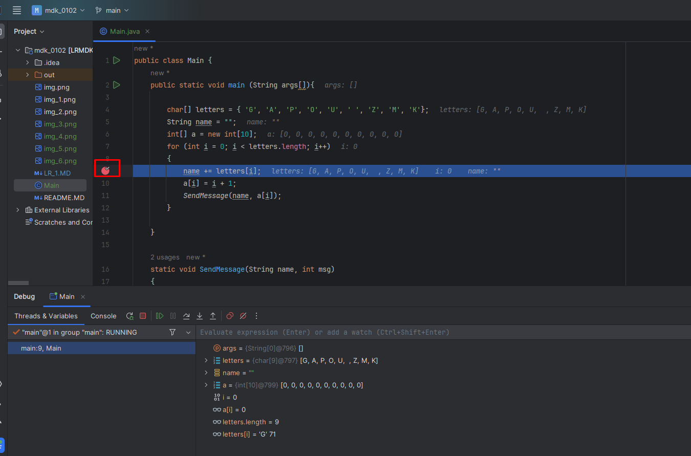

Предыдущее занятие | &nbsp; | Следующее занятие
:----------------:|:----------:|:----------------:
[В начало](../README.MD) | [Содержание](../README.MD) | [ЛР 2](..%2FLR2%2FLR_2.MD)


# Лабораторная работа 1. Отладка

## План

[Требования к сдаче работы](#требования-к-сдаче-работы)

1. [Создание проекта](#создание-проекта)
2. [Отладка](#отладка)
3. [Установка точки останова и запуск отладчика](#установка-точки-останова-и-запуск-отладчика)
4. [Навигация по коду и проверка данных с помощью подсказок по данным](#навигация-по-коду-и-проверка-данных-с-помощью-подсказок-по-данным)
5. [Проверка переменных с помощью окон Threads & Variables](#проверка-переменных-с-помощью-окон-threads--variables)
6. [Установка контрольного значения](#установка-контрольного-значения)
7. [Задания по вариантам](LAB1_Variants.docx)


## Требования к сдаче работы

1. Индивидуальный отчёт по лабораторной работе оформляется используя
   **текстовые редакторы Word(или подобные ему)
   в текстовый файл формата doc или docx.** [ШАБЛОН ДЛЯ ОТЧЕТА ПО ЛР1](LR1_Report.docx)
2. В индивидуальном отчёте должны быть указаны цель, [задание](LAB1_Variants.docx), номер варианта(ваш порядковый номер в списке группы в
журнале на моем сайте), представлены необходимый программный код и пояснения к ним.
3. Следует проанализировать полученные данные.

***Критерии оценивания***

* **Оценка 5**
   * Сделать [пример](#создание-проекта) и сохранить его под именем `Example.java`.
   * Выполнить все задания вашего варианта [задание по вариантам](LAB1_Variants.docx).
   * Сохраните неправильную программу под именем `WrongProgram.java`.
   * Сохраните правильную программу под именем `RightProgram.java`.
   * Оформить индивидуальный отчет [ШАБЛОН ДЛЯ ОТЧЕТА ПО ЛР1](LR1_Report.docx)
   * загрузить все в гугл форму:[235 группа](https://forms.gle/A8uae2c7ebTUH4fA6) или [237 группа](https://forms.gle/xZioXLRf2bn6ymES9)

* Оценка 4
    * Сделать [пример](#создание-проекта) и сохранить его под именем `Example.java`.
    * Выполнить первые два пункта задания вашего варианта [задание по вариантам](LAB1_Variants.docx).
    * Сохраните неправильную программу под именем `WrongProgram.java`.
    * Сохраните правильную программу под именем `RightProgram.java`.
    * Оформить индивидуальный отчет [ШАБЛОН ДЛЯ ОТЧЕТА ПО ЛР1](LR1_Report.docx)
    * загрузить все в гугл форму:[235 группа](https://forms.gle/A8uae2c7ebTUH4fA6) или [237 группа](https://forms.gle/xZioXLRf2bn6ymES9)

* Оценка 3
    * Сделать [пример](#создание-проекта) и сохранить его под именем `Example.java`.
    * Выполнить первые два пункта задания вашего варианта [задание по вариантам](LAB1_Variants.docx).
    * Сохраните неправильную программу под именем `WrongProgram.java`.
    * Оформить индивидуальный отчет [ШАБЛОН ДЛЯ ОТЧЕТА ПО ЛР1](LR1_Report.docx)
    * загрузить все в гугл форму:[235 группа](https://forms.gle/A8uae2c7ebTUH4fA6) или [237 группа](https://forms.gle/xZioXLRf2bn6ymES9)


## Создание проекта

1. Запустите IntelliJ IDEA.
2. Выберите слева вкладку **Projects**  и нажмите на кнопку **New Project**.


3. Дайте имя проекту **debug-app**.
   Language - **Java**, Build system - **IntelliJ**. 
   В качестве JDK используйте Amazon Coretto 22. Нажмите **Create**.
   
4. Если все настройки пройдены успешно появится окно с вашим проектом.
   
5. Запустите свой проект 

Проект успешно создан.

## Отладка

1. Замените программный код класса Main на следующий

```java
public class Main {
    public static void main (String args[]){

        char[] letters = { 'G', 'A', 'P', 'O', 'U', ' ', 'Z', 'M', 'K'};
        String name = "";
        int[] a = new int[10];
        for (int i = 0; i < letters.length; i++)
        {
            name += letters[i];
            a[i] = i + 1;
            SendMessage(name, a[i]);
        }

    }

    static void SendMessage(String name, int msg)
    {
        System.out.println("Hello, " + name + "! Count to " + msg);
    }

}

```
2. Запуск отладчика
В основном мы используем сочетания клавиш, поскольку так быстрее выполнять команды отладчика.
Кроме того, указаны эквивалентные команды, такие как команды панели инструментов или меню.
1.	Чтобы запустить отладчик, нажмите клавишу `Shift+F9` или кнопку `Debug` на стандартной панели инструментов,
или же нажмите кнопку `Debug LR1.Main` в меню `Run` или нажмите правой кнопкой меню в любом месте файла `LR1.Main.java` и в контекстном меню 
выберите `Debug LR1.Main`


**Shift+F9** запускает приложение с прикрепленным к процессу приложения отладчиком. 
Так как специально для изучения кода ничего сделано не было, приложение будет выполняться до завершения
и появятся выходные данные консоли.
 


## Установка точки останова и запуск отладчика

1.	Точка останова указывает, где Idea следует приостановить выполнение кода, 
чтобы вы могли проверить значения переменных или поведение памяти, либо выполнение ветви кода.
В цикле `for` функции `LR1.Main` установите точку останова, щелкнув левое поле следующей строки кода:
`name += letters[i];`
Чтобы задать точку останова, щелкните в области слева от строчки `name += letters[i];` (или установите курсор 
на 9 строчку кода и нажмите клавишу Ctrl+F8). 
В месте установки точки останова появится красный круг.


2. Добавьте точку останова на 11 строке `SendMessage(name, a[i]);`.


3. Чтобы запустить отладку, нажмите правой кнопкой меню в любом месте файла `LR1.Main.java` и в контекстном меню
выберите `Debug LR1.Main`. Будет запущено приложение, и отладчик перейдет к строке кода, где задана точка останова.



4. Выделенная строка - это строка, на котором приостановлен отладчик. Выполнение приложения приостановлено
в той же точке, но оператор еще не выполнен.
Если приложение приостановлено в точке останова, нажав клавишу Alt+F9, можно продолжить выполнение приложения, 
пока оно не достигнет следующей точки останова.

## Навигация по коду и проверка данных с помощью подсказок по данным

1.	Во время приостановки выполнения оператора name += letters[i] наведите указатель мыши на переменную letters, чтобы увидеть подсказку по данным, в которой указан размер массива и тип элемента char[10].


2. Разверните переменную letters, чтобы просмотреть все ее элементы массива и их значения.


3.	Наведите указатель мыши на переменную name, чтобы просмотреть ее текущее значение — пустую строку.


4.	Чтобы переместить отладчик к следующему оператору, нажмите клавишу **F8** или кнопку `Step Over` на вкладке `Threads & Variables`. Дважды нажмите клавишу **F8**, чтобы перейти за пределы вызова метода SendMessage.
При нажатии клавиши F8 отладчик выполняется без захода в функции или методы в коде приложения, хотя код продолжает выполняться. Таким образом мы пропустили отладку кода в методе SendMessage, который сейчас нас не интересует.


5. Чтобы несколько раз выполнить итерацию по циклу for, повторно нажимайте клавишу F8.
Во время каждой итерации цикла сделайте приостановку в точке останова,
а затем наведите указатель мыши на переменную name, чтобы проверить ее значение в подсказке по данным.


Значение переменной изменяется при каждой итерации цикла for — g, затем ga, gap и т. д.
Чтобы ускорить работу отладчика при прохождении цикла, взамен нажмите клавишу Alt + F9
и перейдите к вашей точке останова вместо следующего оператора.

6. Во время приостановки в цикле `for` метода `LR1.Main` нажмите клавишу `F7` или кнопку `Step Into` на вкладке `Threads & Variables`


пока не будет достигнут вызов метода SendMessage.

Отладчик должен быть приостановлен в следующей строке кода:
`SendMessage(name, a[i]);`
7.	Чтобы выполнить шаг с заходом в метод `SendMessage`, снова нажмите клавишу F7.
Будет выделена строка в методе `SendMessage`.


После завершения отладки метода `SendMessage` можно вернуться к циклу `for` метода `main`.
8.	Чтобы выйти из метода `SendMessage`, нажмите сочетание клавиш SHIFT+F8 или кнопку `Step Out` на вкладке `Threads & Variables`


Шаг с выходом возобновляет выполнение приложения и работу отладчика до возврата текущего метода или функции.

## Проверка переменных с помощью окон Threads & Variables

На вкладке **Threads & Variables** отображаются значения переменных во время отладки. 
Окна доступны только во время сеанса отладки. 

1.	В окне Локальные разверните переменную letters, чтобы просмотреть все ее элементы массива и их значения.

 

## Установка контрольного значения
Вы можете указать переменную или выражение, которое необходимо отслеживать
во время поэтапного выполнения кода, добавив его в окно контрольных значений.
1.	Когда отладчик будет приостановлен, щелкните правой кнопкой мыши переменную name и выберите `Add to Watches`.
 


В нижней части справа редактора кода по умолчанию откроется окно контрольных значений.


2.	Теперь, когда вы установили контрольное значение для переменной `name`,
пошагово выполните код, чтобы увидеть, как значение переменной `name` меняется с каждой итерацией цикла `for`.
В отличие от других окон переменных, в окне контрольных значений всегда отображаются просматриваемые вами переменные.


---

Предыдущее занятие | &nbsp; | Следующее занятие
:----------------:|:----------:|:----------------:
[В начало](../README.MD) | [Содержание](../README.MD) | [ЛР 2](..%2FLR2%2FLR_2.MD)