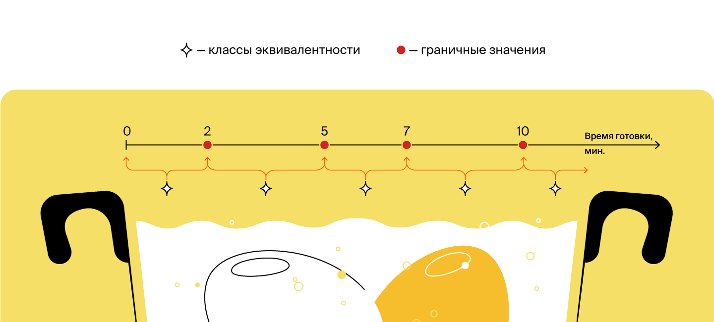
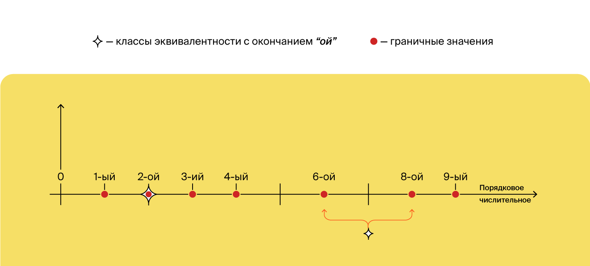
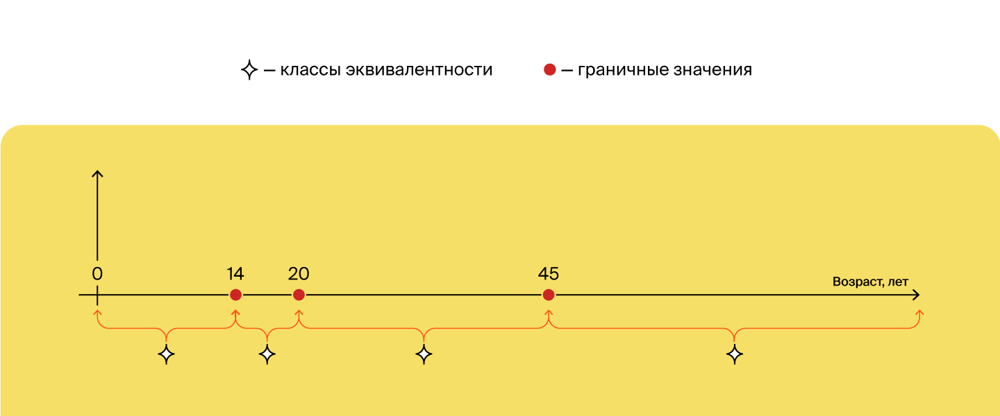
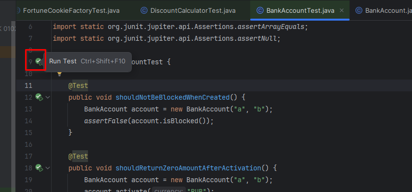
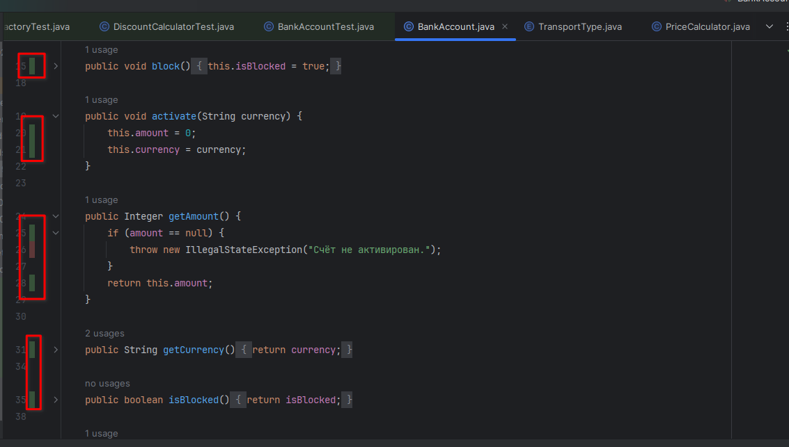
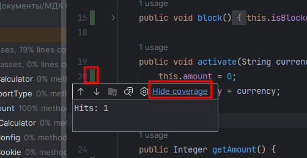
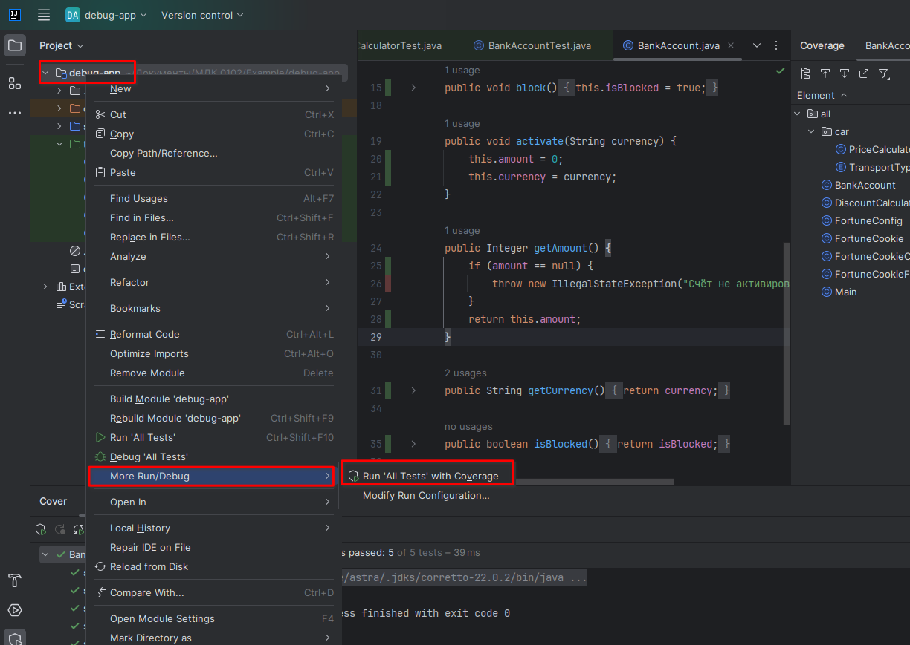
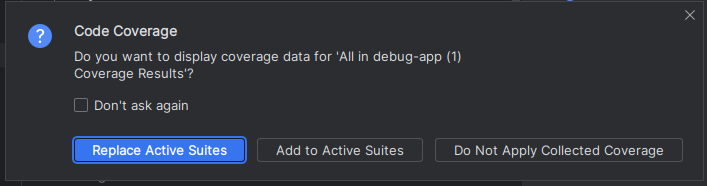
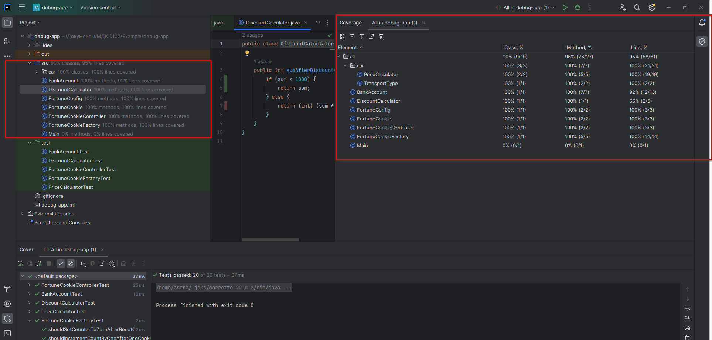

Предыдущее занятие |         &nbsp;          | Следующее занятие
:----------------:|:-----------------------:|:----------------:
[Урок 10](LESSON10.MD) | [Содержание](../README.MD) | [Урок 12](LESSON11.md)

# LR 2. Unit-тесты

# Требования к сдаче работы

Задание выполняется в среде программирования Idea. Результат надо разместить в своем репозитории на GitHub.
Прислать в гугл-формы(размещенная на моем сайте) ссылку на репозиторий.

***Критерии оценивания***

* Оценка 5 - надо сделать все четыре заданий.
* Оценка 4 - надо сделать любые три задания.
* Оценка 3 - надо сделать два любых задания.

# Оглавление

1. [Введение в тему](#введение-в-тему)
2. [Задачи тестирования](#задачи-тестирования)
   * [Требования к программе и сценарии тестирования](#требования-к-программе-и-сценарии-тестирования)
   * [Как проверять требования](#как-проверять-требования)
   * [Пример тестирования](#пример-тестирования)
3. [JUnit — фреймворк для тестов](#junit--фреймворк-для-тестов)
   * [Знакомимся с JUnit](#знакомимся-с-junit)
   * [Пример проекта с подключением JUnit](#пример-проекта-с-подключением-junit)
   * [Метод assertEquals(...)](#метод-assertequals)
4. [JUnit. Методы](#junit-методы)
5. [Тестовое окружение](#тестовое-окружение)
   * [Что такое окружение](#что-такое-окружение)
   * [Тестовое окружение](#тестовое-окружение-1)
   * [Подготовка тестового окружения](#подготовка-тестового-окружения)
6. [Классы эквивалентности и граничные значения](#классы-эквивалентности-и-граничные-значения)
7. [Покрытие кода и покрытие требований](#покрытие-кода-и-покрытие-требований)
    * [Считаем тестовое покрытие в Intellij IDEA](#считаем-тестовое-покрытие-в-intellij-idea)
8. [Краткий конспект](#краткий-конспект)


<details>
<summary>Введение в тему</summary>

# Введение в тему

Один из способов проверить работоспособность программы — протестировать её. В этой теме поговорим о том, зачем нужно тестирование, какое оно бывает и как тестировать свой код максимально эффективно. Вы узнаете:
* когда нужно проводить тестирование;
* что такое фреймворк и какой фреймворк используют для тестирования на Java;
* что такое класс эквивалентности и граничные значения;
* какие бывают метрики покрытия кодовой базы тестами;
* чем различаются понятия покрытия требований и покрытия кода.
А также вы научитесь сами составлять тесты для различных требований, 
запускать их и анализировать результаты тестирования. После этой темы 
помимо финального проекта спринта вас ждёт тестирование по всем темам первого модуля. 
Итак, начинаем!

</details>

<details>

<summary>Задачи тестирования</summary>

# Задачи тестирования

[Оглавление](#оглавление)

Люди довольно часто совершают ошибки, а техника отказывает. По
этому в процесс любого производства включён этап проверки. Автомобили допускаются 
к серийному выпуску только после успешного прохождения всех краш-тестов, 
сложность которых возрастает с каждым годом. Чайники, миксеры и другие бытовые электроприборы 
проходят обязательные проверки на соответствие требованиям пожарной безопасности.

Всё это необходимо для предотвращения возможных рисков. Например, 4 июня 1996 года грузовая ракета Ариан-5 
взорвалась через 37 секунд после взлёта из-за ошибки в программе по расчёту угла наклона. 
Ущерб составил около одного миллиарда долларов.

Требования к качеству продуктов в современном мире становятся всё более строгими. 
Пользователи привыкли, что программное обеспечение работает почти идеально. 
Из-за любой ошибки ваш клиент может перейти к конкурентам или оставить негативный отзыв. 
Поэтому так важно, чтобы каждый разработчик понимал важность процесса тестирования продукта 
до его выпуска на широкую аудиторию.

**Тестирование программы** (англ. software testing) — это исследование, при котором происходит:
* проверка соответствия между ожидаемым и реальным поведением программы,
* а также выявление или подтверждение каких-либо её свойств.
* 
Есть много разных видов проверок: тестирование производительности, нагрузки, гипотез, 
безопасности и так далее. 
Вы изучите базовый вид — **функциональное тестирование** (англ. _functional testing_).
Именно оно проверяет, что программа соответствует **функциональным требованиям** 
(англ. _functional requirements_), то есть делает то, что от неё ожидает пользователь. 
Например, что при включении умного чайника вода нагревается, а не превращается в лёд.


## Требования к программе и сценарии тестирования

Чтобы проверить, что программа работает корректно, необходимо узнать, 
с какой целью она создавалась. 
Другими словами, нужно определить **требования к программе**
(англ. _software requirements_).

Требования могут иметь разную форму и содержание. 
Иногда они представлены в виде официальных документов: 
спецификаций и технических заданий. Часто таких документов нет, 
и единственный способ узнать требования — поговорить с заказчиком.

Требования разделяются на:

* **функциональные**, которые отвечают на вопрос, что должна делать программа. 
Например, на сайте по продаже билетов в кино должна быть кнопка «купить». 
При нажатии на неё будет открываться форма оплаты.

* **нефункциональные**, которые отвечают на вопрос, 
как программа должна выполняться. Вернёмся к примеру с сайтом. 
Нефункциональное требование может звучать так: форма оплаты должна 
открываться менее чем за две секунды с момента нажатия на кнопку «купить».

### Примеры

> **Функциональные требования**
> * Сервис должен отправлять письмо на почту пользователя с информацией о купленных билетах.
> * При закрытии программы должно появляться окно с предложением сохранить проект.
> * При переходе на новый уровень игрок должен получать количество золота по формуле [Уровень * 1000].

> **Нефункциональные требования**
> * Дата покупки должна отображаться как «число.месяц.год»
> * Номер бронирования билета должен пересылаться в строковом формате.
> * Приложение должно запускаться на Android выше 10-й версии.
> * Программа должна возвращать ответ в течение 100 миллисекунд.

## Как проверять требования

Итак, сначала нужно составить или получить список требований.
Затем — написать набор сценариев тестирования. 
Именно они будут определять, делает ли программа то, что от неё ожидается в разных ситуациях. 
Такие сценарии называют **тест-кейсами** (англ. _test case_).

Правильный тест-кейс состоит из трёх частей. 
Рассмотрим их на примере тестирования калькулятора:

* **Подготовка** — определение входных параметров и предусловий. 
Что нужно, чтобы начать тест? Какие данные нам потребуются?
Для проверки калькулятора нам нужны два числа на вход (например, `7` и `4`) и работающий экземпляр класса Calculator.
* **Исполнение** — определение процедуры тестирования. Как именно мы проверяем, 
что программа работает корректно? Какие для этого нужно вызвать методы? 
Какая будет последовательность действий? В примере с калькулятором у 
экземпляра класса вызываем метод сложения. 
В качестве аргументов передаём два числа, заданных на этапе подготовки.
* **Проверка** — сравнение ожидаемого результата с полученным. 
Проверяем, что результат метода в нашем калькуляторе совпадает с ожидаемым и равняется `11`.


Получив тест-кейсы, можно создать и провести **тесты**, 
то есть автоматические или ручные операции по проверке тест-кейсов.


## Пример тестирования

Перенесёмся в будущее. Представим, что вы стали успешным программистом на Java (ура!), 
и ваш руководитель дал вам первое важное задание. 
Нужно написать программу для одного крупного магазина, 
которая будет рассчитывать сумму покупки с учётом скидки.

Условия такие: если сумма находится в диапазоне от `1` до `999` рублей — скидки не будет.
А если сумма покупки больше или равна `1000` рублей — клиенту предоставляется скидка в размере
`2%`. Сумма покупки задаётся только в рублях, без копеек.

Здесь требования к программе прописаны прямо в условии задачи. Сформулируем их более конкретно:
1. Если сумма покупки находится в диапазоне от `1` до `999` рублей, то скидка будет `0%`.
2. Иначе скидка составит `2%`.


Теперь составим тест-кейсы. 
Поскольку у нас есть пронумерованный набор требований, 
тест-кейсы для удобства тоже можно пронумеровать:

1. Если сумма покупки находится в диапазоне от 1 до 999 рублей, то скидка будет 0%.
- 1.1. Совершается покупка на 1 рубль. Ожидаемое поведение: стоимость покупки составляет 1 рубль.
- 1.2. Совершается покупка на 333 рубля. Ожидаемое поведение: стоимость покупки составляет 333 рубля.
- 1.3. Совершается покупка на 999 рублей. Ожидаемое поведение: стоимость покупки составляет 999 рублей.
2. Иначе скидка составит 2 %.
- 2.1. Совершается покупка на 1000 рублей. Ожидаемое поведение: стоимость покупки составляет 980 рублей (−2%).
- 2.2. Совершается покупка на 2000 рублей. Ожидаемое поведение: стоимость покупки составляет 1960 рублей (−2%).


Тест-кейсы 1.1, 1.3 и 2.1. проверяют значения на границах интервалов [1;1000) и [1000;+∞).
Такие значения называются **граничными** (англ. _boundary values_), мы расскажем о них подробнее в следующих уроках. 
А пока заметим, что проверка граничных значений — важное условие. Значительная часть ошибок в программировании совершается именно на граничных значениях.

Помимо граничных значений, необходимо проверить выполнение требований на одном из чисел внутри интервала от 1 до 999.
Нет разницы, на каком именно — 333, 543 или любом другом. Все эти значения **эквивалентны** (англ. _equivalent values_).

Все тест-кейсы необходимо выполнить. Можно запускать программу самостоятельно, передавая различные значения на вход и сверяя их с ожидаемыми — это ручное тестирование. А можно написать код, который будет делать то же самое автоматически — это автоматическое тестирование.

После исполнения тест-кейса необходимо зафиксировать его результат. 
Если реальное поведение программы совпало с ожидаемым, то считается, что тест пройден (англ. _test passed_), 
если поведение отличается — тест провален (англ. _test failed_).

В автотестах результат обычно выводится в виде списка, в котором указано, какие из тестов были пройдены, а какие — провалены.
Это нужно для того, чтобы можно было перейти к любому из проваленных кейсов и исправить либо сам тест,
либо код, который он проверяет.

При ручном тестировании всё зависит от организации: кто-то ставит галочки на листке бумаги, 
кто-то фиксирует текстом в электронном виде, а кто-то просто запоминает. 
Главное — получить ответ: прошла программа тест или нет.

Подведём итог. Для проверки корректности программы нужно проделать следующие шаги:
* Получить/составить/выяснить набор функциональных и нефункциональных требований к программе.
* Для всех требований составить набор тест-кейсов и провести их.

---
### Из каких элементов должен состоять один тест-кейс?

> * **Определение входных параметров и предусловий.**
    Перед началом процедуры тестирования к ней нужно подготовиться.

> * **Сравнение ожидаемого результата с полученным.**
На этом шаге проверяется, исполняет ли программа конкретное требование.

> * **Определение процедуры тестирования.**
Процедура тестирования показывает, из каких шагов состоит тест-кейс.

> * **Информация о результате тест-кейса.**
Без информации о результатах тест-кейса нельзя дать ответ, отвечает ли программа установленным требованиям.
---
</details>

---
<details>

<summary>JUnit — фреймворк для тестов</summary>

# JUnit — фреймворк для тестов

[Оглавление](#оглавление)

Для тестирования существует огромное количество методов, которые объединены во множество библиотек.

## Знакомимся с JUnit

**Фреймворк** (англ. _framework_) — особый класс библиотек.
В нём содержится набор классов и методов,
которые вы можете использовать в своей программе. 
Фреймворк отличается от обычной библиотеки тем, что код библиотеки вы запускаете из вашего кода, 
в то время как фреймворк наоборот может использовать ваш код в своей работе.


Один из самых популярных фреймворков для тестирования на Java — **JUnit**. 
Чтобы написать первый тест с помощью **JUnit**, нужно сделать всего два шага:
* Подключить к проекту **JUnit** как библиотеку.
* Создать метод и пометить его аннотацией `@Test`. 

**Аннотации** — это механизм Java, представляющий дополнительную информацию о создаваемых классах и методах.

Вы уже сталкивались с ним в теме про наследование.

## Пример проекта с подключением JUnit

### Видеоинструкции
    
1. [Создание проекта и подключение JUnit(короткое видео без звука)](https://boosty.to/itmagic/posts/e66c8d9e-95c8-4fb3-acce-55dab5c0c5c5?share=post_link)
2. [Создание проекта и подключение JUnit(с объяснением)](https://boosty.to/itmagic/posts/2082ebb4-545c-4af8-917c-12e7bc287205?share=post_link)

### IntelliJ Build tool

#### Создание проекта

1. Запустите IntelliJ IDEA.
2. Выберите слева вкладку **Projects**  и нажмите на кнопку **New Project**.
   

3. Дайте имя проекту **debug-app**.
   Language - **Java**, Build system - **IntelliJ**.
   В качестве JDK используйте Amazon Coretto 22. Нажмите **Create**.
   
4. Если все настройки пройдены успешно появится окно с вашим проектом.
   
5. Запустите свой проект. Нажмите правой кнопкой мыши в любом месте файла Main.java и в контекстном меню выберите `Run`


Проект успешно создан.

#### Подключение библиотеки JUnit

1. В меню File выберите пункт ProjectStructure


2. В окне Project Structure выберите вкладку **Libraries** и нажмите на кнопку `+`\`From Maven...`

   

3. В окне `Download Library from Maven Repository` в поле поиска введите `org.junit.jupiter` и нажмите на кнопку поиска  


4. Дождитесь пока Idea подключится к центральному репозиторию Maven и подгрузит информацию о доступных к скачиванию версиях библиотек Junit. Выберите из выпадающего списка подходящую версию библиотеки.


5. Выберите подходящую версию и нажмите `OK`.


6. В окне **Choose Mosules** оставьте все без изменений и нажмите **OK**.


7. Если все выполнится успешно то библиотека подключится к проекту. Нажмите кнопку `Aplly` и затем `OK`.


#### Создание кода


1. Нажмите правой кнопкой по папке src. Далее в контекстном меню выберите `New\Java Class`.


2. Введите название класса `DiscountCalculator` и нажмите `Enter`


Замените код класса на следующий

```java
public class DiscountCalculator {

    public int sumAfterDiscount(int sum) {
        if (sum < 1000) {
            return sum;
        } else {
            return (int) (sum * 0.98);
        }
    }
}

```
3. Нажмите правой кнопкой мыши по названию проекта, далее выберите пункт **New\Directory**.


4. Введите название `test` и нажмите кнопку `Enter`


5. Нажмите правой кнопкой мыши по папке test далее в контекстном меню выберите пункт `Mark Directory as\Test Sources Root`


6. Откройте файл `DiscountCalculator.java` и установите курсор на название класса `DiscountCalculator`. 
Нажмите правую кнопку мыши и в контекстном меню выберите пункт `Generate...`


7. В следующем окошке выберите пункт `Test...`


8. В окне **Create Test** поставьте галочку возле названия метода `sumAfterDiscount`. 
Обратите внимание на название создаваемого класса в поле `Class name`. 
Как правило, класс с тестами называют так же, как базовый класс, добавляя в конце слово `“Test”`. 
В нашем случае получится DiscountCalculatorTest.  Нажмите `ОК`.


9. Если все правильно сделано, то должна открыться новая вкладка с кодом класса `DiscountCalculatorTest`


10. Замените код класса `DiscountCalculatorTest` на следующий.

```java
// Заметьте, что классы фреймворка импортируются из пакетов 
// отличных от пакетов стандартной библиотеки Java
import org.junit.jupiter.api.Assertions;
import org.junit.jupiter.api.Test;

public class DiscountCalculatorTest {

    DiscountCalculator discountCalculator = new DiscountCalculator();

    @Test
    public void shouldGiveNoDiscountForValue999() {
        // Подготовка
        int buySum = 999;
        int expectedSum = 500;

        // Исполнение
        int resultSum = discountCalculator.sumAfterDiscount(buySum);

        // Проверка
        Assertions.assertEquals(expectedSum, resultSum);
    }
}
```

11. Осталось проверить работу тестовых методов.
 * Для запуска одного тестового метода достаточно нажать на кнопку  слева от сигнатуры тестового метода.
 * Для запуска всех тестов тестового класса надо нажать на кнопку  слева от названия класса.


12. Нажмите на кнопку  и в выпадающем меню выберите **Run**.


13. Произойдет построение теста. На данный момент у нас только один тестовый метод. Ожидаемый(expectedSum) и фактический(resultSum) 
результаты не совпали, следовательно, статус нашего теста будет - `Test failed`(тест не пройден)
В коде теста мы специально написали, что для товара стоимостью 999 мы ожидаем получить итоговую сумму 500, хотя в реальности исходя из нашего примера должны получить 999. 


14. Исправьте значение переменной expectedSum = 999. Снова выполните тесты.

```java
import org.junit.jupiter.api.Test;

public class DiscountCalculatorTest {

    DiscountCalculator discountCalculator = new DiscountCalculator();

    @Test
    public void shouldGiveNoDiscountForValue999() {
        // Подготовка
        int buySum = 999;
        int expectedSum = 999;

        // Исполнение
        int resultSum = discountCalculator.sumAfterDiscount(buySum);

        // Проверка
        Assertions.assertEquals(expectedSum, resultSum);
    }
}
```

15. На этот раз Ожидаемый(expectedSum) и фактический(resultSum)
результаты совпали, следовательно, статус нашего теста будет - `Test passed`(тест пройден)


### Метод assertEquals(...)

Метод `assertEquals(...)`
Ещё один элемент `JUnit` — это множество статических методов класса `Assertions`. 
Один из них, `assertEquals(Object expected, Object actual, [String message])` вы уже встречали его выше примерах. 
Он принимает 2 или 3 аргумента. Первый — это ожидаемый результат, второй — фактический. Третий аргумент —
необязательная строка, которая выведется, если фактический результат не равен ожидаемому, другими словами, если тест обнаружит ошибку.


</details>

---

<details>

<summary>JUnit. Методы</summary>

# JUnit. Методы

[Оглавление](#оглавление)

JUnit, как и многие другие библиотеки, предоставляет множество инструментов для упрощения стандартных операций. В этом уроке вы изучите основные методы фреймворка, которые позволяют программисту не только быстро проверять свои программы, но и легко ориентироваться в тестах, написанных другими разработчиками.

## Методы `Assertions.assertNull(...)` и `Assertions.assertNotNull(...)`

Проверить, что значение переменной равно `null`, можно с помощью метода `assertEquals(Object object)`:

```java
@Test
public void shouldBeNull() {
    String nullString = null;
    Assertions.assertEquals(null, nullString);
}
```

А если нужно удостовериться, что значение не равно `null`, 
понадобится метод `assertNotEquals(Object object)`:

```java
@Test
public void shouldNotBeNull() {
    String apple = "apple";
    Assertions.assertNotEquals(null, apple);
}
```

Оба теста работают корректно. 
Но если проверку на null вам нужно выполнять часто,
то писать каждый раз `Assertions.assertEquals(null, value)` будет излишеством. 

Лучше воспользоваться более удобными методами `Assertions.assertNull(Object object)` 
и `Assertions.assertNotNull(Object object)`.

```java
import org.junit.jupiter.api.Test;

import static org.junit.jupiter.api.Assertions.assertNotNull;
import static org.junit.jupiter.api.Assertions.assertNull;

public class NullabilityTest {

    @Test
    public void shouldBeNull() {
        String nullString = null;
        assertNull(nullString);
    }

    @Test
    public void shouldNotBeNull() {
        String apple = "apple";
        assertNotNull(apple);
    }
}

```

> Обратите внимание на использование `import static` в примере выше. 
> Методы класса `Assertions` часто импортируют как статические методы, 
> чтобы сократить запись. Это удобно, потому что в одном классе 
> может быть много тестов, и каждый из них будет вызывать какой-то 
> из методов проверки класса `Assertions`. В результате вместо такой записи:

```java
Assertions.assertNull(firstString);
Assertions.assertNotNull(secondString);
Assertions.assertEquals(expected, actual);
```

Будет такая

```java
*assertNull*(firstString);
*assertNotNull*(secondString);
*assertEquals*(expected, actual);
```

Вы также можете импортировать все методы сразу через

```java
  import static org.junit.jupiter.api.Assertions.*.
```

## Методы `assertTrue(...)` и `assertFalse(...)`

Аналогичные методы существуют для проверки значений типа boolean. 
Вы можете использовать assertEquals(true, value) 
или assertEquals(false, value), но удобнее будет делать это с 
помощью специальных методов `assertTrue(value)` и `assertFalse(value).`

```java
import org.junit.jupiter.api.Assertions;
import org.junit.jupiter.api.Test;

import static org.junit.jupiter.api.Assertions.assertTrue;

public class BooleanTest {

    @Test
    public void shouldBeTrue() {
        boolean value = true;
        assertTrue(value);
    }

    @Test
    public void shouldBeFalse() {
        boolean value = false;
        Assertions.assertFalse(value);
    }
}

```

> При сравнении значений через assertEquals() используется метод equals(..) 
> из класса Object. Поэтому для того, чтобы операция была выполнена корректно, в классах объектов этот метод должен быть корректно переопределён. 
> В противном случае сравнение будет работать неправильно.

> Есть ещё одна важная особенность, связанная с методом equals(..).
> Его нельзя переопределить для массивов. Другими словами, два массива с одинаковым содержанием (одинаковыми элементами, расположенными в том же порядке) — это разные объекты с точки зрения Java.
> Поэтому метод equals(..) всегда будет возвращать false для таких массивов, 
> а тест с assertEquals(...) не будет проходить.

 
> Для поэлементного сравнения массивов можно воспользоваться методом 
> Arrays.equals(...), а в JUnit можно использовать метод класса 
> `**Assertions — assertArrayEquals(...)**`. 

</details>

---

<details>

<summary>Тестовое окружение</summary>

# Тестовое окружение

[Оглавление](#оглавление)

Современные приложения — это миллиарды строчек кода, которые описывают сложную систему со строгой и развитой логикой. 
Некоторые компании за время своего существования произвели и теперь 
поддерживают огромные базы рабочего кода. И чем больше разработчиков вносят изменения в продукт, 
тем выше становится вероятность появления в нём багов.

## Что такое окружение

**Среда, или окружение** (англ. _environment_) — это сервер или группа серверов, на которых находится копия приложения. Конкретное окружение часто называется **стендом** (англ. _stand_).

У любой компании есть как минимум одна среда — та, с которой взаимодействуют её клиенты. 
Но часто для полноценной работы над продуктом выделяют и другие окружения:

* **Среда разработки** (англ. _development environment_), **dev** или **dev-стенд**. 
Используется исключительно для разработки. Именно сюда стекаются изменения от всех программистов, 
работающих над проектом. Здесь же запускаются тесты, написанные разработчиками, и ставятся эксперименты.
* **Тестовая среда** (англ. _test environment_), **test** или **test-стенд**. Здесь продукт стабилизируется при помощи более сложных тестов. 
Например, **интеграционных** (англ. _integration tests_) **— которые объединяют (интегрируют) несколько программ/сервисов вместе. 
При интеграционном тестировании часто проверяют, корректно ли данные из одного сервиса передаются в другой. 
Такие тесты часто пишут отдельные команды тестировщиков.
* **Продуктовая среда** (англ. _production environment_), или **prod**. Её ещё называют «боевая среда» 
как противоположность тестовой, «учебной». 
С ней взаимодействуют клиенты компании, поэтому любые ошибки могут привести к денежным и репутационным потерям.
В идеальном мире к моменту выкладки кода на прод в программе уже не должно быть багов, влияющих на пользователя.


Многие компании создают и другие среды для своих целей. Например, одни воспроизводят баги в специфичном окружении — на сервере с определённой версией Java. 
Другие используют отдельные среды для разных видов тестов. 
Третьи вообще создают отдельное тестовое окружение для каждого изменения в коде. 

Во всём этом многообразии одна вещь остаётся верной всегда. Тесты сокращают количество багов, которые увидит конечный пользователь. 

> 💡 Окружением часто называют не только полноценный набор 
> серверов с копией приложения, но также и набор внешних параметров, от которых зависит работа программы. Это может быть и версия Java, и другие приложения, 
> и разные файлы конфигурации. Часть таких внешних параметров 
> можно контролировать во время тестирования, с чем тоже помогает библиотека JUnit.


## Тестовое окружение

При тестировании часто бывает удобно выделить набор доступных классов и конфигураций в мини-окружение,
чтобы использовать его для тестов. 
Такой подход позволяет упростить тестирование классов со сложным порядком инициализации. 

Возьмём в качестве примера `OvercomplicatedCookieFactory` (англ. «переусложнённая фабрика печенек») — класс по производству печенек с предсказаниями. 
При создании его экземпляра нужно указать:
* возможные позитивные и негативные предсказания,
* а также флаг, который будет говорить, какие нужно создавать печеньки: с позитивными предсказаниями или с негативными.

Каждая созданная печенька увеличивает внутренний счётчик готовых печенек. Давайте протестируем этот класс.

```java
import java.util.ArrayList;
import java.util.Random;

public class OvercomplicatedCookieFactory {
    private int cookiesCreated = 0;
    private final ArrayList<String> positiveTexts;
    private final ArrayList<String> negativeTexts;
    private final boolean isPositive;

    // класс Random используется, чтобы возвращать случайное предсказание из списка.
    private final Random rnd = new Random();

    public OvercomplicatedCookieFactory(
            ArrayList<String> positiveTexts,
            ArrayList<String> negativeTexts,
            boolean isPositive
    ) {
        this.positiveTexts = positiveTexts;
        this.negativeTexts = negativeTexts;
        this.isPositive = isPositive;
    }

    // Печём печеньку!
    public String bakeFortuneCookie() {
        StringBuilder cookieBuilder = new StringBuilder();

        // увеличиваем счётчик печенек:
        this.incrementNumberOfCookiesCreated();

        // возвращаем хорошее или плохое предсказание:
        if (isPositive) {
            cookieBuilder.append(randomPositive());
        } else {
            cookieBuilder.append(randomNegative());
        }

        // преобразовываем результат в строку:
        return cookieBuilder.toString();
    }

    // возвращаем количество испечённых печенек:
    public int getCookiesCreated() {
        return this.cookiesCreated;
    }

    // обнуляем счётчик созданных печенек:
    public void resetCookiesCreated() {
        this.cookiesCreated = 0;
    }

    // Увеличиваем счётчик испечённых печенек:
    private void incrementNumberOfCookiesCreated() {
        this.cookiesCreated++;
    }

    // Выбираем произвольное предсказание из списка позитивных:
    private String randomPositive() {
        // Получаем целое случайное число от нуля до максимального размера массива - 1.
        int randomIndex = rnd.nextInt(positiveTexts.size());
        return positiveTexts.get(randomIndex);
    }

    // Выбираем произвольное предсказание из списка негативных:
    private String randomNegative() {
        // Получаем целое случайное число от нуля до максимального размера массива - 1.
        int randomIndex = rnd.nextInt(negativeTexts.size());
        return negativeTexts.get(randomIndex);
    }
}
```

Первые два необходимых теста — создание позитивных предсказаний `shouldReturnPositiveCookie() `
и счётчика печенек `shouldIncreaseCounterByOneAfterCookieBaked()`. 

```java
import org.junit.jupiter.api.Assertions;
import org.junit.jupiter.api.Test;
import java.util.ArrayList;

public class OvercomplicatedCookieFactoryTest {

    @Test
    public void shouldReturnPositiveCookie() {
        ArrayList<String> positiveTexts = new ArrayList<>();
        positiveTexts.add("Вам повезёт!");

        ArrayList<String> negativeTexts = new ArrayList<>();
        negativeTexts.add("Сегодня будет дождь");
        
                OvercomplicatedCookieFactory cookieFactory = new OvercomplicatedCookieFactory(
                positiveTexts,
                negativeTexts,
                true
        );
        String cookieText = cookieFactory.bakeFortuneCookie();
        Assertions.assertEquals("Вам повезёт!", cookieText);
    }

    @Test
    public void shouldIncreaseCounterByOneAfterCookieBaked() {
        ArrayList<String> positiveTexts = new ArrayList<>();
        positiveTexts.add("Вам повезёт!");

        ArrayList<String> negativeTexts = new ArrayList<>();
        negativeTexts.add("Сегодня будет дождь");
        
        OvercomplicatedCookieFactory cookieFactory = new OvercomplicatedCookieFactory(
                positiveTexts,
                negativeTexts,
                true
        );
        cookieFactory.bakeFortuneCookie();
        Assertions.assertEquals(1, cookieFactory.getCookiesCreated());
    }
}
```

Оба теста используют один и тот же код для создания экземпляра `OvercomplicatedCookieFactory`.
В данном случае это, скорее всего, не приведёт к проблемам. Но в реальных кодовых базах одни классы могут зависеть от других,
и такой код будет занимать очень много места. 


Один из вариантов решения этой проблемы — вынести экземпляр класса в переменную перед тестами.

```java
import org.junit.jupiter.api.Assertions;
import org.junit.jupiter.api.Test;

import java.util.ArrayList;

public class OvercomplicatedCookieFactoryTest {
        private final static ArrayList<String> positiveTexts = new ArrayList<>();
    private final static ArrayList<String> negativeTexts = new ArrayList<>();
        
    private final static OvercomplicatedCookieFactory cookieFactory = new OvercomplicatedCookieFactory(
            positiveTexts,
            negativeTexts,
            true
    );

    @Test
    public void shouldReturnPositiveCookie() {
                negativeTexts.add("Сегодня будет дождь");
                positiveTexts.add("Вам повезёт!");
        String cookieText = cookieFactory.bakeFortuneCookie();
        Assertions.assertEquals("Вам повезёт!", cookieText);
    }

    @Test
    public void shouldIncreaseCounterByOneAfterCookieBaked() {
                negativeTexts.add("Сегодня будет дождь");
                positiveTexts.add("Вам повезёт!");
        cookieFactory.bakeFortuneCookie();
        Assertions.assertEquals(1, cookieFactory.getCookiesCreated());
    }
}

```

В этом случае переменной cookieFactory будет присвоен экземпляр `OvercomplicatedCookieFactory`, 
который используется в обоих тестах. Всё бы хорошо, но таким образом в тестовом классе 
появится нежелательная зависимость между тестами. Дело в том, что порядок их запуска в общем случае не определён.
Более того, он может меняться от запуска к запуску.

Предположим, что сначала выполнится тест создания позитивных предсказаний `shouldReturnPositiveCookie()`.
Поскольку в нём вызывается метод `bakeFortuneCookie()`, внутренний счётчик переменной `cookieFactory` увеличится на единицу. 
Если после этого сразу запустится тест счётчика печенек `shouldIncreaseCounterByOneAfterCookieBaked()`, 
то к внутреннему значению прибавиться ещё единица, и `assertEquals()` выдаст ошибку. Если же сначала запустится тест
счётчика `shouldIncreaseCounterByOneAfterCookieBaked()`, а затем `shouldReturnPositiveCookie()`, 
такой ошибки не произойдёт.
Подобные баги очень сложно обнаружить и исправить, 
поэтому тестовое окружение лучше готовить под каждый тест по отдельности.


## Подготовка тестового окружения

В `JUnit` есть четыре специальных аннотации, которые позволяют запускать определённый код до или после тестов. 

Первая из них — `@BeforeEach` (англ. «перед каждым»). Если установить её над методом, этот метод будет запускаться всякий раз перед любым из тестов внутри класса. 

Исправленный код будет выглядеть следующим образом:

```java
import org.junit.jupiter.api.Assertions;
import org.junit.jupiter.api.BeforeEach;
import org.junit.jupiter.api.Test;

public class OvercomplicatedCookieFactoryTest {

    private static OvercomplicatedCookieFactory cookieFactory;

    @BeforeEach
    public void beforeEach() {
        ArrayList<String> positiveTexts = new ArrayList<>();
        positiveTexts.add("Вам повезёт!");

        ArrayList<String> negativeTexts = new ArrayList<>();
        negativeTexts.add("Сегодня будет дождь");
        
        cookieFactory = new OvercomplicatedCookieFactory(
                positiveTexts,
                negativeTexts,
                true
        );
    }

    @Test
    public void shouldReturnPositiveCookie() {
        String cookieText = cookieFactory.bakeFortuneCookie();
        Assertions.assertEquals("Вам повезёт!", cookieText);
    }

    @Test
    public void shouldIncreaseCounterByOneAfterCookieBaked() {
        cookieFactory.bakeFortuneCookie();
        Assertions.assertEquals(1, cookieFactory.getCookiesCreated());
    }
}
```

Теперь можно писать любое количество проверок. 
Поскольку перед каждым тестом создаётся новый экземпляр `OvercomplicatedCookieFactory`, 
тесты больше не будут зависеть друг от друга. 

Другие три аннотации позволяют запускать произвольный код:
* `@BeforeAll` (англ. «перед всеми») — один раз до запуска всех тестов;
* `@AfterEach` (англ. «после каждого») — каждый раз после окончания каждого теста;
* `@AfterAll `(англ. «после всех») — один раз после окончания всех тестов.

Аннотации, срабатывающие один раз: `@BeforeAll` и `@AfterAll`, должны стоять над статическим методом. 
Если метод будет не статичный, тест попросту не запустится.

Все четыре аннотации могут содержаться в одном тестовом классе. 
Они ведут себя так, как и ожидается: 
* перед началом тестов исполнится `@BeforeAll`, 
* перед каждым тестом — `@BeforeEach`, 
* после каждого — `@AfterEach`. 
* В самом конце, после выполнения всех тестов, сработает `@AfterAll`.

```java
import org.junit.jupiter.api.AfterAll;
import org.junit.jupiter.api.AfterEach;
import org.junit.jupiter.api.BeforeAll;
import org.junit.jupiter.api.BeforeEach;
import org.junit.jupiter.api.Test;

public class TestBenchExample {

    @BeforeAll
    static void beforeAll() {
        System.out.println("Running beforeAll");
    }

    @AfterAll
    static void afterAll() {
        System.out.println("Running afterAll");
    }

    @BeforeEach
    void beforeEach() {
        System.out.println("--Running beforeEach");
    }

    @AfterEach
    void afterEach() {
        System.out.println("--Running afterEach");
    }


    @Test
    public void someTestOne() {
        System.out.println("-- --Running test 1");
    }

    @Test
    public void someTestTwo() {
        System.out.println("-- --Running test 2");
    }
}
```

</details>

---

<details>

<summary>Классы эквивалентности и граничные значения</summary>

# Классы эквивалентности и граничные значения

[Оглавление](#оглавление)

Исполнение каждого теста на JUnit или любом другом тестовом фреймворке 
занимает какое-то время. В больших системах, где количество тестов 
переваливает за десятки и сотни тысяч, проверки могут длиться несколько часов, а иногда и дней. 

Задача разработчика, тестирующего свой код, — проверить, что программа ведёт себя корректно, 
потратив при этом минимальное количество времени. То есть, с одной стороны, тесты должны проверить 
все возможные сценарии поведения программы. С другой — их должно быть настолько мало, насколько это возможно. 

## Граничные значения и классы эквивалентности

Чтобы сократить количество тестов и оставить только самые необходимые, программисты применяют 
техники выделения граничных значений и классов эквивалентности.  

> **Граничные значения** (англ. _boundary values_) — это параметры, при переходе через которые поведение программы меняется.

> **Классы эквивалентности** (англ. _equivalence class_) — параметры, при вводе которых программа ведёт себя одинаково.

Для примера рассмотрим робота, который помогает варить яйца.
На вход он получает информацию о том, сколько минут длится варка, а на выходе говорит, в каком состоянии находится яйцо: 

* если яйцо варится меньше `2` минут — оно ещё сырое;
* от `2` до `5` минут — состояние готовности «в мешочек», когда и белок, и желток жидкие;
* от `5` до `7` минут — состояние готовности «всмятку», когда белок твёрдый, а желток жидкий;
* от `7` до `10` минут — состояние готовности «вкрутую», когда и белок, и желток твёрдые;
* больше `10` минут — яйцо переварено.



Есть два способа составить набор тест-кейсов по граничным значениям и классам эквивалентности:

* **Написать как минимум по одному тесту на каждое из граничных значений,
а также по одному — на любое значение из каждого промежутка класса эквивалентности**. 
Например, протестировать робота можно на значениях: `1, 2, 3, 5, 6, 7, 9, 10, 21 минута.`

* **Проверить работу программы на каждом из граничных значений +/- одно значение**. 
Такой подход связан с тем, что чаще всего ошибки происходят именно при работе с граничными значениями. 
При этом +/- одно значение позволят проверить работу не только на границах, 
но и в рамках каждого класса эквивалентности. 
В таком случае получится больше тестов, 
чем в первом варианте, зато они покроют большую часть возможных ошибок. 
В примере с роботом по готовке яиц понадобятся следующие входные данные: `1, 2, 3, 4, 5, 6, 7, 8, 9, 10, 11`. 
Если бы наш шаг был в половину минуты, значений было бы больше: `1.5, 2, 2.5, 4.5, 5, 5.5, 6.5, 7, 7.5, 9.5, 10, 10.5`.

Бывают такие ситуации, когда между граничными значениями нет класса эквивалентности 
или когда классы эквивалентности встречаются повторно. 
Пример — окончания порядковых числительных. Число `1` превращается в «**первый**», а `2` — во «**второй**». 
При этом окончание «_-ой_» также будет в порядковых числительных «**шестой**», «**седьмой**» и «**восьмой**».



В таком случае можно вывести более широкий класс эквивалентности. 
К примеру, двузначные числа, начинающиеся на цифры от 2 до 9, ведут себя одинаково — при окончании на
2 будет добавляться окончание «-**ой**»: «двадцать втор**ой**», «тридцать втор**ой**». 
Это один класс эквивалентности. При окончании на 3 — «-**ий**»: «сорок трет**ий**», «пятьдесят трет**ий**» и так далее. 
Это другой класс эквивалентности. А вот двузначные числа, начинающиеся с единицы, — особый случай.
Какая бы ни была вторая цифра, окончание будет «-ый»: «одиннадцат**ый**», «двенадцат**ый**» и т. д.

Другой пример — сервис, который помогает выдавать паспорта Российской Федерации. 
На вход программа получает возраст человека, а на выходе говорит, 
нужно ли ему получить или поменять паспорт в этом году. 

По законам Российской Федерации гражданин должен получить паспорт в возрасте 14 лет, 
а затем поменять его в 20 и в 45 лет.
В нашей программе эти числа будут граничными значениями, а любой промежуток между ними — **одним** классом эквивалентности,
так как для любого другого числа ответ будет одинаковым — «паспорт менять не нужно».



</details>

<details>

<summary>Задание 4</summary>

# Задание 4

[Оглавление](#оглавление)

Вам нужно доработать тесты для класса `PriceCalculator` по расчёту стоимости доставки в зависимости от расстояния
и типа транспорта. 

Когда класс только разрабатывался, поддерживался единственный тип транспорта — велосипед (`BIKE`).
К сожалению, тестированию тогда внимания не уделялось, и был написан всего один тест. 
Теперь к обрабатываемым типам транспорта добавились легковая машина (`CAR`) и фура (`TRUCK`). 
Также есть пока что неиспользуемый тип транспорта — квадрокоптер (`DRONE`).

Вам нужно доработать тесты для велосипеда, машины, фуры и квадрокоптера в соответствии с правилами:

* Доставка осуществляется только на расстояния больше 0 км.
* На велосипеде можно доставлять грузы на расстояние до 20 км (включительно). 
Стоимость доставки задана через переменную-константу `BIKE_PRICE_PER_KM`.
* Машина может доставлять грузы на расстояние до 1000 км (включительно). 
Стоимость доставки задана через переменную-константу `CAR_PRICE_PER_KM`.
* Грузовик может доставлять грузы на любые расстояния.
Стоимость доставки задана через переменную-константу `TRUCK_PRICE_PER_KM`.
* В случае выхода за границы доставки для определённого транспорта возвращаем отрицательное значение.
* Доставка на квадрокоптере не поддерживается. В случае попытки рассчитать для него доставку возвращаем `null`.

Вам требуется определить необходимый минимальный набор тестов, 
чтобы полностью проверить корректность программы и написать эти тесты.

`TransportType`

```java
public enum TransportType {
    BIKE, CAR, TRUCK, DRONE
}
```

`PriceCalculator.java`

```java
public class PriceCalculator {

    private static final int BIKE_PRICE_PER_KM = 10;
    private static final int CAR_PRICE_PER_KM = 7;
    private static final int TRUCK_PRICE_PER_KM = 5;

    public Integer calculatePrice(TransportType transportType, int distanceKm) {
        switch (transportType) {
            case BIKE:
                return calculateForBike(distanceKm);
            case CAR:
                return calculateForCar(distanceKm);
            case TRUCK:
                return calculateForTruck(distanceKm);
            default:
                return null;
        }
    }

    private int calculateForTruck(int distanceKm) {
        if (distanceKm <= 0)
            return -1;
        return distanceKm * TRUCK_PRICE_PER_KM;
    }

    private int calculateForCar(int distanceKm) {
        if (distanceKm > 1000) 
            return -2;
        if (distanceKm <= 0) 
            return -1;
        return distanceKm * CAR_PRICE_PER_KM;
    }

    private int calculateForBike(int distanceKm) {
        if (distanceKm > 20)
            return -2;
        if (distanceKm <= 0)
            return -1;
        return distanceKm * BIKE_PRICE_PER_KM;
    }
}
```

```java
import org.junit.jupiter.api.Assertions;
import org.junit.jupiter.api.Test;

public class PriceCalculatorTest {

    private final PriceCalculator priceCalculator = new PriceCalculator();

    @Test
    public void shouldBeNegativeWhenBikeAndDistanceIs0Km() {
        // ваш код
    }

    @Test
    public void shouldReturn100ForBikeAndDistanceIs10Km() {
        // ваш код
    }

    @Test
    public void shouldBeNegativeWhenBikeAndDistanceIs21Km() {
        // ваш код
    }


    @Test
    public void shouldBeNegativeWhenCarAndDistanceIs0Km() {
        // ваш код
    }

    @Test
    public void shouldBeNegativeWhenCarAndDistanceIs1001Km() {
       // ваш код
    }

    @Test
    public void shouldReturn100ForCarAndDistanceIs1000Km() {
        // ваш код
    }


    @Test
    public void shouldBeNegativeWhenTruckAndDistanceIs0Km() {
       // ваш код
    }

    @Test
    public void shouldReturn5000ForTruckAndDistanceIs1000Km() {
       // ваш код
    }

    @Test
    public void shouldBeNullWhenDroneAndDistanceIs0Km() {
        // ваш код
    }
}

```


## Подсказки

* Всего должно быть девять тестов: три для велосипеда (один уже написан), три для автомобиля, два для фуры и один для квадрокоптера. Для каждого вида транспорта один из тестов должен проверять позитивное поведение, другие проверяют ошибки, если дистанция равна 0 или если дистанция больше допустимой. Для квадрокоптера тест должен проверять соответствующую ошибку.
* Для проверки лучше использовать граничные значения — например, 1000 и 1001 для автомобиля.
* Для позитивных тестов удобно использовать названия вида `shouldReturn[число]For[транспорт]AndDistanceIs[дистанция]Km()`. 
В них вам нужно:
  - вызвать метод `calculatePrice(...) `с соответствующим транспортом и дистанцией;
  - сохранить результат в переменную price;
  - с помощью `Assertions.assertEquals(...)` сравнить ожидаемый результат с фактическим.

* Для негативных сценариев можно использовать названия `shouldBe[условие]When[транспорт]AndDistanceIs[дистанция]Km()`.
  - С помощью `Assertions.assertNull(...)` или `Assertions.assertTrue(…)` можно сравнить ожидаемый результат с фактическим.


</details>


<details>

<summary>Покрытие кода и покрытие требований</summary>

# Покрытие кода и покрытие требований

[Оглавление](#оглавление)

С помощью техник выделения классов эквивалентности и 
граничных значений удобно проверять отдельно взятые методы и классы. 
Но в очень больших проектах невозможно выделить все возможные ситуации, 
в которых будет запускаться программа. А значит, и протестировать программу на 100% не получится. 

Поэтому при работе с масштабными проектами многие компании используют метрики покрытия кодовой базы тестами.
О двух таких метриках расскажем в этом уроке.

## Покрытие кода и покрытие требований

- **покрытие кода** (англ. _code coverage_), показывает, какой процент строк кода исполняется при запуске всех тестов. 
Это может быть и **70%** строк, и **5%** — в зависимости от количества и сложности тестов. **100%** бывает редко, потому что 
покрыть тестами абсолютно весь код — довольно трудоёмкая задача. 
Также покрытие кода иногда называют **тестовым покрытием** (англ. _test coverage_).
 
> 💡 Часто тестовое покрытие считают не от всего кода, 
> а только от **бизнес-логики** (англ. _business logic_) программы. 
> **Бизнес-логика (или бизнес-функционал)** — это та часть кода, которая описывает функциональные требования. 
> В неё не входят файлы конфигураций, настройки окружения и модели объектов. 
> Распространённая практика — устанавливать порог тестового покрытия бизнес-логики в 80%. 
> Такой уровень считается оптимальным соотношением между временем, 
> потраченным на написание тестов, и качеством готового продукта.


- **покрытие требований** (англ. _requirements coverage_), она показывает процент требований, проверенных набором тестов. 

Рассмотрим работу двух этих метрик на примере. 
Допустим, нужно написать метод `transfer(...)` (англ. «_перевод_»)
в классе `MoneyTransferService` (англ. «сервис по переводу денег»), который переводит сумму денег `amount` с одного счёта 
на другой. При этом должны соблюдаться следующие требования:
* переводить деньги можно только на другой счёт (нельзя совершить перевод на тот же счёт, с которого выполняется перевод);
* сумма перевода должна быть больше 0;
* баланс счёта, с которого осуществляется перевод, не может быть меньше 0;
* при зачислении средств на счёт его баланс может только расти.

Разработчик программы торопился и реализовал только два из четырёх требований. В результате код выглядит так:

```java
class MoneyTransferService {

    public int transfer(int amount, Account accountOne, Account accountTwo) {
        // переводить деньги можно только на другой счёт
        if (accountOne.id.equals(accountTwo.id)) {
            System.out.println("Нельзя перевести деньги на тот же аккаунт. Id: " + accountOne.id);
            return -2;
        }
        // сумма перевода должна быть больше 0
        if (amount <= 0){
            System.out.println("Сумма перевода должна быть больше 0. Текущая сумма: " + amount);
            return -1;
        }

        accountOne.balance -= amount;
        accountTwo.balance += amount;
        return 0;
    }

    
}

class Account {
    public String id;
    public int balance;

    public Account(String id, int balance) {
        this.id = id;
        this.balance = balance;
    }
}
```

Тесты

```java
import org.junit.jupiter.api.Test;

import static org.junit.jupiter.api.Assertions.assertEquals;

public class MoneyTransferTest {
    private final MoneyTransferService moneyTransferService = new MoneyTransferService();

    @Test
    void shouldMakeTransfer() {
        Account accountOne = new Account("1", 10);
        Account accountTwo = new Account("2", 10);
        
        assertEquals(0, moneyTransferService.transfer(7, accountOne, accountTwo), "Успешная транзакция должна возвращать результат 0");
        assertEquals(3, accountOne.balance);
        assertEquals(17, accountTwo.balance);
    }

    @Test
    void shouldNotTransferMoneyOnSameAccount() {
        Account accountOne = new Account("1", 10);
        assertEquals(-2, moneyTransferService.transfer(5, accountOne, accountOne), "Нельзя перевести деньги на тот же аккаунт. Id: 1");
    }

    @Test
    public void shouldNotTransferZero() {

        Account accountOne = new Account("1", 10);
        Account accountTwo = new Account("2", 10);

        assertEquals(-1, moneyTransferService.transfer(0, accountOne, accountTwo), "Сумма перевода должна быть больше 0. Текущая сумма: 0");
    }

}


```

Все написанные тесты будут пройдены. Но из этого не следует, что программа написана корректно. 

Покрытие кода в этом случае составит 100%, 
потому что в тесте вызывается каждая строчка кода. 
Тем не менее программа работает неправильно, потому что не выполнены два из четырёх требований: 
баланс может оказаться меньше нуля, а также программа неверно работает с переполнением при переводе очень больших сумм. 
Получается, что покрытие требований на текущий момент — только 50%.

Добавим тесты, чтобы проверить все требования:

```java
import org.junit.jupiter.api.Test;

import static org.junit.jupiter.api.Assertions.assertEquals;

public class MoneyTransferTest {
    private final MoneyTransferService moneyTransferService = new MoneyTransferService();

    @Test
    void shouldMakeTransfer() {
        Account accountOne = new Account("1", 10);
        Account accountTwo = new Account("2", 10);
        
        assertEquals(0, moneyTransferService.transfer(7, accountOne, accountTwo), "Успешная транзакция должна возвращать результат 0");
        assertEquals(3, accountOne.balance);
        assertEquals(17, accountTwo.balance);
    }

    @Test
    void shouldNotTransferMoneyOnSameAccount() {
        Account accountOne = new Account("1", 10);
        assertEquals(-2, moneyTransferService.transfer(5, accountOne, accountOne), "Нельзя перевести деньги на тот же аккаунт. Id: 1");
    }

    @Test
    public void shouldNotTransferZero() {

        Account accountOne = new Account("1", 10);
        Account accountTwo = new Account("2", 10);

        assertEquals(-1, moneyTransferService.transfer(0, accountOne, accountTwo), "Сумма перевода должна быть больше 0. Текущая сумма: 0");
    }

    @Test
    public void shouldNotMakeBalanceLessThanZero() {

        Account accountOne = new Account("1", 10);
        Account accountTwo = new Account("2", 10);
        assertEquals(-3, moneyTransferService.transfer(15, accountOne, accountTwo), "Недостаточно средств на счёте с id 1. Перевод суммы 15 невозможен.");
    }

    @Test
    public void shouldNotMakeOverflowOnTransfer() {

        Account accountOne = new Account("1", 10);
        Account accountTwo = new Account("2", Integer.MAX_VALUE);

        assertEquals(-4, moneyTransferService.transfer(1, accountOne, accountTwo), "Перевод невозможен. Если транзакция выполнится, счёт с id 2 будет переполнен.");
    }
}
```

Тесты `shouldNotMakeBalanceLessThanZero` и `shouldNotMakeOverflowOnTransfer` завершаются ошибкой. Они проверяют два условия:
* баланс счёта, с которого осуществляется перевод, не может быть меньше 0;
* при зачислении средств на счёт его баланс может только расти.

Исправим программу так, чтобы она проходила новые тесты. Но в этом коде не хватает ещё нескольких проверок: по граничным значениям и классам эквивалентности. 

```java
class MoneyTransferService {

    public int transfer(int amount, Account accountOne, Account accountTwo) {
        // переводить деньги можно только на другой счёт
        if (accountOne.id.equals(accountTwo.id)) {
            System.out.println("Нельзя перевести деньги на тот же аккаунт. Id: " + accountOne.id);
            return -2;
        }
        // сумма перевода должна быть больше 0
        if (amount <= 0){
            System.out.println("Сумма перевода должна быть больше 0. Текущая сумма: " + amount);
            return -1;
        }

        // баланс не может стать отрицательным
        if (amount > accountOne.balance) {
            System.out.println("Недостаточно средств на счёте с id " + accountOne.id + ". Перевод суммы " + amount + " невозможен.");
            return -3;
        }

        // перевод не должен приводить к переполнению баланса
        if (accountTwo.balance + amount < 0) {
            System.out.println("Перевод невозможен. Если транзакция выполнится, счёт с " + accountTwo.id + " будет переполнен.");
            return -4;
        }

        accountOne.balance -= amount;
        accountTwo.balance += amount;
        return 0;
    }
}
```

Теперь программа будет работать правильно в любой ситуации. 
Из этого примера можно сделать важный вывод: 

>> 100% покрытие кода совсем не означает, что программа работает корректно. Важно обращать внимание на покрытие требований.

## Считаем тестовое покрытие в Intellij IDEA

Процент запускаемых строчек кода во время теста очень легко подсчитать, например, в среде разработки IntelliJ IDEA.
Для этого перейдите в класс с тестами, наведите курсор
мышки на кнопку запуска одного теста или всего класса.



А затем выберите `Run 'BankAccountTest' with Coverage` (англ. «запустить [имя класса] с покрытием»).


После исполнения тестов в контекстном меню справа можно будет увидеть покрытие кода. 


Если открыть файл с кодом тестируемого класса, то покрытые тестами строки кода также будут выделяться зеленым цветом.



Убрать все обозначения можно командой `Hide Coverage` 
(англ. «**скрыть покрытие**»). Для этого дважды нажмите Shift для вызова контекстного меню, 
введите “Hide Coverage” и нажмите Enter. Или просто наведите курсор мыши на любой из зеленых или красных прямоугольников.
Далее в всплывающем меню нажмите на кнопку `Hide coverage`.




Аналогичным способом можно запустить тесты или подсчёт покрытия не для одного тест-класса, а для всех тестов внутри проекта. 

Для этого нужно щёлкнуть правой кнопкой мыши на открытом модуле в дереве проектов, 
в открывшемся меню выбрать “Run 'All Tests'” 
для запуска всех тестов или “More Run/Debug” → “Run 'All Tests' with Coverage” для подсчёта тестового покрытия.



Если покрытие уже было подсчитано для каких-то пакетов/тест-кейсов, то при запуске подсчёта покрытия для других пакетов IDEA спросит, что делать с новыми результатами:



* **Replace active suites** (англ. «_заменить текущие тест-кейсы»_) — оставит только что запущенный результат;
* **Add to active suites** (англ. «_добавить к текущим тест-кейсам_») — добавит к имеющимся результатам новый;
* **Do not apply collected coverage** (англ. «_не принимать подсчитанное покрытие_») — оставит старые результаты;

Если отметить пункт “Do not show this dialog in the future” (англ. «больше не показывать этот диалог»), 
то выбранный пункт будет применяться всегда.

После подсчётов статистика будет показана для каждого тестируемого класса и для проекта вцелом.



> Если вместо покрытия кода сфокусироваться на покрытии требований к программе, 
> с высокой вероятностью это приведёт к 100% покрытию кода.

</details>

<details>

<summary>Краткий конспект</summary>

# Краткий конспект

[Оглавление](#оглавление)

Тестирование — это процесс проверки работоспособности программы. 
Оно помогает убедиться, что программа работает так, как задумано,
и что она не содержит ошибок. 

Вот что вы узнали в пройденной теме:
* Фреймворк — это инструмент, который помогает разработчикам писать тесты.
Для тестирования на Java используется JUnit. 
Он предоставляет набор инструментов для написания, запуска и управления тестовыми сценариями.
* Класс эквивалентности — это набор тестов, которые проверяют, 
что функция работает правильно для всех возможных входных значений. 
Граничные значения — это тесты, 
которые проверяют поведение функции на границах допустимого диапазона входных значений.
* Проверить, что значение переменной равно `null`, можно с помощью методов `assertNull`, `assertNotNull`. 
Булевы значения проверяют методами `assertTrue` и `assertFalse`, а массивы на совпадение — методом `assertArrayEquals`.

* В JUnit есть четыре специальные аннотации, 
которые позволяют запускать определённый код до или после тестов: 
`BeforeAll`, `BeforeEach`, `AfterAll`, `AfterEach`.

### Для чего нужны аннотации

* `AfterEach` позволяет выполнить некоторый код после каждого теста. Например, она может использоваться для очистки ресурсов, которые были использованы в тесте.
* `AfterAll` выполняется после всех тестов в классе. Она может быть полезна для выполнения финальных действий, когда завершились все тесты.
* `BeforeEach` выполняет некоторый код перед каждым тестом. Например, её используют для инициализации тестовых данных или для установки некоторых переменных перед началом теста.
* `BeforeAll` выполняется перед всеми тестами в классе. Её используют для общей инициализации, которая выполняется до начала всех тестов.


> Покрытие кода показывает, какой процент строк кода исполняется при запуске всех тестов. Покрытие требований показывает процент требований, проверенных набором тестов.

Эти знания помогут вам разрабатывать более качественные и надёжные приложения на Java. 
Пользователи оценят ваши старания и заботу: чем меньше ошибок в приложении, тем приятнее им пользоваться. Кроме того, тесты не только помогают найти и исправить ошибки, но и улучшают понимание кода, делая его более читаемым и поддерживаемым.

</details>


Предыдущее занятие | &nbsp; | Следующее занятие
:----------------:|:----------:|:----------------:
[Урок 10](LESSON10.md) | [Содержание](readme.md) | [Урок 12](LESSON12.md)