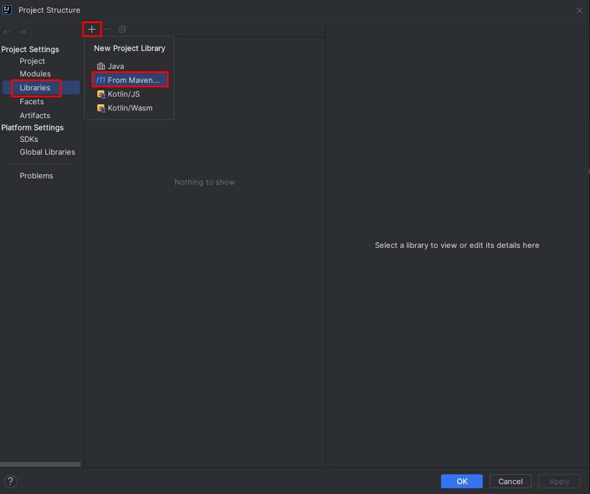

Предыдущее занятие |         &nbsp;          | Следующее занятие
:----------------:|:-----------------------:|:----------------:
[ЛР 1](..%2FLR1%2FLR_1.MD) | [Содержание](../README.MD) | [ЛР 3](..%2FLR3%2FLR_3.MD)

# LR 2. Unit-тесты

## Требования к сдаче работы

1. Индивидуальный отчёт по лабораторной работе оформляется используя
   **текстовые редакторы Word(или подобные ему)
   в текстовый файл формата doc или docx.** [ШАБЛОН ДЛЯ ОТЧЕТА ПО ЛР2](LR2_Report.docx)
2. В индивидуальном отчёте должны быть указаны цель, [задание](LAB1_Variants.docx), номер варианта(ваш порядковый номер в списке группы в
журнале на моем сайте), представлены необходимый программный код и пояснения к ним.

***Критерии оценивания***

* Оценка 5
   * Сделать [Пример проекта с подключением JUnit](#пример-проекта-с-подключением-junit) и и добавьте скриншоты в отчет.
   * Выполните [задание](#задание) согласно вашему варианту.
   * Оформить индивидуальный отчет [ШАБЛОН ДЛЯ ОТЧЕТА ПО ЛР2](LR2_Report.docx) и ответить на вопросы.
   * загрузить все в гугл форму:[235 группа](https://forms.gle/rsQvqzeLBAh8pWQa7) или [237 группа](https://forms.gle/xZioXLRf2bn6ymES9)

* Оценка 4
   * Сделать [Пример проекта с подключением JUnit](#пример-проекта-с-подключением-junit) и и добавьте скриншоты в отчет.
   * Выполните [задание](#задание) согласно вашему варианту.
   * Оформить индивидуальный отчет [ШАБЛОН ДЛЯ ОТЧЕТА ПО ЛР2](LR2_Report.docx) без ответов на вопросы.
   * загрузить все в гугл форму:[235 группа](https://forms.gle/rsQvqzeLBAh8pWQa7) или [237 группа](https://forms.gle/xZioXLRf2bn6ymES9)

* Оценка 3
   * Сделать [Пример проекта с подключением JUnit](#пример-проекта-с-подключением-junit) и добавьте скриншоты в отчет.
   * Оформить индивидуальный отчет [ШАБЛОН ДЛЯ ОТЧЕТА ПО ЛР2](LR2_Report.docx).
   * загрузить все в гугл форму:[235 группа](https://forms.gle/rsQvqzeLBAh8pWQa7) или [237 группа](https://forms.gle/xZioXLRf2bn6ymES9)

# Оглавление

1. [Задачи тестирования](#задачи-тестирования)
   * [Требования к программе и сценарии тестирования](#требования-к-программе-и-сценарии-тестирования)
   * [Как проверять требования](#как-проверять-требования)
   * [Пример тестирования](#пример-тестирования)
2. [JUnit — фреймворк для тестов](#junit--фреймворк-для-тестов)
   * [Знакомимся с JUnit](#знакомимся-с-junit)
   * [Пример проекта с подключением JUnit](#пример-проекта-с-подключением-junit)
3. [JUnit. Методы](#junit-методы)
4. [Задание](#задание)
5. [Контрольные вопросы](#контрольные-вопросы)


---

<details>

<summary>Задачи тестирования</summary>

# Задачи тестирования

[Оглавление](#оглавление)

Люди довольно часто совершают ошибки, а техника отказывает. По
этому в процесс любого производства включён этап проверки. Автомобили допускаются 
к серийному выпуску только после успешного прохождения всех краш-тестов, 
сложность которых возрастает с каждым годом. Чайники, миксеры и другие бытовые электроприборы 
проходят обязательные проверки на соответствие требованиям пожарной безопасности.

Всё это необходимо для предотвращения возможных рисков. Например, 4 июня 1996 года грузовая ракета Ариан-5 
взорвалась через 37 секунд после взлёта из-за ошибки в программе по расчёту угла наклона. 
Ущерб составил около одного миллиарда долларов.

Требования к качеству продуктов в современном мире становятся всё более строгими. 
Пользователи привыкли, что программное обеспечение работает почти идеально. 
Из-за любой ошибки ваш клиент может перейти к конкурентам или оставить негативный отзыв. 
Поэтому так важно, чтобы каждый разработчик понимал важность процесса тестирования продукта 
до его выпуска на широкую аудиторию.

**Тестирование программы** (англ. software testing) — это исследование, при котором происходит:
* проверка соответствия между ожидаемым и реальным поведением программы,
* а также выявление или подтверждение каких-либо её свойств.
* 
Есть много разных видов проверок: тестирование производительности, нагрузки, гипотез, 
безопасности и так далее. 
Вы изучите базовый вид — **функциональное тестирование** (англ. _functional testing_).
Именно оно проверяет, что программа соответствует **функциональным требованиям** 
(англ. _functional requirements_), то есть делает то, что от неё ожидает пользователь. 
Например, что при включении умного чайника вода нагревается, а не превращается в лёд.


## Требования к программе и сценарии тестирования

Чтобы проверить, что программа работает корректно, необходимо узнать, 
с какой целью она создавалась. 
Другими словами, нужно определить **требования к программе**
(англ. _software requirements_).

Требования могут иметь разную форму и содержание. 
Иногда они представлены в виде официальных документов: 
спецификаций и технических заданий. Часто таких документов нет, 
и единственный способ узнать требования — поговорить с заказчиком.

Требования разделяются на:

* **функциональные**, которые отвечают на вопрос, что должна делать программа. 
Например, на сайте по продаже билетов в кино должна быть кнопка «купить». 
При нажатии на неё будет открываться форма оплаты.

* **нефункциональные**, которые отвечают на вопрос, 
как программа должна выполняться. Вернёмся к примеру с сайтом. 
Нефункциональное требование может звучать так: форма оплаты должна 
открываться менее чем за две секунды с момента нажатия на кнопку «купить».

### Примеры

> **Функциональные требования**
> * Сервис должен отправлять письмо на почту пользователя с информацией о купленных билетах.
> * При закрытии программы должно появляться окно с предложением сохранить проект.
> * При переходе на новый уровень игрок должен получать количество золота по формуле [Уровень * 1000].

> **Нефункциональные требования**
> * Дата покупки должна отображаться как «число.месяц.год»
> * Номер бронирования билета должен пересылаться в строковом формате.
> * Приложение должно запускаться на Android выше 10-й версии.
> * Программа должна возвращать ответ в течение 100 миллисекунд.

## Как проверять требования

Итак, сначала нужно составить или получить список требований.
Затем — написать набор сценариев тестирования. 
Именно они будут определять, делает ли программа то, что от неё ожидается в разных ситуациях. 
Такие сценарии называют **тест-кейсами** (англ. _test case_).

Правильный тест-кейс состоит из трёх частей. 
Рассмотрим их на примере тестирования калькулятора:

* **Подготовка** — определение входных параметров и предусловий. 
Что нужно, чтобы начать тест? Какие данные нам потребуются?
Для проверки калькулятора нам нужны два числа на вход (например, `7` и `4`) и работающий экземпляр класса Calculator.
* **Исполнение** — определение процедуры тестирования. Как именно мы проверяем, 
что программа работает корректно? Какие для этого нужно вызвать методы? 
Какая будет последовательность действий? В примере с калькулятором у 
экземпляра класса вызываем метод сложения. 
В качестве аргументов передаём два числа, заданных на этапе подготовки.
* **Проверка** — сравнение ожидаемого результата с полученным. 
Проверяем, что результат метода в нашем калькуляторе совпадает с ожидаемым и равняется `11`.


Получив тест-кейсы, можно создать и провести **тесты**, 
то есть автоматические или ручные операции по проверке тест-кейсов.


## Пример тестирования

Перенесёмся в будущее. Представим, что вы стали успешным программистом на Java (ура!), 
и ваш руководитель дал вам первое важное задание. 
Нужно написать программу для одного крупного магазина, 
которая будет рассчитывать сумму покупки с учётом скидки.

Условия такие: если сумма находится в диапазоне от `1` до `999` рублей — скидки не будет.
А если сумма покупки больше или равна `1000` рублей — клиенту предоставляется скидка в размере
`2%`. Сумма покупки задаётся только в рублях, без копеек.

Здесь требования к программе прописаны прямо в условии задачи. Сформулируем их более конкретно:
1. Если сумма покупки находится в диапазоне от `1` до `999` рублей, то скидка будет `0%`.
2. Иначе скидка составит `2%`.


Теперь составим тест-кейсы. 
Поскольку у нас есть пронумерованный набор требований, 
тест-кейсы для удобства тоже можно пронумеровать:

1. Если сумма покупки находится в диапазоне от 1 до 999 рублей, то скидка будет 0%.
- 1.1. Совершается покупка на 1 рубль. Ожидаемое поведение: стоимость покупки составляет 1 рубль.
- 1.2. Совершается покупка на 333 рубля. Ожидаемое поведение: стоимость покупки составляет 333 рубля.
- 1.3. Совершается покупка на 999 рублей. Ожидаемое поведение: стоимость покупки составляет 999 рублей.
2. Иначе скидка составит 2 %.
- 2.1. Совершается покупка на 1000 рублей. Ожидаемое поведение: стоимость покупки составляет 980 рублей (−2%).
- 2.2. Совершается покупка на 2000 рублей. Ожидаемое поведение: стоимость покупки составляет 1960 рублей (−2%).


Тест-кейсы 1.1, 1.3 и 2.1. проверяют значения на границах интервалов [1;1000) и [1000;+∞).
Такие значения называются **граничными** (англ. _boundary values_), мы расскажем о них подробнее в следующих уроках. 
А пока заметим, что проверка граничных значений — важное условие. Значительная часть ошибок в программировании совершается именно на граничных значениях.

Помимо граничных значений, необходимо проверить выполнение требований на одном из чисел внутри интервала от 1 до 999.
Нет разницы, на каком именно — 333, 543 или любом другом. Все эти значения **эквивалентны** (англ. _equivalent values_).

Все тест-кейсы необходимо выполнить. Можно запускать программу самостоятельно, передавая различные значения на вход и сверяя их с ожидаемыми — это ручное тестирование. А можно написать код, который будет делать то же самое автоматически — это автоматическое тестирование.

После исполнения тест-кейса необходимо зафиксировать его результат. 
Если реальное поведение программы совпало с ожидаемым, то считается, что тест пройден (англ. _test passed_), 
если поведение отличается — тест провален (англ. _test failed_).

В автотестах результат обычно выводится в виде списка, в котором указано, какие из тестов были пройдены, а какие — провалены.
Это нужно для того, чтобы можно было перейти к любому из проваленных кейсов и исправить либо сам тест,
либо код, который он проверяет.

При ручном тестировании всё зависит от организации: кто-то ставит галочки на листке бумаги, 
кто-то фиксирует текстом в электронном виде, а кто-то просто запоминает. 
Главное — получить ответ: прошла программа тест или нет.

Подведём итог. Для проверки корректности программы нужно проделать следующие шаги:
* Получить/составить/выяснить набор функциональных и нефункциональных требований к программе.
* Для всех требований составить набор тест-кейсов и провести их.

---
### Из каких элементов должен состоять один тест-кейс?

> * **Определение входных параметров и предусловий.**
    Перед началом процедуры тестирования к ней нужно подготовиться.

> * **Сравнение ожидаемого результата с полученным.**
На этом шаге проверяется, исполняет ли программа конкретное требование.

> * **Определение процедуры тестирования.**
Процедура тестирования показывает, из каких шагов состоит тест-кейс.

> * **Информация о результате тест-кейса.**
Без информации о результатах тест-кейса нельзя дать ответ, отвечает ли программа установленным требованиям.
---
</details>

<details>

<summary>JUnit — фреймворк для тестов</summary>

# JUnit — фреймворк для тестов

[Оглавление](#оглавление)

Для тестирования существует огромное количество методов, которые объединены во множество библиотек.

## Знакомимся с JUnit

**Фреймворк** (англ. _framework_) — особый класс библиотек.
В нём содержится набор классов и методов,
которые вы можете использовать в своей программе. 
Фреймворк отличается от обычной библиотеки тем, что код библиотеки вы запускаете из вашего кода, 
в то время как фреймворк наоборот может использовать ваш код в своей работе.


Один из самых популярных фреймворков для тестирования на Java — **JUnit**. 
Чтобы написать первый тест с помощью **JUnit**, нужно сделать всего два шага:
* Подключить к проекту **JUnit** как библиотеку.
* Создать метод и пометить его аннотацией `@Test`. 

**Аннотации** — это механизм Java, представляющий дополнительную информацию о создаваемых классах и методах.

Вы уже сталкивались с ним в теме про наследование.

## Пример проекта с подключением JUnit

### Видеоинструкции
    
1. [Создание проекта и подключение JUnit(короткое видео без звука)](https://boosty.to/itmagic/posts/e66c8d9e-95c8-4fb3-acce-55dab5c0c5c5?share=post_link)
2. [Создание проекта и подключение JUnit(с объяснением)](https://boosty.to/itmagic/posts/2082ebb4-545c-4af8-917c-12e7bc287205?share=post_link)

### IntelliJ Build tool

#### Создание проекта

1. Запустите IntelliJ IDEA.
2. Выберите слева вкладку **Projects**  и нажмите на кнопку **New Project**.
   

3. Дайте имя проекту **debug-app**.
   Language - **Java**, Build system - **IntelliJ**.
   В качестве JDK используйте Amazon Coretto 22. Нажмите **Create**.
   
4. Если все настройки пройдены успешно появится окно с вашим проектом.
   
5. Запустите свой проект. Нажмите правой кнопкой мыши в любом месте файла Main.java и в контекстном меню выберите `Run`


Проект успешно создан.

#### Подключение библиотеки JUnit

1. В меню File выберите пункт ProjectStructure


2. В окне Project Structure выберите вкладку **Libraries** и нажмите на кнопку `+`\`From Maven...`

   

3. В окне `Download Library from Maven Repository` в поле поиска введите `org.junit.jupiter` и нажмите на кнопку поиска  


4. Дождитесь пока Idea подключится к центральному репозиторию Maven и подгрузит информацию о доступных к скачиванию версиях библиотек Junit. Выберите из выпадающего списка подходящую версию библиотеки.


5. Выберите подходящую версию и нажмите `OK`.


6. В окне **Choose Mosules** оставьте все без изменений и нажмите **OK**.


7. Если все выполнится успешно то библиотека подключится к проекту. Нажмите кнопку `Aplly` и затем `OK`.


#### Создание кода


1. Нажмите правой кнопкой по папке src. Далее в контекстном меню выберите `New\Java Class`.


2. Введите название класса `DiscountCalculator` и нажмите `Enter`


Замените код класса на следующий

```java
public class DiscountCalculator {

    public int sumAfterDiscount(int sum) {
        if (sum < 1000) {
            return sum;
        } else {
            return (int) (sum * 0.98);
        }
    }
}

```
3. Нажмите правой кнопкой мыши по названию проекта, далее выберите пункт **New\Directory**.


4. Введите название `test` и нажмите кнопку `Enter`


5. Нажмите правой кнопкой мыши по папке test далее в контекстном меню выберите пункт `Mark Directory as\Test Sources Root`


6. Откройте файл `DiscountCalculator.java` и установите курсор на название класса `DiscountCalculator`. 
Нажмите правую кнопку мыши и в контекстном меню выберите пункт `Generate...`


7. В следующем окошке выберите пункт `Test...`


8. В окне **Create Test** поставьте галочку возле названия метода `sumAfterDiscount`. 
Обратите внимание на название создаваемого класса в поле `Class name`. 
Как правило, класс с тестами называют так же, как базовый класс, добавляя в конце слово `“Test”`. 
В нашем случае получится DiscountCalculatorTest.  Нажмите `ОК`.


9. Если все правильно сделано, то должна открыться новая вкладка с кодом класса `DiscountCalculatorTest`


10. Замените код класса `DiscountCalculatorTest` на следующий.

```java
// Заметьте, что классы фреймворка импортируются из пакетов 
// отличных от пакетов стандартной библиотеки Java
import org.junit.jupiter.api.Assertions;
import org.junit.jupiter.api.Test;

public class DiscountCalculatorTest {

    DiscountCalculator discountCalculator = new DiscountCalculator();

    @Test
    public void shouldGiveNoDiscountForValue999() {
        // Подготовка
        int buySum = 999;
        int expectedSum = 500;

        // Исполнение
        int resultSum = discountCalculator.sumAfterDiscount(buySum);

        // Проверка
        Assertions.assertEquals(expectedSum, resultSum);
    }
}
```

11. Осталось проверить работу тестовых методов.
 * Для запуска одного тестового метода достаточно нажать на кнопку  слева от сигнатуры тестового метода.
 * Для запуска всех тестов тестового класса надо нажать на кнопку  слева от названия класса.


12. Нажмите на кнопку  и в выпадающем меню выберите **Run**.


13. Произойдет построение теста. На данный момент у нас только один тестовый метод. Ожидаемый(expectedSum) и фактический(resultSum) 
результаты не совпали, следовательно, статус нашего теста будет - `Test failed`(тест не пройден)
В коде теста мы специально написали, что для товара стоимостью 999 мы ожидаем получить итоговую сумму 500, хотя в реальности исходя из нашего примера должны получить 999. 


14. Исправьте значение переменной expectedSum = 999. Снова выполните тесты.

```java
import org.junit.jupiter.api.Test;

public class DiscountCalculatorTest {

    DiscountCalculator discountCalculator = new DiscountCalculator();

    @Test
    public void shouldGiveNoDiscountForValue999() {
        // Подготовка
        int buySum = 999;
        int expectedSum = 999;

        // Исполнение
        int resultSum = discountCalculator.sumAfterDiscount(buySum);

        // Проверка
        Assertions.assertEquals(expectedSum, resultSum);
    }
}
```

15. На этот раз Ожидаемый(expectedSum) и фактический(resultSum)
результаты совпали, следовательно, статус нашего теста будет - `Test passed`(тест пройден)


> ### **Сделайте снимок экрана 1 - Созданный пример по уроку**

</details>

<details>

<summary>JUnit. Методы</summary>

# JUnit. Методы

[Оглавление](#оглавление)

JUnit, как и многие другие библиотеки, предоставляет множество инструментов для упрощения стандартных операций. В этом уроке вы изучите основные методы фреймворка, которые позволяют программисту не только быстро проверять свои программы, но и легко ориентироваться в тестах, написанных другими разработчиками.

## Метод assertEquals(...)

Метод `assertEquals(...)`
Ещё один элемент `JUnit` — это множество статических методов класса `Assertions`. 
Один из них, `assertEquals(Object expected, Object actual, [String message])` вы уже встречали его выше примерах. 
Он принимает 2 или 3 аргумента. Первый — это ожидаемый результат, второй — фактический. Третий аргумент —
необязательная строка, которая выведется, если фактический результат не равен ожидаемому, другими словами, если тест обнаружит ошибку.


## Методы `Assertions.assertNull(...)` и `Assertions.assertNotNull(...)`

Проверить, что значение переменной равно `null`, можно с помощью метода `assertEquals(Object object)`:

```java
@Test
public void shouldBeNull() {
    String nullString = null;
    Assertions.assertEquals(null, nullString);
}
```

А если нужно удостовериться, что значение не равно `null`, 
понадобится метод `assertNotEquals(Object object)`:

```java
@Test
public void shouldNotBeNull() {
    String apple = "apple";
    Assertions.assertNotEquals(null, apple);
}
```

Оба теста работают корректно. 
Но если проверку на null вам нужно выполнять часто,
то писать каждый раз `Assertions.assertEquals(null, value)` будет излишеством. 

Лучше воспользоваться более удобными методами `Assertions.assertNull(Object object)` 
и `Assertions.assertNotNull(Object object)`.

```java
import org.junit.jupiter.api.Test;

import static org.junit.jupiter.api.Assertions.assertNotNull;
import static org.junit.jupiter.api.Assertions.assertNull;

public class NullabilityTest {

    @Test
    public void shouldBeNull() {
        String nullString = null;
        assertNull(nullString);
    }

    @Test
    public void shouldNotBeNull() {
        String apple = "apple";
        assertNotNull(apple);
    }
}

```

> Обратите внимание на использование `import static` в примере выше. 
> Методы класса `Assertions` часто импортируют как статические методы, 
> чтобы сократить запись. Это удобно, потому что в одном классе 
> может быть много тестов, и каждый из них будет вызывать какой-то 
> из методов проверки класса `Assertions`. В результате вместо такой записи:

```java
Assertions.assertNull(firstString);
Assertions.assertNotNull(secondString);
Assertions.assertEquals(expected, actual);
```

Будет такая

```java
*assertNull*(firstString);
*assertNotNull*(secondString);
*assertEquals*(expected, actual);
```

Вы также можете импортировать все методы сразу через

```java
  import static org.junit.jupiter.api.Assertions.*.
```

## Методы `assertTrue(...)` и `assertFalse(...)`

Аналогичные методы существуют для проверки значений типа boolean. 
Вы можете использовать assertEquals(true, value) 
или assertEquals(false, value), но удобнее будет делать это с 
помощью специальных методов `assertTrue(value)` и `assertFalse(value).`

```java
import org.junit.jupiter.api.Assertions;
import org.junit.jupiter.api.Test;

import static org.junit.jupiter.api.Assertions.assertTrue;

public class BooleanTest {

    @Test
    public void shouldBeTrue() {
        boolean value = true;
        assertTrue(value);
    }

    @Test
    public void shouldBeFalse() {
        boolean value = false;
        Assertions.assertFalse(value);
    }
}

```

> При сравнении значений через assertEquals() используется метод equals(..) 
> из класса Object. Поэтому для того, чтобы операция была выполнена корректно, в классах объектов этот метод должен быть корректно переопределён. 
> В противном случае сравнение будет работать неправильно.

> Есть ещё одна важная особенность, связанная с методом equals(..).
> Его нельзя переопределить для массивов. Другими словами, два массива с одинаковым содержанием (одинаковыми элементами, расположенными в том же порядке) — это разные объекты с точки зрения Java.
> Поэтому метод equals(..) всегда будет возвращать false для таких массивов, 
> а тест с assertEquals(...) не будет проходить.

 
> Для поэлементного сравнения массивов можно воспользоваться методом 
> Arrays.equals(...), а в JUnit можно использовать метод класса 
> `**Assertions — assertArrayEquals(...)**`. 

</details>

---

<details>

<summary>Задание</summary>

## Задание

1. Создайте новый проект с подключением библиотеки JUnit.
2. в папке `src` создайте новый публичный класс IvanovIvanLab2.java
3. Добавьте в этот класс публичный метод `public String CheckNumberX(double x)`, который определяет принадлежность этой точки одному из выделенных отрезков, согласно вашему варианту 
задания из ЛР1[LAB1_Variants.docx](LAB1_Variants.docx)

Например, для области 


код будет следующим.

`IvanovIvanLab2.java`

```java

public class IvanovIvanLab2 {

     public String checkNumberX(double x)
        {
            if (x >= -5 && x < 1)
                return "принадлежит";
            else
                return "не принадлежит";
        }
       
```

4. Создайте класс модульных тестов IvanovIvanLab2Test.java
5. Создайте в нем необходимое количество тестов для покрытия всех требований метода.
    например, для данной области нужно будет создать пять тестов:
    * два теста для проверки на границах области:
      * для x = -5;
      * для x = 1.
    * три теста на каждую из областей: 
      * для x из области A(-∞; -5), например -8; 
      * для x из области B(-5;1), например -2;
      * для x из области C(1; +∞), например 8;. 

`IvanovIvanLab2Test.java`

```java
import org.junit.jupiter.api.Assertions;
import org.junit.jupiter.api.Test;

public class IvanovIvanLab2Test {

    IvanovIvanLab2 ivanovIvanLab2 = new IvanovIvanLab2();

    @Test
    public void shouldReturnNoBelongForValueMinus8() {
        // Подготовка
        int x = -8;
        String expected = "не принадлежит";

        // Исполнение
        String result = ivanovIvanLab2.checkNumberX(x);

        // Проверка
        Assertions.assertEquals(expected, result);
    }
}
          
```
6. Выполните тесты. 


> ### **Сделайте нимок экрана 2 - Проверка тестовых методов класса IvanovIvanLab2Test.**

7. Оформить индивидуальный отчет [ШАБЛОН ДЛЯ ОТЧЕТА ПО ЛР2](LR2_Report.docx) и ответить на вопросы.

</details>


<details>

<summary>Контрольные вопросы</summary>

## Контрольные вопросы

1. Что такое модульное (Unit) тестирование?
2. Зачем оно нужно?
3. Методы модульного тестирования
4. Преимущества модульного тестирования
5. Недостатки модульного тестирования

</details>

Предыдущее занятие | &nbsp; | Следующее занятие
:----------------:|:----------:|:----------------:
[ЛР 1](..%2FLR1%2FLR_1.MD) | [Содержание](../README.MD) | [ЛР 3](..%2FLR3%2FLR_3.MD)