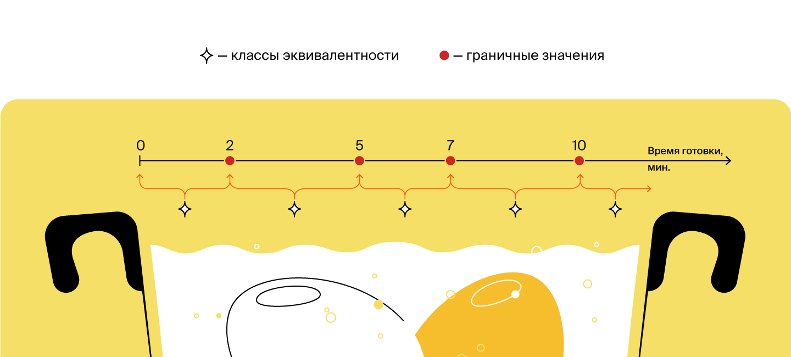
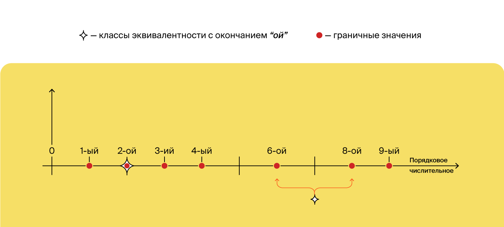
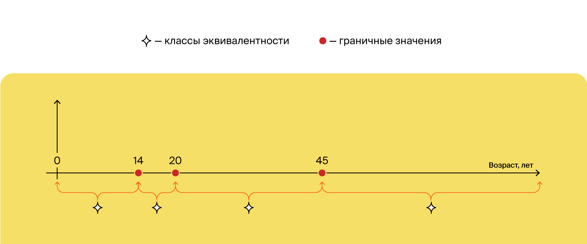
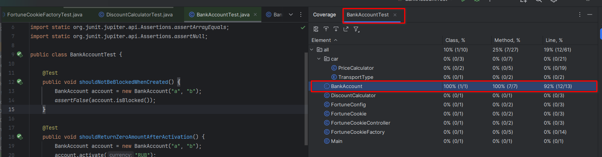
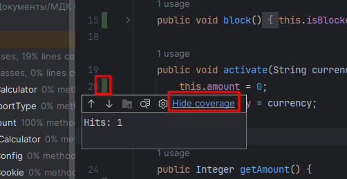
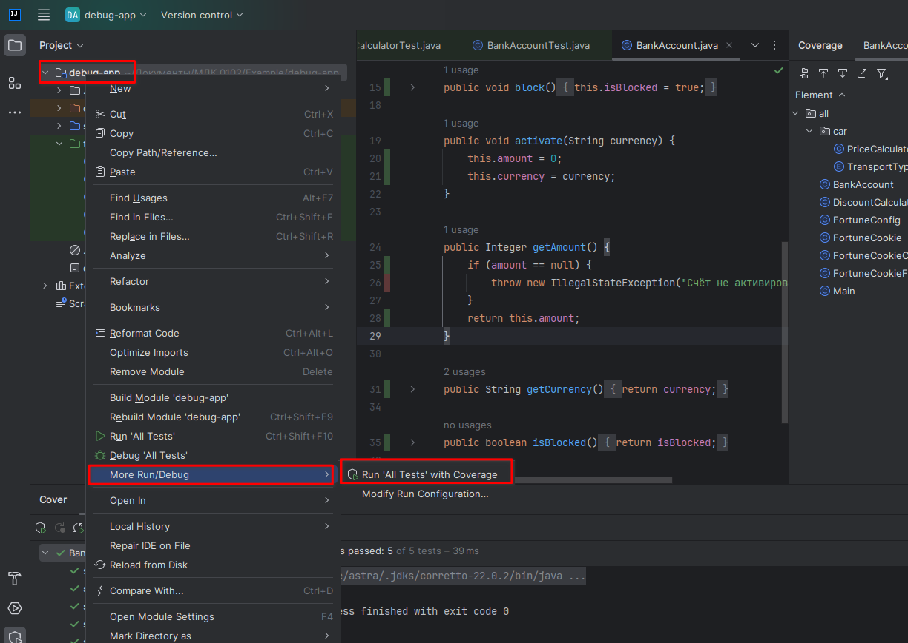
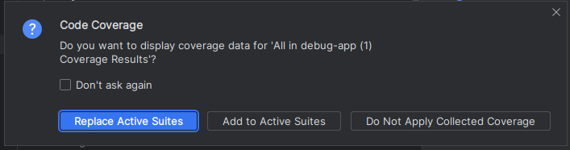

Предыдущее занятие |         &nbsp;          | Следующее занятие
:----------------:|:-----------------------:|:----------------:
[Урок 10](LESSON10.MD) | [Содержание](../README.MD) | [Урок 12](LESSON11.md)

# Лекция 7. Тестовое окружение и покрытие кода

# Оглавление

1. [Введение в тему](#введение-в-тему)
2. [Тестовое окружение](#тестовое-окружение)
   * [Что такое окружение](#что-такое-окружение)
   * [Тестовое окружение](#тестовое-окружение-1)
   * [Подготовка тестового окружения](#подготовка-тестового-окружения)
3. [Классы эквивалентности и граничные значения](#классы-эквивалентности-и-граничные-значения)
4. [Покрытие кода и покрытие требований](#покрытие-кода-и-покрытие-требований)
    * [Считаем тестовое покрытие в Intellij IDEA](#считаем-тестовое-покрытие-в-intellij-idea)
5. [Краткий конспект](#краткий-конспект)
6. [Задание](#задание)
7. [Контрольные вопросы](#контрольные-вопросы)

---

<details>

<summary>Тестовое окружение</summary>

# Тестовое окружение

[Оглавление](#оглавление)

Современные приложения — это миллиарды строчек кода, которые описывают сложную систему со строгой и развитой логикой. 
Некоторые компании за время своего существования произвели и теперь 
поддерживают огромные базы рабочего кода. И чем больше разработчиков вносят изменения в продукт, 
тем выше становится вероятность появления в нём багов.

## Что такое окружение

**Среда, или окружение** (англ. _environment_) — это сервер или группа серверов, на которых находится копия приложения. Конкретное окружение часто называется **стендом** (англ. _stand_).

У любой компании есть как минимум одна среда — та, с которой взаимодействуют её клиенты. 
Но часто для полноценной работы над продуктом выделяют и другие окружения:

* **Среда разработки** (англ. _development environment_), **dev** или **dev-стенд**. 
Используется исключительно для разработки. Именно сюда стекаются изменения от всех программистов, 
работающих над проектом. Здесь же запускаются тесты, написанные разработчиками, и ставятся эксперименты.
* **Тестовая среда** (англ. _test environment_), **test** или **test-стенд**. Здесь продукт стабилизируется при помощи более сложных тестов. 
Например, **интеграционных** (англ. _integration tests_) **— которые объединяют (интегрируют) несколько программ/сервисов вместе. 
При интеграционном тестировании часто проверяют, корректно ли данные из одного сервиса передаются в другой. 
Такие тесты часто пишут отдельные команды тестировщиков.
* **Продуктовая среда** (англ. _production environment_), или **prod**. Её ещё называют «боевая среда» 
как противоположность тестовой, «учебной». 
С ней взаимодействуют клиенты компании, поэтому любые ошибки могут привести к денежным и репутационным потерям.
В идеальном мире к моменту выкладки кода на прод в программе уже не должно быть багов, влияющих на пользователя.


Многие компании создают и другие среды для своих целей. Например, одни воспроизводят баги в специфичном окружении — на сервере с определённой версией Java. 
Другие используют отдельные среды для разных видов тестов. 
Третьи вообще создают отдельное тестовое окружение для каждого изменения в коде. 

Во всём этом многообразии одна вещь остаётся верной всегда. Тесты сокращают количество багов, которые увидит конечный пользователь. 

> 💡 Окружением часто называют не только полноценный набор 
> серверов с копией приложения, но также и набор внешних параметров, от которых зависит работа программы. Это может быть и версия Java, и другие приложения, 
> и разные файлы конфигурации. Часть таких внешних параметров 
> можно контролировать во время тестирования, с чем тоже помогает библиотека JUnit.


## Тестовое окружение

При тестировании часто бывает удобно выделить набор доступных классов и конфигураций в мини-окружение,
чтобы использовать его для тестов. 
Такой подход позволяет упростить тестирование классов со сложным порядком инициализации. 

Возьмём в качестве примера `OvercomplicatedCookieFactory` (англ. «переусложнённая фабрика печенек») — класс по производству печенек с предсказаниями. 
При создании его экземпляра нужно указать:
* возможные позитивные и негативные предсказания,
* а также флаг, который будет говорить, какие нужно создавать печеньки: с позитивными предсказаниями или с негативными.

Каждая созданная печенька увеличивает внутренний счётчик готовых печенек. Давайте протестируем этот класс.

```java
import java.util.ArrayList;
import java.util.Random;

public class OvercomplicatedCookieFactory {
    private int cookiesCreated = 0;
    private final ArrayList<String> positiveTexts;
    private final ArrayList<String> negativeTexts;
    private final boolean isPositive;

    // класс Random используется, чтобы возвращать случайное предсказание из списка.
    private final Random rnd = new Random();

    public OvercomplicatedCookieFactory(
            ArrayList<String> positiveTexts,
            ArrayList<String> negativeTexts,
            boolean isPositive
    ) {
        this.positiveTexts = positiveTexts;
        this.negativeTexts = negativeTexts;
        this.isPositive = isPositive;
    }

    // Печём печеньку!
    public String bakeFortuneCookie() {
        StringBuilder cookieBuilder = new StringBuilder();

        // увеличиваем счётчик печенек:
        this.incrementNumberOfCookiesCreated();

        // возвращаем хорошее или плохое предсказание:
        if (isPositive) {
            cookieBuilder.append(randomPositive());
        } else {
            cookieBuilder.append(randomNegative());
        }

        // преобразовываем результат в строку:
        return cookieBuilder.toString();
    }

    // возвращаем количество испечённых печенек:
    public int getCookiesCreated() {
        return this.cookiesCreated;
    }

    // обнуляем счётчик созданных печенек:
    public void resetCookiesCreated() {
        this.cookiesCreated = 0;
    }

    // Увеличиваем счётчик испечённых печенек:
    private void incrementNumberOfCookiesCreated() {
        this.cookiesCreated++;
    }

    // Выбираем произвольное предсказание из списка позитивных:
    private String randomPositive() {
        // Получаем целое случайное число от нуля до максимального размера массива - 1.
        int randomIndex = rnd.nextInt(positiveTexts.size());
        return positiveTexts.get(randomIndex);
    }

    // Выбираем произвольное предсказание из списка негативных:
    private String randomNegative() {
        // Получаем целое случайное число от нуля до максимального размера массива - 1.
        int randomIndex = rnd.nextInt(negativeTexts.size());
        return negativeTexts.get(randomIndex);
    }
}
```

Первые два необходимых теста — создание позитивных предсказаний `shouldReturnPositiveCookie() `
и счётчика печенек `shouldIncreaseCounterByOneAfterCookieBaked()`. 

```java
import org.junit.jupiter.api.Assertions;
import org.junit.jupiter.api.Test;
import java.util.ArrayList;

public class OvercomplicatedCookieFactoryTest {

    @Test
    public void shouldReturnPositiveCookie() {
        ArrayList<String> positiveTexts = new ArrayList<>();
        positiveTexts.add("Вам повезёт!");

        ArrayList<String> negativeTexts = new ArrayList<>();
        negativeTexts.add("Сегодня будет дождь");
        
                OvercomplicatedCookieFactory cookieFactory = new OvercomplicatedCookieFactory(
                positiveTexts,
                negativeTexts,
                true
        );
        String cookieText = cookieFactory.bakeFortuneCookie();
        Assertions.assertEquals("Вам повезёт!", cookieText);
    }

    @Test
    public void shouldIncreaseCounterByOneAfterCookieBaked() {
        ArrayList<String> positiveTexts = new ArrayList<>();
        positiveTexts.add("Вам повезёт!");

        ArrayList<String> negativeTexts = new ArrayList<>();
        negativeTexts.add("Сегодня будет дождь");
        
        OvercomplicatedCookieFactory cookieFactory = new OvercomplicatedCookieFactory(
                positiveTexts,
                negativeTexts,
                true
        );
        cookieFactory.bakeFortuneCookie();
        Assertions.assertEquals(1, cookieFactory.getCookiesCreated());
    }
}
```

Оба теста используют один и тот же код для создания экземпляра `OvercomplicatedCookieFactory`.
В данном случае это, скорее всего, не приведёт к проблемам. Но в реальных кодовых базах одни классы могут зависеть от других,
и такой код будет занимать очень много места. 


Один из вариантов решения этой проблемы — вынести экземпляр класса в переменную перед тестами.

```java
import org.junit.jupiter.api.Assertions;
import org.junit.jupiter.api.Test;

import java.util.ArrayList;

public class OvercomplicatedCookieFactoryTest {
        private final static ArrayList<String> positiveTexts = new ArrayList<>();
    private final static ArrayList<String> negativeTexts = new ArrayList<>();
        
    private final static OvercomplicatedCookieFactory cookieFactory = new OvercomplicatedCookieFactory(
            positiveTexts,
            negativeTexts,
            true
    );

    @Test
    public void shouldReturnPositiveCookie() {
                negativeTexts.add("Сегодня будет дождь");
                positiveTexts.add("Вам повезёт!");
        String cookieText = cookieFactory.bakeFortuneCookie();
        Assertions.assertEquals("Вам повезёт!", cookieText);
    }

    @Test
    public void shouldIncreaseCounterByOneAfterCookieBaked() {
                negativeTexts.add("Сегодня будет дождь");
                positiveTexts.add("Вам повезёт!");
        cookieFactory.bakeFortuneCookie();
        Assertions.assertEquals(1, cookieFactory.getCookiesCreated());
    }
}

```

В этом случае переменной cookieFactory будет присвоен экземпляр `OvercomplicatedCookieFactory`, 
который используется в обоих тестах. Всё бы хорошо, но таким образом в тестовом классе 
появится нежелательная зависимость между тестами. Дело в том, что порядок их запуска в общем случае не определён.
Более того, он может меняться от запуска к запуску.

Предположим, что сначала выполнится тест создания позитивных предсказаний `shouldReturnPositiveCookie()`.
Поскольку в нём вызывается метод `bakeFortuneCookie()`, внутренний счётчик переменной `cookieFactory` увеличится на единицу. 
Если после этого сразу запустится тест счётчика печенек `shouldIncreaseCounterByOneAfterCookieBaked()`, 
то к внутреннему значению прибавиться ещё единица, и `assertEquals()` выдаст ошибку. Если же сначала запустится тест
счётчика `shouldIncreaseCounterByOneAfterCookieBaked()`, а затем `shouldReturnPositiveCookie()`, 
такой ошибки не произойдёт.
Подобные баги очень сложно обнаружить и исправить, 
поэтому тестовое окружение лучше готовить под каждый тест по отдельности.


## Подготовка тестового окружения

В `JUnit` есть четыре специальных аннотации, которые позволяют запускать определённый код до или после тестов. 

Первая из них — `@BeforeEach` (англ. «перед каждым»). Если установить её над методом, этот метод будет запускаться всякий раз перед любым из тестов внутри класса. 

Исправленный код будет выглядеть следующим образом:

```java
import org.junit.jupiter.api.Assertions;
import org.junit.jupiter.api.BeforeEach;
import org.junit.jupiter.api.Test;

public class OvercomplicatedCookieFactoryTest {

    private static OvercomplicatedCookieFactory cookieFactory;

    @BeforeEach
    public void beforeEach() {
        ArrayList<String> positiveTexts = new ArrayList<>();
        positiveTexts.add("Вам повезёт!");

        ArrayList<String> negativeTexts = new ArrayList<>();
        negativeTexts.add("Сегодня будет дождь");
        
        cookieFactory = new OvercomplicatedCookieFactory(
                positiveTexts,
                negativeTexts,
                true
        );
    }

    @Test
    public void shouldReturnPositiveCookie() {
        String cookieText = cookieFactory.bakeFortuneCookie();
        Assertions.assertEquals("Вам повезёт!", cookieText);
    }

    @Test
    public void shouldIncreaseCounterByOneAfterCookieBaked() {
        cookieFactory.bakeFortuneCookie();
        Assertions.assertEquals(1, cookieFactory.getCookiesCreated());
    }
}
```

Теперь можно писать любое количество проверок. 
Поскольку перед каждым тестом создаётся новый экземпляр `OvercomplicatedCookieFactory`, 
тесты больше не будут зависеть друг от друга. 

Другие три аннотации позволяют запускать произвольный код:
* `@BeforeAll` (англ. «перед всеми») — один раз до запуска всех тестов;
* `@AfterEach` (англ. «после каждого») — каждый раз после окончания каждого теста;
* `@AfterAll `(англ. «после всех») — один раз после окончания всех тестов.

Аннотации, срабатывающие один раз: `@BeforeAll` и `@AfterAll`, должны стоять над статическим методом. 
Если метод будет не статичный, тест попросту не запустится.

Все четыре аннотации могут содержаться в одном тестовом классе. 
Они ведут себя так, как и ожидается: 
* перед началом тестов исполнится `@BeforeAll`, 
* перед каждым тестом — `@BeforeEach`, 
* после каждого — `@AfterEach`. 
* В самом конце, после выполнения всех тестов, сработает `@AfterAll`.

```java
import org.junit.jupiter.api.AfterAll;
import org.junit.jupiter.api.AfterEach;
import org.junit.jupiter.api.BeforeAll;
import org.junit.jupiter.api.BeforeEach;
import org.junit.jupiter.api.Test;

public class TestBenchExample {

    @BeforeAll
    static void beforeAll() {
        System.out.println("Running beforeAll");
    }

    @AfterAll
    static void afterAll() {
        System.out.println("Running afterAll");
    }

    @BeforeEach
    void beforeEach() {
        System.out.println("--Running beforeEach");
    }

    @AfterEach
    void afterEach() {
        System.out.println("--Running afterEach");
    }


    @Test
    public void someTestOne() {
        System.out.println("-- --Running test 1");
    }

    @Test
    public void someTestTwo() {
        System.out.println("-- --Running test 2");
    }
}
```

</details>

---

<details>

<summary>Классы эквивалентности и граничные значения</summary>

# Классы эквивалентности и граничные значения

[Оглавление](#оглавление)

Исполнение каждого теста на JUnit или любом другом тестовом фреймворке 
занимает какое-то время. В больших системах, где количество тестов 
переваливает за десятки и сотни тысяч, проверки могут длиться несколько часов, а иногда и дней. 

Задача разработчика, тестирующего свой код, — проверить, что программа ведёт себя корректно, 
потратив при этом минимальное количество времени. То есть, с одной стороны, тесты должны проверить 
все возможные сценарии поведения программы. С другой — их должно быть настолько мало, насколько это возможно. 

## Граничные значения и классы эквивалентности

Чтобы сократить количество тестов и оставить только самые необходимые, программисты применяют 
техники выделения граничных значений и классов эквивалентности.  

> **Граничные значения** (англ. _boundary values_) — это параметры, при переходе через которые поведение программы меняется.

> **Классы эквивалентности** (англ. _equivalence class_) — параметры, при вводе которых программа ведёт себя одинаково.

Для примера рассмотрим робота, который помогает варить яйца.
На вход он получает информацию о том, сколько минут длится варка, а на выходе говорит, в каком состоянии находится яйцо: 

* если яйцо варится меньше `2` минут — оно ещё сырое;
* от `2` до `5` минут — состояние готовности «в мешочек», когда и белок, и желток жидкие;
* от `5` до `7` минут — состояние готовности «всмятку», когда белок твёрдый, а желток жидкий;
* от `7` до `10` минут — состояние готовности «вкрутую», когда и белок, и желток твёрдые;
* больше `10` минут — яйцо переварено.



Есть два способа составить набор тест-кейсов по граничным значениям и классам эквивалентности:

* **Написать как минимум по одному тесту на каждое из граничных значений,
а также по одному — на любое значение из каждого промежутка класса эквивалентности**. 
Например, протестировать робота можно на значениях: `1, 2, 3, 5, 6, 7, 9, 10, 21 минута.`

* **Проверить работу программы на каждом из граничных значений +/- одно значение**. 
Такой подход связан с тем, что чаще всего ошибки происходят именно при работе с граничными значениями. 
При этом +/- одно значение позволят проверить работу не только на границах, 
но и в рамках каждого класса эквивалентности. 
В таком случае получится больше тестов, 
чем в первом варианте, зато они покроют большую часть возможных ошибок. 
В примере с роботом по готовке яиц понадобятся следующие входные данные: `1, 2, 3, 4, 5, 6, 7, 8, 9, 10, 11`. 
Если бы наш шаг был в половину минуты, значений было бы больше: `1.5, 2, 2.5, 4.5, 5, 5.5, 6.5, 7, 7.5, 9.5, 10, 10.5`.

Бывают такие ситуации, когда между граничными значениями нет класса эквивалентности 
или когда классы эквивалентности встречаются повторно. 
Пример — окончания порядковых числительных. Число `1` превращается в «**первый**», а `2` — во «**второй**». 
При этом окончание «_-ой_» также будет в порядковых числительных «**шестой**», «**седьмой**» и «**восьмой**».



В таком случае можно вывести более широкий класс эквивалентности. 
К примеру, двузначные числа, начинающиеся на цифры от 2 до 9, ведут себя одинаково — при окончании на
2 будет добавляться окончание «-**ой**»: «двадцать втор**ой**», «тридцать втор**ой**». 
Это один класс эквивалентности. При окончании на 3 — «-**ий**»: «сорок трет**ий**», «пятьдесят трет**ий**» и так далее. 
Это другой класс эквивалентности. А вот двузначные числа, начинающиеся с единицы, — особый случай.
Какая бы ни была вторая цифра, окончание будет «-ый»: «одиннадцат**ый**», «двенадцат**ый**» и т. д.

Другой пример — сервис, который помогает выдавать паспорта Российской Федерации. 
На вход программа получает возраст человека, а на выходе говорит, 
нужно ли ему получить или поменять паспорт в этом году. 

По законам Российской Федерации гражданин должен получить паспорт в возрасте 14 лет, 
а затем поменять его в 20 и в 45 лет.
В нашей программе эти числа будут граничными значениями, а любой промежуток между ними — **одним** классом эквивалентности,
так как для любого другого числа ответ будет одинаковым — «паспорт менять не нужно».



</details>

<details>

<summary>Покрытие кода и покрытие требований</summary>

# Покрытие кода и покрытие требований

[Оглавление](#оглавление)

С помощью техник выделения классов эквивалентности и 
граничных значений удобно проверять отдельно взятые методы и классы. 
Но в очень больших проектах невозможно выделить все возможные ситуации, 
в которых будет запускаться программа. А значит, и протестировать программу на 100% не получится. 

Поэтому при работе с масштабными проектами многие компании используют метрики покрытия кодовой базы тестами.
О двух таких метриках расскажем в этом уроке.

## Покрытие кода и покрытие требований

- **покрытие кода** (англ. _code coverage_), показывает, какой процент строк кода исполняется при запуске всех тестов. 
Это может быть и **70%** строк, и **5%** — в зависимости от количества и сложности тестов. **100%** бывает редко, потому что 
покрыть тестами абсолютно весь код — довольно трудоёмкая задача. 
Также покрытие кода иногда называют **тестовым покрытием** (англ. _test coverage_).
 
> 💡 Часто тестовое покрытие считают не от всего кода, 
> а только от **бизнес-логики** (англ. _business logic_) программы. 
> **Бизнес-логика (или бизнес-функционал)** — это та часть кода, которая описывает функциональные требования. 
> В неё не входят файлы конфигураций, настройки окружения и модели объектов. 
> Распространённая практика — устанавливать порог тестового покрытия бизнес-логики в 80%. 
> Такой уровень считается оптимальным соотношением между временем, 
> потраченным на написание тестов, и качеством готового продукта.


- **покрытие требований** (англ. _requirements coverage_), она показывает процент требований, проверенных набором тестов. 

Рассмотрим работу двух этих метрик на примере. 
Допустим, нужно написать метод `transfer(...)` (англ. «_перевод_»)
в классе `MoneyTransferService` (англ. «сервис по переводу денег»), который переводит сумму денег `amount` с одного счёта 
на другой. При этом должны соблюдаться следующие требования:
* переводить деньги можно только на другой счёт (нельзя совершить перевод на тот же счёт, с которого выполняется перевод);
* сумма перевода должна быть больше 0;
* баланс счёта, с которого осуществляется перевод, не может быть меньше 0;
* при зачислении средств на счёт его баланс может только расти.

Разработчик программы торопился и реализовал только два из четырёх требований. В результате код выглядит так:

```java
class MoneyTransferService {

    public int transfer(int amount, Account accountOne, Account accountTwo) {
        // переводить деньги можно только на другой счёт
        if (accountOne.id.equals(accountTwo.id)) {
            System.out.println("Нельзя перевести деньги на тот же аккаунт. Id: " + accountOne.id);
            return -2;
        }
        // сумма перевода должна быть больше 0
        if (amount <= 0){
            System.out.println("Сумма перевода должна быть больше 0. Текущая сумма: " + amount);
            return -1;
        }

        accountOne.balance -= amount;
        accountTwo.balance += amount;
        return 0;
    }

    
}

class Account {
    public String id;
    public int balance;

    public Account(String id, int balance) {
        this.id = id;
        this.balance = balance;
    }
}
```

Тесты

```java
import org.junit.jupiter.api.Test;

import static org.junit.jupiter.api.Assertions.assertEquals;

public class MoneyTransferTest {
    private final MoneyTransferService moneyTransferService = new MoneyTransferService();

    @Test
    void shouldMakeTransfer() {
        Account accountOne = new Account("1", 10);
        Account accountTwo = new Account("2", 10);
        
        assertEquals(0, moneyTransferService.transfer(7, accountOne, accountTwo), "Успешная транзакция должна возвращать результат 0");
        assertEquals(3, accountOne.balance);
        assertEquals(17, accountTwo.balance);
    }

    @Test
    void shouldNotTransferMoneyOnSameAccount() {
        Account accountOne = new Account("1", 10);
        assertEquals(-2, moneyTransferService.transfer(5, accountOne, accountOne), "Нельзя перевести деньги на тот же аккаунт. Id: 1");
    }

    @Test
    public void shouldNotTransferZero() {

        Account accountOne = new Account("1", 10);
        Account accountTwo = new Account("2", 10);

        assertEquals(-1, moneyTransferService.transfer(0, accountOne, accountTwo), "Сумма перевода должна быть больше 0. Текущая сумма: 0");
    }

}


```

Все написанные тесты будут пройдены. Но из этого не следует, что программа написана корректно. 

Покрытие кода в этом случае составит 100%, 
потому что в тесте вызывается каждая строчка кода. 
Тем не менее программа работает неправильно, потому что не выполнены два из четырёх требований: 
баланс может оказаться меньше нуля, а также программа неверно работает с переполнением при переводе очень больших сумм. 
Получается, что покрытие требований на текущий момент — только 50%.

Добавим тесты, чтобы проверить все требования:

```java
import org.junit.jupiter.api.Test;

import static org.junit.jupiter.api.Assertions.assertEquals;

public class MoneyTransferTest {
    private final MoneyTransferService moneyTransferService = new MoneyTransferService();

    @Test
    void shouldMakeTransfer() {
        Account accountOne = new Account("1", 10);
        Account accountTwo = new Account("2", 10);
        
        assertEquals(0, moneyTransferService.transfer(7, accountOne, accountTwo), "Успешная транзакция должна возвращать результат 0");
        assertEquals(3, accountOne.balance);
        assertEquals(17, accountTwo.balance);
    }

    @Test
    void shouldNotTransferMoneyOnSameAccount() {
        Account accountOne = new Account("1", 10);
        assertEquals(-2, moneyTransferService.transfer(5, accountOne, accountOne), "Нельзя перевести деньги на тот же аккаунт. Id: 1");
    }

    @Test
    public void shouldNotTransferZero() {

        Account accountOne = new Account("1", 10);
        Account accountTwo = new Account("2", 10);

        assertEquals(-1, moneyTransferService.transfer(0, accountOne, accountTwo), "Сумма перевода должна быть больше 0. Текущая сумма: 0");
    }

    @Test
    public void shouldNotMakeBalanceLessThanZero() {

        Account accountOne = new Account("1", 10);
        Account accountTwo = new Account("2", 10);
        assertEquals(-3, moneyTransferService.transfer(15, accountOne, accountTwo), "Недостаточно средств на счёте с id 1. Перевод суммы 15 невозможен.");
    }

    @Test
    public void shouldNotMakeOverflowOnTransfer() {

        Account accountOne = new Account("1", 10);
        Account accountTwo = new Account("2", Integer.MAX_VALUE);

        assertEquals(-4, moneyTransferService.transfer(1, accountOne, accountTwo), "Перевод невозможен. Если транзакция выполнится, счёт с id 2 будет переполнен.");
    }
}
```

Тесты `shouldNotMakeBalanceLessThanZero` и `shouldNotMakeOverflowOnTransfer` завершаются ошибкой. Они проверяют два условия:
* баланс счёта, с которого осуществляется перевод, не может быть меньше 0;
* при зачислении средств на счёт его баланс может только расти.

Исправим программу так, чтобы она проходила новые тесты. Но в этом коде не хватает ещё нескольких проверок: по граничным значениям и классам эквивалентности. 

```java
class MoneyTransferService {

    public int transfer(int amount, Account accountOne, Account accountTwo) {
        // переводить деньги можно только на другой счёт
        if (accountOne.id.equals(accountTwo.id)) {
            System.out.println("Нельзя перевести деньги на тот же аккаунт. Id: " + accountOne.id);
            return -2;
        }
        // сумма перевода должна быть больше 0
        if (amount <= 0){
            System.out.println("Сумма перевода должна быть больше 0. Текущая сумма: " + amount);
            return -1;
        }

        // баланс не может стать отрицательным
        if (amount > accountOne.balance) {
            System.out.println("Недостаточно средств на счёте с id " + accountOne.id + ". Перевод суммы " + amount + " невозможен.");
            return -3;
        }

        // перевод не должен приводить к переполнению баланса
        if (accountTwo.balance + amount < 0) {
            System.out.println("Перевод невозможен. Если транзакция выполнится, счёт с " + accountTwo.id + " будет переполнен.");
            return -4;
        }

        accountOne.balance -= amount;
        accountTwo.balance += amount;
        return 0;
    }
}
```

Теперь программа будет работать правильно в любой ситуации. 
Из этого примера можно сделать важный вывод: 

>> 100% покрытие кода совсем не означает, что программа работает корректно. Важно обращать внимание на покрытие требований.

## Считаем тестовое покрытие в Intellij IDEA

Процент запускаемых строчек кода во время теста очень легко подсчитать, например, в среде разработки IntelliJ IDEA.
Для этого перейдите в класс с тестами, наведите курсор
мышки на кнопку запуска одного теста или всего класса.


А затем выберите `Run 'BankAccountTest' with Coverage` (англ. «запустить [имя класса] с покрытием»).


После исполнения тестов в контекстном меню справа можно будет увидеть покрытие кода. 



Если открыть файл с кодом тестируемого класса, то покрытые тестами строки кода также будут выделяться зеленым цветом.


Убрать все обозначения можно командой `Hide Coverage` 
(англ. «**скрыть покрытие**»). Для этого дважды нажмите Shift для вызова контекстного меню, 
введите “Hide Coverage” и нажмите Enter. Или просто наведите курсор мыши на любой из зеленых или красных прямоугольников.
Далее в всплывающем меню нажмите на кнопку `Hide coverage`.




Аналогичным способом можно запустить тесты или подсчёт покрытия не для одного тест-класса, а для всех тестов внутри проекта. 

Для этого нужно щёлкнуть правой кнопкой мыши на открытом модуле в дереве проектов, 
в открывшемся меню выбрать “Run 'All Tests'” 
для запуска всех тестов или “More Run/Debug” → “Run 'All Tests' with Coverage” для подсчёта тестового покрытия.



Если покрытие уже было подсчитано для каких-то пакетов/тест-кейсов, то при запуске подсчёта покрытия для других пакетов IDEA спросит, что делать с новыми результатами:



* **Replace active suites** (англ. «_заменить текущие тест-кейсы»_) — оставит только что запущенный результат;
* **Add to active suites** (англ. «_добавить к текущим тест-кейсам_») — добавит к имеющимся результатам новый;
* **Do not apply collected coverage** (англ. «_не принимать подсчитанное покрытие_») — оставит старые результаты;

Если отметить пункт “Do not show this dialog in the future” (англ. «больше не показывать этот диалог»), 
то выбранный пункт будет применяться всегда.

После подсчётов статистика будет показана для каждого тестируемого класса и для проекта вцелом.


> Если вместо покрытия кода сфокусироваться на покрытии требований к программе, 
> с высокой вероятностью это приведёт к 100% покрытию кода.

</details>


<details>

<summary>Контрольные вопросы</summary>

## Контрольные вопросы

1. Что такое модульное (Unit) тестирование?
2. Зачем оно нужно?
3. Методы модульного тестирования
4. Преимущества модульного тестирования
5. Недостатки модульного тестирования

</details>

Предыдущее занятие | &nbsp; | Следующее занятие
:----------------:|:----------:|:----------------:
[Урок 10](LESSON10.md) | [Содержание](readme.md) | [Урок 12](LESSON12.md)