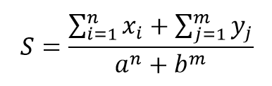

| Предыдущее занятие     | &nbsp;                     | Следующее занятие          |
|------------------------|----------------------------|----------------------------|
| [ЛР 3](../LR3/LR_3.MD) | [Содержание](../README.MD) | [ЛР 4](..%2FLR3%2FLR_3.MD) |

# LR 5. Передача массивов в качестве параметров в метод

## Цель работы:

* Освоить принципы тестирования массивов.
* Научиться создавать unit-тесты с использованием фреймворка JUnit.
* Разработать тест-кейсы для проверки корректности работы методов.
* Провести тестирование на основе позитивных и негативных сценариев.

# Оглавление

1. [Теоретический материал](#теоретический-материал)
2. [Задание](#задание)
3. [Контрольные вопросы](#контрольные-вопросы)
4. [Заключение](#заключение)

## Типовой пример

Типовой пример. Вычислить **S**. Входные данные **a**, **b** - вещественные, **n**, **m** – целые (>0);
**{x<sub>i</sub>}**, **{y<sub>j</sub>}** – массивы, содержащие **n** и **m** вещественных чисел соответственно.



## Класс, реализующий основные методы

```java

import java.util.Random;

public class Lab5 {
    // метод (функция) Степень
    static float Step(float osn, int nn) {
        float st = 1;
        for (int i = 1; i <= nn; i++) {
            st = st * osn;
        }
        return st;
    }

    static float SummaMassiv(float[] mas) {
        float Sum = 0;
        for (int i = 0; i < mas.length; i++) {
            Sum = Sum + mas[i];
        }
        return Sum;
    }

    // x - первый массив, n - его размер
    // y - второй массив, m - его размер
    // a - параметр, b - параметр
    static float GetResult(float[] x, int n, float[] y, int m, float a, float b) {
        float s = (SummaMassiv(x) + SummaMassiv(y)) / (Step(a, n) + Step(b, m));
        return s;
    }

}

```

## Тестовый класс

```java
import org.junit.jupiter.api.Assertions;
import org.junit.jupiter.api.Test;

class Lab5Test {

    @Test
    void getResultFirstMethod() {
        float[] x = {1, 2, 3, 4, 5};
        int n = 5;
        float[] y = {-1, -2, -3, 0};
        int m = 4;
        float a = 1;
        float b = 1;
        float expected = 4.5F;
        float actual = Lab5.GetResult(x, n, y, m, a, b);
        Assertions.assertEquals(expected, actual);
    }
}
```


## Задание

1. Реализуйте методы для решения задач согласно вашему варианту.
   Для этой лабораторной работы варианты будут те же, что и у Парфенова А.В.

### Требования к сдаче работы

1. Индивидуальный отчёт по лабораторной работе оформляется используя
   **текстовые редакторы Word(или подобные ему)
   в текстовый файл формата doc или docx.** [ШАБЛОН ДЛЯ ОТЧЕТА ПО ЛР5](LR5_Report.docx)
2. В индивидуальном отчёте должны быть указаны цель, [задание](LAB5_Variants.docx), номер варианта(ДЛЯ ЭТОЙ РАБОТЫ
   ВАРИАНТЫ ТАКИЕ ЖЕ КАК ПО МДК 01.01 у Парфенова),
   представлены необходимый программный код и пояснения к ним.

***Критерии оценивания***

* Оценка 5
    * Реализовать класс с необходимыми методами согласно вашему варианту [заданий](LAB5_Variants.docx).
    * Написать тестовый класс с использованием JUnit, реализовав тестовые методы,
  чтобы тестовое покрытие методов было  100%.
    * Создать 10 тест-кейсов и оформить их по образцу в индивидуальном отчёте.
    * Оформить индивидуальный отчет [ШАБЛОН ДЛЯ ОТЧЕТА ПО ЛР5](LR5_Report.docx) и ответить на вопросы.
    * загрузить все в гугл форму:[235 группа](https://forms.gle/qSnFBx3ZAuzm1s25A)
      или [237 группа](https://forms.gle/9sRtXMQLVxCmUk4V6)

* Оценка 4
    * Реализовать класс с необходимыми методами согласно вашему варианту [заданий](LAB5_Variants.docx).
    * Написать тестовый класс с использованием JUnit, реализовав тестовые методы,
  чтобы тестовое покрытие методов было  100%.
    * Создать 7 тест-кейсов и оформить их по образцу в индивидуальном отчёте.
    * Оформить индивидуальный отчет [ШАБЛОН ДЛЯ ОТЧЕТА ПО ЛР5](LR5_Report.docx) и ответить на вопросы.
    * загрузить все в гугл форму:[235 группа](https://forms.gle/qSnFBx3ZAuzm1s25A)
      или [237 группа](https://forms.gle/9sRtXMQLVxCmUk4V6)

* Оценка 3
    * Реализовать класс с необходимыми методами согласно вашему варианту [заданий](LAB5_Variants.docx).
    * Написать тестовый класс с использованием JUnit, реализовав тестовые методы,
  чтобы тестовое покрытие методов было  100%.
    * Создать 5 тест-кейсов и оформить их по образцу в индивидуальном отчёте.
    * Оформить индивидуальный отчет [ШАБЛОН ДЛЯ ОТЧЕТА ПО ЛР5](LR5_Report.docx) и ответить на вопросы.
    * загрузить все в гугл форму:[235 группа](https://forms.gle/qSnFBx3ZAuzm1s25A)
      или [237 группа](https://forms.gle/9sRtXMQLVxCmUk4V6)

## Контрольные вопросы
1. Как правильно объявить метод, принимающий массив целых чисел в качестве параметра? Приведите пример вызова такого метода.
2. Изменятся ли элементы исходного массива, если мы передадим его в метод и там модифицируем? Почему?
3. Чем отличается передача массива в метод от передачи простого типа (например, int)?
4. Как вернуть массив из метода? Приведите пример.
5. Что такое varargs (аргументы переменной длины) и как их использовать для передачи произвольного количества элементов в метод?


## Заключение

В ходе лабораторной работы студенты освоили принципы тестирования массивов, научились создавать unit-тесты
с использованием JUnit и разрабатывать тест-кейсы для проверки корректности работы методов.

| Предыдущее занятие     | &nbsp;                     | Следующее занятие          |
|------------------------|----------------------------|----------------------------|
| [ЛР 4](../LR4/LR_4.MD) | [Содержание](../README.MD) | [ЛР 6](..%2FLR3%2FLR_3.MD) |
