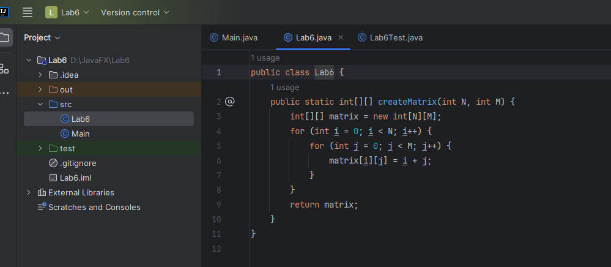
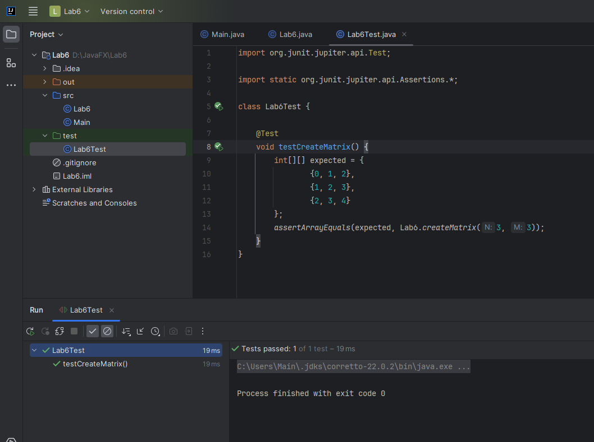

| Предыдущее занятие     | &nbsp;                     | Следующее занятие          |
|------------------------|----------------------------|----------------------------|
| [ЛР 5](../LR4/LR_5.MD) | [Содержание](../README.MD) | [ЛР 7](..%2FLR3%2FLR_3.MD) |

# LR 6. Двумерные массивы (матрицы). Формирование матрицы и вывод ее элементов

## Цель работы:

* Освоить принципы тестирования массивов.
* Научиться создавать unit-тесты с использованием фреймворка JUnit.
* Разработать тест-кейсы для проверки корректности работы методов.
* Провести тестирование на основе позитивных и негативных сценариев.

# Оглавление

1. [Типовой пример](#типовой-пример)
2. [Задание](#задание)
3. [Контрольные вопросы](#контрольные-вопросы)
4. [Заключение](#заключение)

## Типовой пример

Типовой пример. 

Создать матрицу размера $ N \times M $, где каждый элемент равен сумме его строкового и столбцового индексов ($ A[i][j] = i + j $).


## Класс, реализующий основные методы

```java

import java.util.Random;

public class Lab6 {
     public static int[][] createMatrix(int N, int M) {
        int[][] matrix = new int[N][M];
        for (int i = 0; i < N; i++) {
            for (int j = 0; j < M; j++) {
                matrix[i][j] = i + j;
            }
        }
        return matrix;
    }

}

```



## Тестовый класс

```java
import org.junit.jupiter.api.Assertions.*;
import org.junit.jupiter.api.Test;

class Lab6Test {

     @Test
    void testCreateMatrix() {
        int[][] expected = {
            {0, 1, 2},
            {1, 2, 3},
            {2, 3, 4}
        };
        assertArrayEquals(expected, Lab6.createMatrix(3, 3));
    }
}
```




## Задание

1. Реализуйте методы для решения задач согласно вашему варианту.
   
### Требования к сдаче работы

1. Индивидуальный отчёт по лабораторной работе оформляется используя
   **текстовые редакторы Word(или подобные ему)
   в текстовый файл формата doc или docx.** [ШАБЛОН ДЛЯ ОТЧЕТА ПО ЛР6](LR6_Report.docx)
2. В индивидуальном отчёте должны быть указаны цель, [задание](#варианты-заданий), номер варианта(ДЛЯ ЭТОЙ РАБОТЫ
   ВАРИАНТЫ ТАКИЕ ЖЕ КАК ПО МДК 01.01 у Парфенова),
   представлены необходимый программный код и пояснения к ним.

***Критерии оценивания***

* Оценка 5
    * Реализовать класс с необходимыми методами согласно вашему [варианту](#варианты-заданий) для всех заданий.
    * Написать тестовый класс с использованием JUnit, реализовав тестовые методы,
  чтобы тестовое покрытие методов было  100%.
    * Создать по 5 тест-кейсов для каждого из заданий и оформить их по образцу в индивидуальном отчёте.
    * Оформить индивидуальный отчет [ШАБЛОН ДЛЯ ОТЧЕТА ПО ЛР6](LR6_Report.docx) и ответить на вопросы.
    * загрузить все в гугл форму:[235 группа](https://forms.gle/CCg4Q5ApGum9pMmbA)
      или [237 группа](https://forms.gle/GyBYPoVaaetvT89q8)

* Оценка 4
    * Реализовать класс с необходимыми методами согласно вашему [варианту](#варианты-заданий) для 2 заданий из 3.
    * Написать тестовый класс с использованием JUnit, реализовав тестовые методы,
  чтобы тестовое покрытие методов было  100%.
    * Создать по 5 тест-кейсов и оформить их по образцу в индивидуальном отчёте.
    * Оформить индивидуальный отчет [ШАБЛОН ДЛЯ ОТЧЕТА ПО ЛР6](LR6_Report.docx) и ответить на вопросы.
    * загрузить все в гугл форму:[235 группа](https://forms.gle/CCg4Q5ApGum9pMmbA)
      или [237 группа](https://forms.gle/GyBYPoVaaetvT89q8)

* Оценка 3
    * Реализовать класс с необходимыми методами согласно вашему [варианту](#варианты-заданий) для 1 заданий из 3.
    * Написать тестовый класс с использованием JUnit, реализовав тестовые методы, чтобы тестовое покрытие методов было  100%.
    * Создать 5 тест-кейсов и оформить их по образцу в индивидуальном отчёте.
    * Оформить индивидуальный отчет [ШАБЛОН ДЛЯ ОТЧЕТА ПО ЛР6](LR6_Report.docx) и ответить на вопросы.
    * загрузить все в гугл форму:[235 группа](https://forms.gle/CCg4Q5ApGum9pMmbA)
      или [237 группа](https://forms.gle/GyBYPoVaaetvT89q8)

## Контрольные вопросы
1. Как объявить двумерный массив в Java? Приведите пример объявления и инициализации матрицы размера 3×4, заполненной нулями.
2. Как вывести на экран элементы матрицы размера N×M в виде таблицы? Напишите фрагмент кода, который выполняет эту задачу.
3. Что произойдет, если попытаться обратиться к элементу матрицы с индексом, выходящим за пределы массива? Как избежать этой ошибки??
4. Как создать матрицу размера N×M, где каждый элемент равен произведению его индексов? Напишите соответствующий код на Java.
5. Как проверить, является ли матрица квадратной (т.е. количество строк равно количеству столбцов)? Напишите фрагмент кода, который выполняет эту проверку?


## Заключение

В ходе лабораторной работы студенты освоили принципы тестирования массивов, научились создавать unit-тесты
с использованием JUnit и разрабатывать тест-кейсы для проверки корректности работы методов.

## Варианты заданий

### **Вариант 1**
1. Даны целые положительные числа $ N $ и $ M $. Сформировать матрицу $ A $ размера $ N \times M $, где все элементы $ i $-й строки равны $ 1 \cdot i $ ($ i = 1, \dots, N $).
2. Даны целые положительные числа $ N $ и $ M $. Сформировать матрицу $ B $ размера $ N \times M $, где все элементы $ j $-го столбца равны $ 5 \cdot j $ ($ j = 1, \dots, M $).
3. Даны целые положительные числа $ N $ и $ M $. Сформировать матрицу $ C $ размера $ N \times M $, где все элементы равны сумме их индексов: $ C[i][j] = i + j $.

---

### **Вариант 2**
1. Даны целые положительные числа $ N $ и $ M $. Сформировать матрицу $ A $ размера $ N \times M $, где все элементы $ i $-й строки равны $2 \cdot i $ ($ i = 1, \dots, N $).
2. Даны целые положительные числа $ N $ и $ M $. Сформировать матрицу $ D $ размера $ N \times M $, где все элементы равны произведению их индексов: $ D[i][j] = i \cdot j $.
3. Даны целые положительные числа $ N $ и $ M $. Сформировать матрицу $ E $ размера $ N \times M $, где все элементы равны остатку от деления суммы индексов на 3: $ E[i][j] = (i + j) \mod 3 $.

---

### **Вариант 3**
1. Даны целые положительные числа $ N $ и $ M $. Сформировать матрицу $ A $ размера $ N \times M $, где все элементы $ i $-й строки равны $ 3 \cdot i $ ($ i = 1, \dots, N $).
2. Даны целые положительные числа $ N $ и $ M $. Сформировать матрицу $ F $ размера $ N \times M $, где все элементы равны разности их индексов: $ F[i][j] = i - j $.
3. Даны целые положительные числа $ N $ и $ M $. Сформировать матрицу $ G $ размера $ N \times M $, где все элементы равны наибольшему из их индексов: $ G[i][j] = \max(i, j) $.

---

### **Вариант 4**
1. Даны целые положительные числа $ N $ и $ M $. Сформировать матрицу $ A $ размера $ N \times M $, где все элементы $ i $-й строки равны $ 4 \cdot i $ ($ i = 1, \dots, N $).
2. Даны целые положительные числа $ N $ и $ M $. Сформировать матрицу $ H $ размера $ N \times M $, где все элементы равны наименьшему из их индексов: $ H[i][j] = \min(i, j) $.
3. Даны целые положительные числа $ N $ и $ M $. Сформировать матрицу $ I $ размера $ N \times M $, где все элементы равны сумме квадратов их индексов: $ I[i][j] = i^2 + j^2 $.

---

### **Вариант 5**
1. Даны целые положительные числа $ N $ и $ M $. Сформировать матрицу $ A $ размера $ N \times M $, где все элементы $ i $-й строки равны $ 5 \cdot i $ ($ i = 1, \dots, N $).
2. Даны целые положительные числа $ N $ и $ M $. Сформировать матрицу $ J $ размера $ N \times M $, где все элементы равны произведению квадратов их индексов: $ J[i][j] = i^2 \cdot j^2 $.
3. Даны целые положительные числа $ N $ и $ M $. Сформировать матрицу $ K $ размера $ N \times M $, где все элементы равны остатку от деления произведения индексов на 4: $ K[i][j] = (i \cdot j) \mod 4 $.

---

### **Вариант 6**
1. Даны целые положительные числа $ N $ и $ M $. Сформировать матрицу $ A $ размера $ N \times M $, где все элементы $ i $-й строки равны $ 6 \cdot i $ ($ i = 1, \dots, N $).
2. Даны целые положительные числа $ N $ и $ M $. Сформировать матрицу $ L $ размера $ N \times M $, где все элементы равны сумме модулей их индексов: $ L[i][j] = |i| + |j| $.
3. Даны целые положительные числа $ N $ и $ M $. Сформировать матрицу $ M $ размера $ N \times M $, где все элементы равны разности квадратов их индексов: $ M[i][j] = i^2 - j^2 $.

---

### **Вариант 7**
1. Даны целые положительные числа $ N $ и $ M $. Сформировать матрицу $ A $ размера $ N \times M $, где все элементы $ i $-й строки равны $ 7 \cdot i $ ($ i = 1, \dots, N $).
2. Даны целые положительные числа $ N $ и $ M $. Сформировать матрицу $ N $ размера $ N \times M $, где все элементы равны сумме факториалов их индексов: $ N[i][j] = i! + j! $.
3. Даны целые положительные числа $ N $ и $ M $. Сформировать матрицу $ O $ размера $ N \times M $, где все элементы равны произведению факториалов их индексов: $ O[i][j] = i! \cdot j! $.

---

### **Вариант 8**
1. Даны целые положительные числа $ N $ и $ M $. Сформировать матрицу $ A $ размера $ N \times M $, где все элементы $ i $-й строки равны $ 8 \cdot i $ ($ i = 1, \dots, N $).
2. Даны целые положительные числа $ N $ и $ M $. Сформировать матрицу $ P $ размера $ N \times M $, где все элементы равны остатку от деления суммы факториалов их индексов на 5: $ P[i][j] = (i! + j!) \mod 5 $.
3. Даны целые положительные числа $ N $ и $ M $. Сформировать матрицу $ Q $ размера $ N \times M $, где все элементы равны остатку от деления произведения факториалов их индексов на 7: $ Q[i][j] = (i! \cdot j!) \mod 7 $.

---

### **Вариант 9**
1. Даны целые положительные числа $ N $ и $ M $. Сформировать матрицу $ A $ размера $ N \times M $, где все элементы $ i $-й строки равны $ 9 \cdot i $ ($ i = 1, \dots, N $).
2. Даны целые положительные числа $ N $ и $ M $. Сформировать матрицу $ R $ размера $ N \times M $, где все элементы равны сумме степеней их индексов: $ R[i][j] = i^j + j^i $.
3. Даны целые положительные числа $ N $ и $ M $. Сформировать матрицу $ S $ размера $ N \times M $, где все элементы равны произведению степеней их индексов: $ S[i][j] = i^j \cdot j^i $.

---

### **Вариант 10**
1. Даны целые положительные числа $ N $ и $ M $. Сформировать матрицу $ A $ размера $ N \times M $, где все элементы $ i $-й строки равны $ 10 \cdot i $ ($ i = 1, \dots, N $).
2. Даны целые положительные числа $ N $ и $ M $. Сформировать матрицу $ T $ размера $ N \times M $, где все элементы равны остатку от деления суммы степеней их индексов на 10: $ T[i][j] = (i^j + j^i) \mod 10 $.
3. Даны целые положительные числа $ N $ и $ M $. Сформировать матрицу $ U $ размера $ N \times M $, где все элементы равны остатку от деления произведения степеней их индексов на 10: $ U[i][j] = (i^j \cdot j^i) \mod 10 $.

---

### **Вариант 11**
1. Даны целые положительные числа $ N $ и $ M $. Сформировать матрицу $ A $ размера $ N \times M $, где все элементы $ i $-й строки равны $ 11 \cdot i $ ($ i = 1, \dots, N $).
2. Даны целые положительные числа $ N $ и $ M $. Сформировать матрицу $ X $ размера $ N \times M $, где все элементы равны сумме квадратов строкового и столбцового индексов: $ X[i][j] = i^2 + j^2 $.
3. Даны целые положительные числа $ N $ и $ M $. Сформировать матрицу $ Y $ размера $ N \times M $, где все элементы равны остатку от деления произведения индексов на 5: $ Y[i][j] = (i \cdot j) \mod 5 $.

---

### **Вариант 12**
1. Даны целые положительные числа $ N $ и $ M $. Сформировать матрицу $ A $ размера $ N \times M $, где все элементы $ i $-й строки равны $ 12 \cdot i $ ($ i = 1, \dots, N $).
2. Даны целые положительные числа $ N $ и $ M $. Сформировать матрицу $ Z $ размера $ N \times M $, где все элементы равны произведению их индексов плюс 1: $ Z[i][j] = (i \cdot j) + 1 $.
3. Даны целые положительные числа $ N $ и $ M $. Сформировать матрицу $ W $ размера $ N \times M $, где все элементы равны разности кубов их индексов: $ W[i][j] = i^3 - j^3 $.

---

### **Вариант 13**
1. Даны целые положительные числа $ N $ и $ M $. Сформировать матрицу $ A $ размера $ N \times M $, где все элементы $ i $-й строки равны $ 13 \cdot i $ ($ i = 1, \dots, N $).
2. Даны целые положительные числа $ N $ и $ M $. Сформировать матрицу $ V $ размера $ N \times M $, где все элементы равны сумме факториалов строкового и столбцового индексов: $ V[i][j] = i! + j! $.
3. Даны целые положительные числа $ N $ и $ M $. Сформировать матрицу $ U $ размера $ N \times M $, где все элементы равны остатку от деления суммы индексов на 4: $ U[i][j] = (i + j) \mod 4 $.

---

### **Вариант 14**
1. Даны целые положительные числа $ N $ и $ M $. Сформировать матрицу $ A $ размера $ N \times M $, где все элементы $ i $-й строки равны $ 14 \cdot i $ ($ i = 1, \dots, N $).
2. Даны целые положительные числа $ N $ и $ M $. Сформировать матрицу $ T $ размера $ N \times M $, где все элементы равны произведению квадратов их индексов минус 1: $ T[i][j] = (i^2 \cdot j^2) - 1 $.
3. Даны целые положительные числа $ N $ и $ M $. Сформировать матрицу $ S $ размера $ N \times M $, где все элементы равны наибольшему из их индексов плюс 1: $ S[i][j] = \max(i, j) + 1 $.

---

### **Вариант 15**
1. Даны целые положительные числа $ N $ и $ M $. Сформировать матрицу $ A $ размера $ N \times M $, где все элементы $ i $-й строки равны $ 15 \cdot i $ ($ i = 1, \dots, N $).
2. Даны целые положительные числа $ N $ и $ M $. Сформировать матрицу $ R $ размера $ N \times M $, где все элементы равны сумме модулей разностей их индексов: $ R[i][j] = |i - j| $.
3. Даны целые положительные числа $ N $ и $ M $. Сформировать матрицу $ Q $ размера $ N \times M $, где все элементы равны произведению их индексов в степени 2: $ Q[i][j] = (i \cdot j)^2 $.

---

### **Вариант 16**
1. Даны целые положительные числа $ N $ и $ M $. Сформировать матрицу $ A $ размера $ N \times M $, где все элементы $ i $-й строки равны $ 16 \cdot i $ ($ i = 1, \dots, N $).
2. Даны целые положительные числа $ N $ и $ M $. Сформировать матрицу $ P $ размера $ N \times M $, где все элементы равны сумме кубов их индексов минус 1: $ P[i][j] = (i^3 + j^3) - 1 $.
3. Даны целые положительные числа $ N $ и $ M $. Сформировать матрицу $ O $ размера $ N \times M $, где все элементы равны остатку от деления произведения индексов на 7: $ O[i][j] = (i \cdot j) \mod 7 $.

---

### **Вариант 17**
1. Даны целые положительные числа $ N $ и $ M $. Сформировать матрицу $ A $ размера $ N \times M $, где все элементы $ i $-й строки равны $ 17 \cdot i $ ($ i = 1, \dots, N $).
2. Даны целые положительные числа $ N $ и $ M $. Сформировать матрицу $ N $ размера $ N \times M $, где все элементы равны произведению их индексов в степени 3: $ N[i][j] = (i \cdot j)^3 $.
3. Даны целые положительные числа $ N $ и $ M $. Сформировать матрицу $ M $ размера $ N \times M $, где все элементы равны сумме факториалов строкового и столбцового индексов плюс 1: $ M[i][j] = (i! + j!) + 1 $.

---

### **Вариант 18**
1. Даны целые положительные числа $ N $ и $ M $. Сформировать матрицу $ A $ размера $ N \times M $, где все элементы $ i $-й строки равны $ 18 \cdot i $ ($ i = 1, \dots, N $).
2. Даны целые положительные числа $ N $ и $ M $. Сформировать матрицу $ L $ размера $ N \times M $, где все элементы равны разности квадратов их индексов плюс 1: $ L[i][j] = (i^2 - j^2) + 1 $.
3. Даны целые положительные числа $ N $ и $ M $. Сформировать матрицу $ K $ размера $ N \times M $, где все элементы равны остатку от деления суммы индексов на 6: $ K[i][j] = (i + j) \mod 6 $.

---

### **Вариант 19**
1. Даны целые положительные числа $ N $ и $ M $. Сформировать матрицу $ A $ размера $ N \times M $, где все элементы $ i $-й строки равны $ 19 \cdot i $ ($ i = 1, \dots, N $).
2. Даны целые положительные числа $ N $ и $ M $. Сформировать матрицу $ J $ размера $ N \times M $, где все элементы равны произведению их индексов минус 1: $ J[i][j] = (i \cdot j) - 1 $.
3. Даны целые положительные числа $ N $ и $ M $. Сформировать матрицу $ I $ размера $ N \times M $, где все элементы равны сумме квадратов их индексов плюс 1: $ I[i][j] = (i^2 + j^2) + 1 $.

---

### **Вариант 20**
1. Даны целые положительные числа $ N $ и $ M $. Сформировать матрицу $ A $ размера $ N \times M $, где все элементы $ i $-й строки равны $ 20 \cdot i $ ($ i = 1, \dots, N $).
2. Даны целые положительные числа $ N $ и $ M $. Сформировать матрицу $ H $ размера $ N \times M $, где все элементы равны остатку от деления произведения индексов на 8: $ H[i][j] = (i \cdot j) \mod 8 $.
3. Даны целые положительные числа $ N $ и $ M $. Сформировать матрицу $ G $ размера $ N \times M $, где все элементы равны разности кубов их индексов плюс 1: $ G[i][j] = (i^3 - j^3) + 1 $.

---

### **Вариант 21**
1. Даны целые положительные числа $ N $ и $ M $. Сформировать матрицу $ A $ размера $ N \times M $, где все элементы $ i $-й строки равны $ 21 \cdot i $ ($ i = 1, \dots, N $).
2. Даны целые положительные числа $ N $ и $ M $. Сформировать матрицу $ F $ размера $ N \times M $, где все элементы равны сумме их индексов в квадрате: $ F[i][j] = (i + j)^2 $.
3. Даны целые положительные числа $ N $ и $ M $. Сформировать матрицу $ E $ размера $ N \times M $, где все элементы равны остатку от деления произведения индексов на 9: $ E[i][j] = (i \cdot j) \mod 9 $.

---

### **Вариант 22**
1. Даны целые положительные числа $ N $ и $ M $. Сформировать матрицу $ A $ размера $ N \times M $, где все элементы $ i $-й строки равны $ 22 \cdot i $ ($ i = 1, \dots, N $).
2. Даны целые положительные числа $ N $ и $ M $. Сформировать матрицу $ D $ размера $ N \times M $, где все элементы равны произведению их индексов плюс разность их индексов: $ D[i][j] = (i \cdot j) + (i - j) $.
3. Даны целые положительные числа $ N $ и $ M $. Сформировать матрицу $ C $ размера $ N \times M $, где все элементы равны наибольшему из их индексов минус 1: $ C[i][j] = \max(i, j) - 1 $.

---

### **Вариант 23**
1. Даны целые положительные числа $ N $ и $ M $. Сформировать матрицу $ A $ размера $ N \times M $, где все элементы $ i $-й строки равны $ 23 \cdot i $ ($ i = 1, \dots, N $).
2. Даны целые положительные числа $ N $ и $ M $. Сформировать матрицу $ B $ размера $ N \times M $, где все элементы равны сумме кубов их индексов плюс 1: $ B[i][j] = (i^3 + j^3) + 1 $.
3. Даны целые положительные числа $ N $ и $ M $. Сформировать матрицу $ Z $ размера $ N \times M $, где все элементы равны остатку от деления суммы индексов на 10: $ Z[i][j] = (i + j) \mod 10 $.

---

### **Вариант 24**
1. Даны целые положительные числа $ N $ и $ M $. Сформировать матрицу $ A $ размера $ N \times M $, где все элементы $ i $-й строки равны $ 24 \cdot i $ ($ i = 1, \dots, N $).
2. Даны целые положительные числа $ N $ и $ M $. Сформировать матрицу $ Y $ размера $ N \times M $, где все элементы равны произведению их индексов в степени 4: $ Y[i][j] = (i \cdot j)^4 $.
3. Даны целые положительные числа $ N $ и $ M $. Сформировать матрицу $ X $ размера $ N \times M $, где все элементы равны разности квадратов их индексов минус 1: $ X[i][j] = (i^2 - j^2) - 1 $.

---

### **Вариант 25**
1. Даны целые положительные числа $ N $ и $ M $. Сформировать матрицу $ A $ размера $ N \times M $, где все элементы $ i $-й строки равны $ 25 \cdot i $ ($ i = 1, \dots, N $).
2. Даны целые положительные числа $ N $ и $ M $. Сформировать матрицу $ W $ размера $ N \times M $, где все элементы равны сумме факториалов строкового и столбцового индексов минус 1: $ W[i][j] = (i! + j!) - 1 $.
3. Даны целые положительные числа $ N $ и $ M $. Сформировать матрицу $ V $ размера $ N \times M $, где все элементы равны остатку от деления произведения индексов на 11: $ V[i][j] = (i \cdot j) \mod 11 $.

---

### **Вариант 26**
1. Даны целые положительные числа $ N $ и $ M $. Сформировать матрицу $ A $ размера $ N \times M $, где все элементы $ i $-й строки равны $ 26 \cdot i $ ($ i = 1, \dots, N $).
2. Даны целые положительные числа $ N $ и $ M $. Сформировать матрицу $ U $ размера $ N \times M $, где все элементы равны произведению их индексов плюс сумма их индексов: $ U[i][j] = (i \cdot j) + (i + j) $.
3. Даны целые положительные числа $ N $ и $ M $. Сформировать матрицу $ T $ размера $ N \times M $, где все элементы равны наибольшему из их индексов плюс 2: $ T[i][j] = \max(i, j) + 2 $.

---

### **Вариант 27**
1. Даны целые положительные числа $ N $ и $ M $. Сформировать матрицу $ A $ размера $ N \times M $, где все элементы $ i $-й строки равны $ 27 \cdot i $ ($ i = 1, \dots, N $).
2. Даны целые положительные числа $ N $ и $ M $. Сформировать матрицу $ S $ размера $ N \times M $, где все элементы равны сумме квадратов их индексов минус 1: $ S[i][j] = (i^2 + j^2) - 1 $.
3. Даны целые положительные числа $ N $ и $ M $. Сформировать матрицу $ R $ размера $ N \times M $, где все элементы равны остатку от деления суммы индексов на 12: $ R[i][j] = (i + j) \mod 12 $.

---

### **Вариант 28**
1. Даны целые положительные числа $ N $ и $ M $. Сформировать матрицу $ A $ размера $ N \times M $, где все элементы $ i $-й строки равны $ 28 \cdot i $ ($ i = 1, \dots, N $).
2. Даны целые положительные числа $ N $ и $ M $. Сформировать матрицу $ Q $ размера $ N \times M $, где все элементы равны произведению их индексов в степени 5: $ Q[i][j] = (i \cdot j)^5 $.
3. Даны целые положительные числа $ N $ и $ M $. Сформировать матрицу $ P $ размера $ N \times M $, где все элементы равны разности кубов их индексов минус 1: $ P[i][j] = (i^3 - j^3) - 1 $.

---

### **Вариант 29**
1. Даны целые положительные числа $ N $ и $ M $. Сформировать матрицу $ A $ размера $ N \times M $, где все элементы $ i $-й строки равны $ 29 \cdot i $ ($ i = 1, \dots, N $).
2. Даны целые положительные числа $ N $ и $ M $. Сформировать матрицу $ O $ размера $ N \times M $, где все элементы равны сумме факториалов строкового и столбцового индексов плюс 2: $ O[i][j] = (i! + j!) + 2 $.
3. Даны целые положительные числа $ N $ и $ M $. Сформировать матрицу $ N $ размера $ N \times M $, где все элементы равны остатку от деления произведения индексов на 13: $ N[i][j] = (i \cdot j) \mod 13 $.

---

### **Вариант 30**
1. Даны целые положительные числа $ N $ и $ M $. Сформировать матрицу $ A $ размера $ N \times M $, где все элементы $ i $-й строки равны $ 30 \cdot i $ ($ i = 1, \dots, N $).
2. Даны целые положительные числа $ N $ и $ M $. Сформировать матрицу $ M $ размера $ N \times M $, где все элементы равны произведению их индексов плюс разность их индексов в квадрате: $ M[i][j] = (i \cdot j) + (i - j)^2 $.
3. Даны целые положительные числа $ N $ и $ M $. Сформировать матрицу $ L $ размера $ N \times M $, где все элементы равны наибольшему из их индексов минус 2: $ L[i][j] = \max(i, j) - 2 $.

---

### **Вариант 31**
1. Даны целые положительные числа $ N $ и $ M $. Сформировать матрицу $ A $ размера $ N \times M $, где все элементы $ i $-й строки равны $ 31 \cdot i $ ($ i = 1, \dots, N $).
2. Даны целые положительные числа $ N $ и $ M $. Сформировать матрицу $ V $ размера $ N \times M $, где все элементы равны сумме кубов их индексов: $ V[i][j] = i^3 + j^3 $.
3. Даны целые положительные числа $ N $ и $ M $. Сформировать матрицу $ W $ размера $ N \times M $, где все элементы равны произведению кубов их индексов: $ W[i][j] = i^3 \cdot j^3 $.

| Предыдущее занятие     | &nbsp;                     | Следующее занятие          |
|------------------------|----------------------------|----------------------------|
| [ЛР 5](../LR4/LR_4.MD) | [Содержание](../README.MD) | [ЛР 7](..%2FLR3%2FLR_3.MD) |
