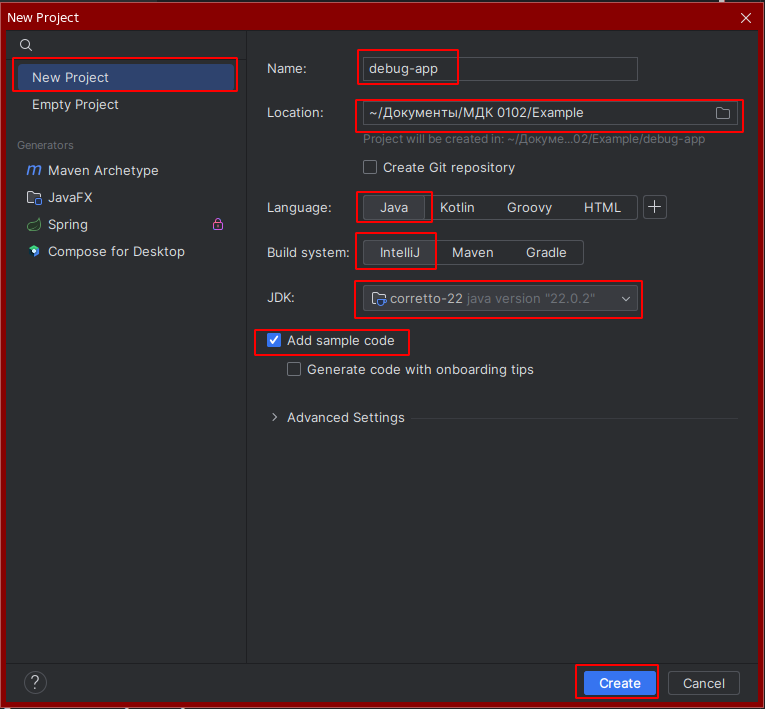

Предыдущее занятие | &nbsp; | Следующее занятие
:----------------:|:----------:|:----------------:
[В начало](README.MD) | [Содержание](README.MD) | [Урок 2](LR_2.MD)

# Лабораторная работа 1. Отладка

## План
1. [Создание проекта](#создание-проекта)
2. [Настройка проекта](#настройка-проекта)
    * [pom.xml](#pomxml)
    * [checkstyle.xml](#checkstylexml)
    * [suppressions.xml](#suppressionsxml)
3. [Настройка подключения к БД](#настройка-подключения-к-бд)
    * [hibernate.cfg.xml](#hibernatecfgxml)
    * [module-info.java](#module-infojava)
    * [Настройка стилей base-styles.css](#base-stylescss)
    * [Класс User](#User.java)
4. [package util]()
    * [класс HibernateSessionFactoryUtil.java](#класс-hibernatesessionfactoryutiljava)
    * [класс MakeCaptcha.java](#класс-makecaptchajava)
    * [Класс Manager.java](#класс-managerjava)
5. [package controllers]()
    * [LoginController.java](#logincontrollerjava)
    * [MainWindowController.java](#mainwindowcontrollerjava)
6. [package resources.ru.demo.tradeapp]()
    * [login-view.fxml](#login-viewfxml)
    * [main-view.fxml](#main-viewfxml)
7. [Файл TradeApp.java](#tradeappjava)
8. [Запуск приложения](#запуск-приложения)
9. [Задания](#задания)
10. [Пример создания интерфейса](#пример-создания-интерфейса-)

## Создание проекта

1. Запустите IntelliJ IDEA.
2. Выберите слева вкладку **Projects**  и нажмите на кнопку **New Project**.

3. Дайте имя проекту **debug-app**.
   Language - **Java**, Build system - **IntelliJ**. 
   В качестве JDK используйте Amazon Coretto 22. Нажмите **Create**.
   
4. Если все настройки пройдены успешно появится окно с вашим проектом.
   
6. Откройте файл **HelloApplication.java**. Нажмите правой кнопкой мыши в любом месте программного кода и выберите в контекстном меню пункт Run HelloApplication.main()
   
7. После этого запустится форма с одной кнопкой.
   

Проект успешно создан.

---

Предыдущее занятие | &nbsp; | Следующее занятие
:----------------:|:----------:|:----------------:
[В начало](README.MD) | [Содержание](README.MD) | [Урок 2](LR_2.MD)